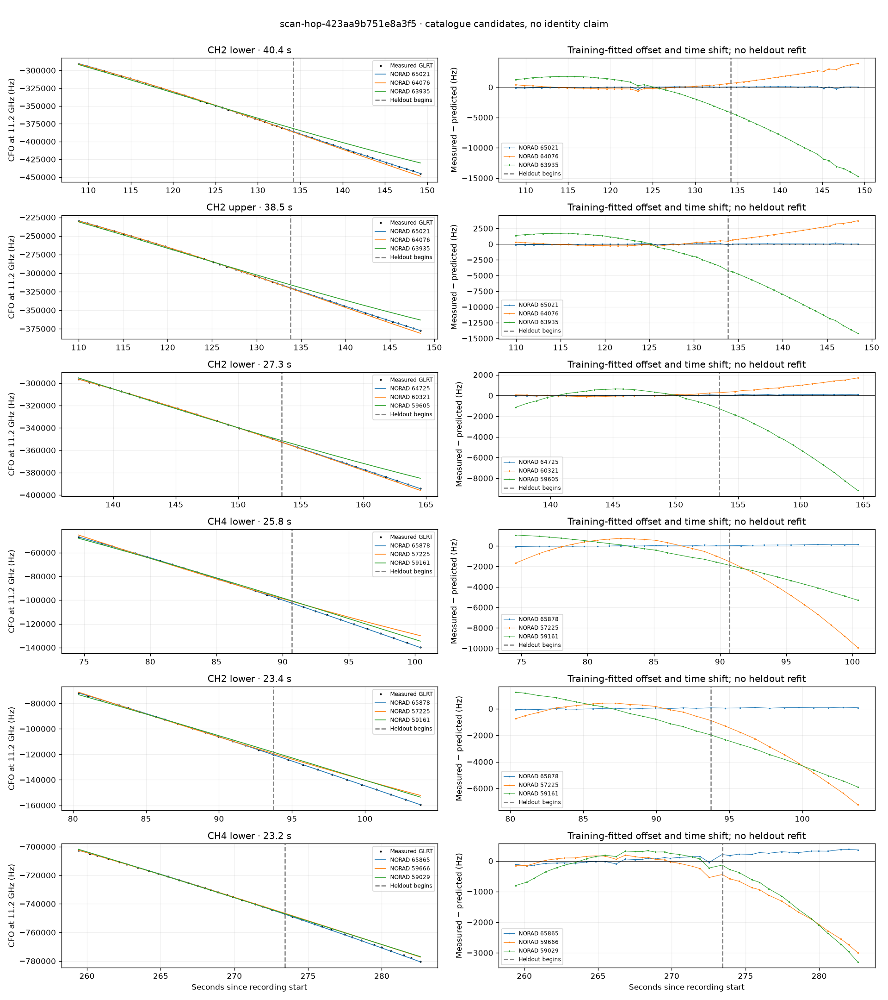

# scan-hop-423aa9b751e8a3f5

Recorded **2026-09-14T19:50:12.646148Z**, RX0, 10 MS/s.

**Candidates pass descriptive checks; no identification.** Candidates: 65878 (2 tracklets), 65021 (2 tracklets), 65865 (2 tracklets).

Counts are correlated lane tracklets, not independent detections or satellite counts. A recording can contain multiple transmitters; these are not one-label-per-file assignments.

Solid curves include a per-track constant carrier offset fitted on the first 60% of observations. The final 40% is held out. A close curve is not identity evidence by itself.

Catalogue: `sha256:4b2095c8131c06da613b154fc073602a412fc2bfa0847667b2c078799384e2ac`. Orbital-only exclusions: STARLINK-1770 (NORAD 46383; SGP4 []).

| Lane | Recording seconds | Top 3 training NORADs | Train / heldout RMS (Hz) | Leader heldout rank | Assessment |
|---|---:|---|---:|---:|---|
| CH4 lower | 74.6–100.4 | 65878, 57225, 59161 | 36.8 / 95.4 | 1 | Passes descriptive checks; candidate only |
| CH2 lower | 80.4–103.8 | 65878, 57225, 59161 | 38.8 / 75.6 | 1 | Passes descriptive checks; candidate only |
| CH2 lower | 108.8–149.2 | 65021, 64076, 63935 | 86.9 / 98.3 | 1 | Passes descriptive checks; candidate only |
| CH2 upper | 110.0–148.4 | 65021, 64076, 63935 | 80.6 / 61.8 | 1 | Passes descriptive checks; candidate only |
| CH4 lower | 259.4–282.6 | 65865, 59666, 59029 | 92.1 / 292.3 | 1 | Passes descriptive checks; candidate only |
| CH4 upper | 261.2–283.8 | 65865, 59666, 59029 | 85.7 / 245.3 | 1 | Passes descriptive checks; candidate only |
| CH2 lower | 137.2–164.6 | 64725, 60321, 59605 | 39.0 / 79.2 | 1 | time-shift boundary |

[Full candidate, control and measured-CFO evidence](scan-hop-423aa9b751e8a3f5.json.gz).
