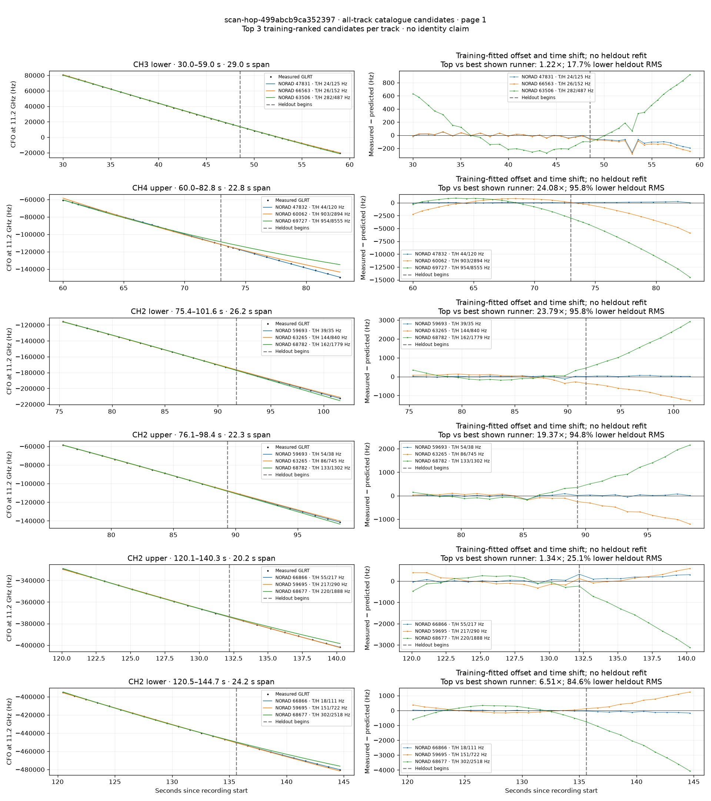
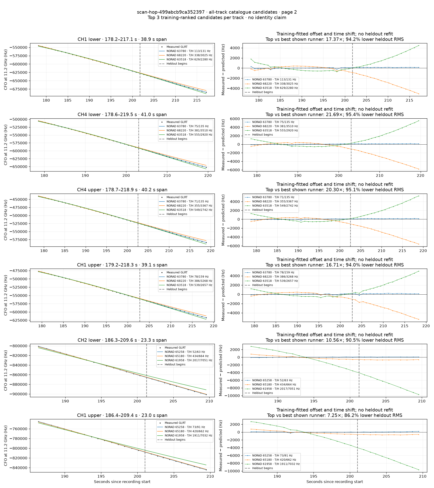
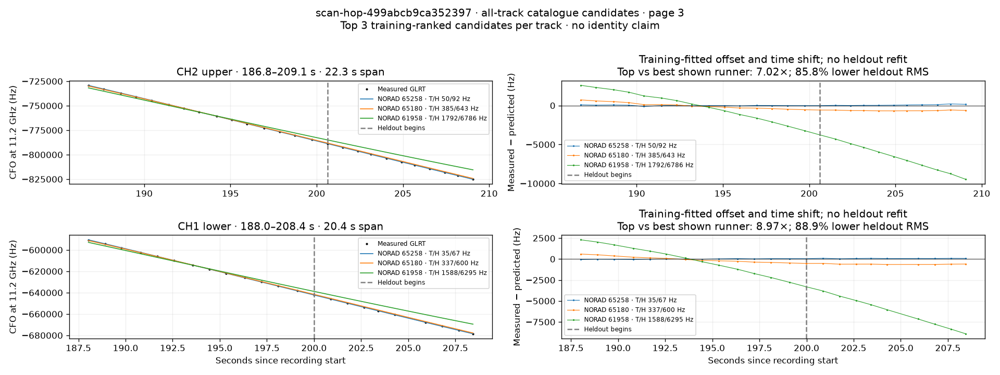

# All track overlays: scan-hop-499abcb9ca352397

Recorded **2026-09-14T16:40:12.231571Z**, RX0, 10 MS/s. All **14 eligible tracks** are shown in chronological order.

[Recording assessment](scan-hop-499abcb9ca352397.md) · [Candidate RMS and gains](scan-hop-499abcb9ca352397-candidates.md)

Each row matches the requested view: measured GLRT CFO and the top three training-ranked TLE curves on the left, residuals on the right. Offset and time shift are fitted only on the first 60%; the last 40% is held out. These are candidate diagnostics, not satellite identifications.

RMS cells below are `training / heldout` in Hz. Runner-up 1 and 2 are training ranks two and three. The gain compares the top TLE with whichever of those two has lower heldout RMS.

| Track | Top TLE, train / heldout RMS | Runner-up 1, train / heldout RMS | Runner-up 2, train / heldout RMS | Top vs best shown runner, heldout |
|---|---:|---:|---:|---:|
| CH3 lower, 30.0–59.0 s | STARLINK-2420 / 47831: 24.1 / 125.4 Hz | STARLINK-35437 / 66563: 25.6 / 152.3 Hz | STARLINK-33792 / 63506: 282.2 / 486.8 Hz | 1.22× / 17.7% lower |
| CH4 upper, 60.0–82.8 s | STARLINK-2422 / 47832: 44.5 / 120.2 Hz | STARLINK-11166 / 60062: 902.9 / 2894.4 Hz | STARLINK-38010 / 69727: 953.6 / 8555.1 Hz | 24.08× / 95.8% lower |
| CH2 lower, 75.4–101.6 s | STARLINK-32088 / 59693: 38.6 / 35.3 Hz | STARLINK-11654 / 63265: 143.6 / 839.8 Hz | STARLINK-37390 / 68782: 161.7 / 1778.8 Hz | 23.79× / 95.8% lower |
| CH2 upper, 76.1–98.4 s | STARLINK-32088 / 59693: 54.1 / 38.4 Hz | STARLINK-11654 / 63265: 86.0 / 744.7 Hz | STARLINK-37390 / 68782: 132.9 / 1302.3 Hz | 19.37× / 94.8% lower |
| CH2 upper, 120.1–140.3 s | STARLINK-36126 / 66866: 54.6 / 217.0 Hz | STARLINK-32104 / 59695: 216.9 / 289.8 Hz | STARLINK-36168 / 68677: 220.2 / 1888.3 Hz | 1.34× / 25.1% lower |
| CH2 lower, 120.5–144.7 s | STARLINK-36126 / 66866: 17.8 / 110.9 Hz | STARLINK-32104 / 59695: 151.3 / 722.3 Hz | STARLINK-36168 / 68677: 301.5 / 2518.2 Hz | 6.51× / 84.6% lower |
| CH1 lower, 178.2–217.1 s | STARLINK-33846 / 63780: 113.3 / 131.2 Hz | STARLINK-37030 / 68220: 338.2 / 3025.1 Hz | STARLINK-33807 / 63518: 629.1 / 2279.6 Hz | 17.37× / 94.2% lower |
| CH4 lower, 178.6–219.5 s | STARLINK-33846 / 63780: 75.1 / 134.7 Hz | STARLINK-37030 / 68220: 381.0 / 3510.1 Hz | STARLINK-33807 / 63518: 555.2 / 2920.5 Hz | 21.69× / 95.4% lower |
| CH4 upper, 178.7–218.9 s | STARLINK-33846 / 63780: 71.3 / 135.1 Hz | STARLINK-37030 / 68220: 355.0 / 3367.0 Hz | STARLINK-33807 / 63518: 549.3 / 2742.4 Hz | 20.30× / 95.1% lower |
| CH1 upper, 179.2–218.3 s | STARLINK-33846 / 63780: 78.4 / 159.0 Hz | STARLINK-37030 / 68220: 385.7 / 3268.5 Hz | STARLINK-33807 / 63518: 538.6 / 2656.9 Hz | 16.71× / 94.0% lower |
| CH2 lower, 186.3–209.6 s | STARLINK-34980 / 65258: 51.7 / 62.8 Hz | STARLINK-34862 / 65180: 433.7 / 663.6 Hz | STARLINK-32566 / 61958: 2017.3 / 7050.7 Hz | 10.56× / 90.5% lower |
| CH1 upper, 186.4–209.4 s | STARLINK-34980 / 65258: 73.3 / 91.3 Hz | STARLINK-34862 / 65180: 420.4 / 662.0 Hz | STARLINK-32566 / 61958: 1910.6 / 7032.3 Hz | 7.25× / 86.2% lower |
| CH2 upper, 186.8–209.1 s | STARLINK-34980 / 65258: 49.5 / 91.6 Hz | STARLINK-34862 / 65180: 385.4 / 643.0 Hz | STARLINK-32566 / 61958: 1792.2 / 6785.8 Hz | 7.02× / 85.8% lower |
| CH1 lower, 188.0–208.4 s | STARLINK-34980 / 65258: 35.4 / 66.9 Hz | STARLINK-34862 / 65180: 337.2 / 600.2 Hz | STARLINK-32566 / 61958: 1588.1 / 6295.1 Hz | 8.97× / 88.9% lower |

## Page 1

## Page 2

## Page 3

