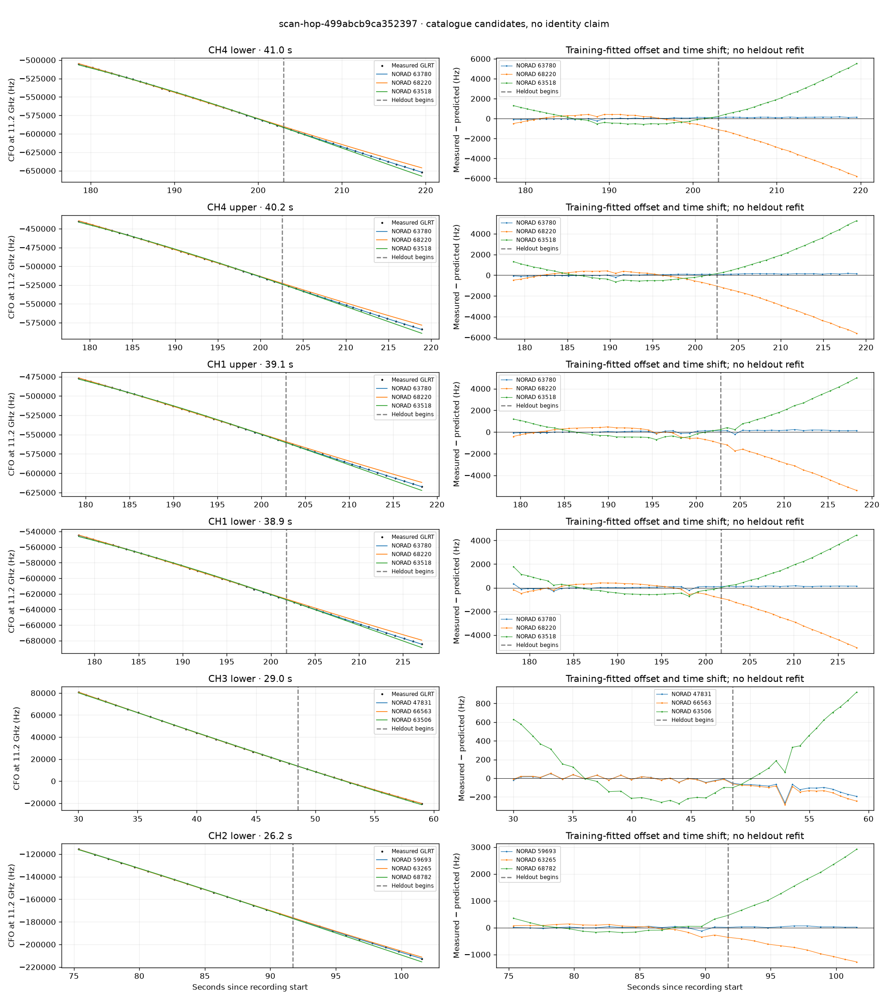

# scan-hop-499abcb9ca352397

Recorded **2026-09-14T16:40:12.231571Z**, RX0, 10 MS/s.

**Candidates pass descriptive checks; no identification.** Candidates: 65258 (4 tracklets), 59693 (2 tracklets), 47831 (1 tracklets).

**Stricter audit of one shortlisted track: ABSTAIN; leading NORAD 63780.** radio-polynomial-null-not-worse-on-heldout. [Full audit](deep-checks/scan-hop-499abcb9ca352397.json.gz).

[Satellite RMS comparisons and top-1 gains](scan-hop-499abcb9ca352397-candidates.md).

Counts are correlated lane tracklets, not independent detections or satellite counts. A recording can contain multiple transmitters; these are not one-label-per-file assignments.

Solid curves include a per-track constant carrier offset fitted on the first 60% of observations. The final 40% is held out. A close curve is not identity evidence by itself.

Catalogue: `sha256:f623da8623d574a387a40f84f1b4e813d76f1f993d2759f7aa9a8c002a1c272e`. Orbital-only exclusions: STARLINK-1770 (NORAD 46383; SGP4 []), STARLINK-34343 DEB (NORAD 69730; SGP4 [6]), STARLINK-37793 (NORAD 100286; SGP4 [6]).

| Lane | Recording seconds | Top 3 training NORADs | Train / heldout RMS (Hz) | Leader heldout rank | Assessment |
|---|---:|---|---:|---:|---|
| CH3 lower | 30.0–59.0 | 47831, 66563, 63506 | 24.1 / 125.4 | 1 | Passes descriptive checks; candidate only |
| CH4 upper | 60.0–82.8 | 47832, 60062, 69727 | 44.5 / 120.2 | 1 | Passes descriptive checks; candidate only |
| CH2 lower | 75.4–101.6 | 59693, 63265, 68782 | 38.6 / 35.3 | 1 | Passes descriptive checks; candidate only |
| CH2 upper | 76.1–98.4 | 59693, 63265, 68782 | 54.1 / 38.4 | 1 | Passes descriptive checks; candidate only |
| CH2 lower | 120.5–144.7 | 66866, 59695, 68677 | 17.8 / 110.9 | 1 | Passes descriptive checks; candidate only |
| CH1 lower | 178.2–217.1 | 63780, 68220, 63518 | 113.3 / 131.2 | 1 | Passes descriptive checks; candidate only |
| CH4 lower | 178.6–219.5 | 63780, 68220, 63518 | 75.1 / 134.7 | 1 | 500s control fits as well or better |
| CH4 upper | 178.7–218.9 | 63780, 68220, 63518 | 71.3 / 135.1 | 1 | 500s control fits as well or better |
| CH1 upper | 179.2–218.3 | 63780, 68220, 63518 | 78.4 / 159.0 | 1 | 500s control fits as well or better |
| CH2 lower | 186.3–209.6 | 65258, 65180, 61958 | 51.7 / 62.8 | 1 | Passes descriptive checks; candidate only |
| CH2 upper | 186.8–209.1 | 65258, 65180, 61958 | 49.5 / 91.6 | 1 | Passes descriptive checks; candidate only |
| CH2 upper | 120.1–140.3 | 66866, 59695, 68677 | 54.6 / 217.0 | 1 | -500s control fits as well or better |
| CH1 lower | 188.0–208.4 | 65258, 65180, 61958 | 35.4 / 66.9 | 1 | Passes descriptive checks; candidate only |
| CH1 upper | 186.4–209.4 | 65258, 65180, 61958 | 73.3 / 91.3 | 1 | Passes descriptive checks; candidate only |

[Full candidate, control and measured-CFO evidence](scan-hop-499abcb9ca352397.json.gz).
