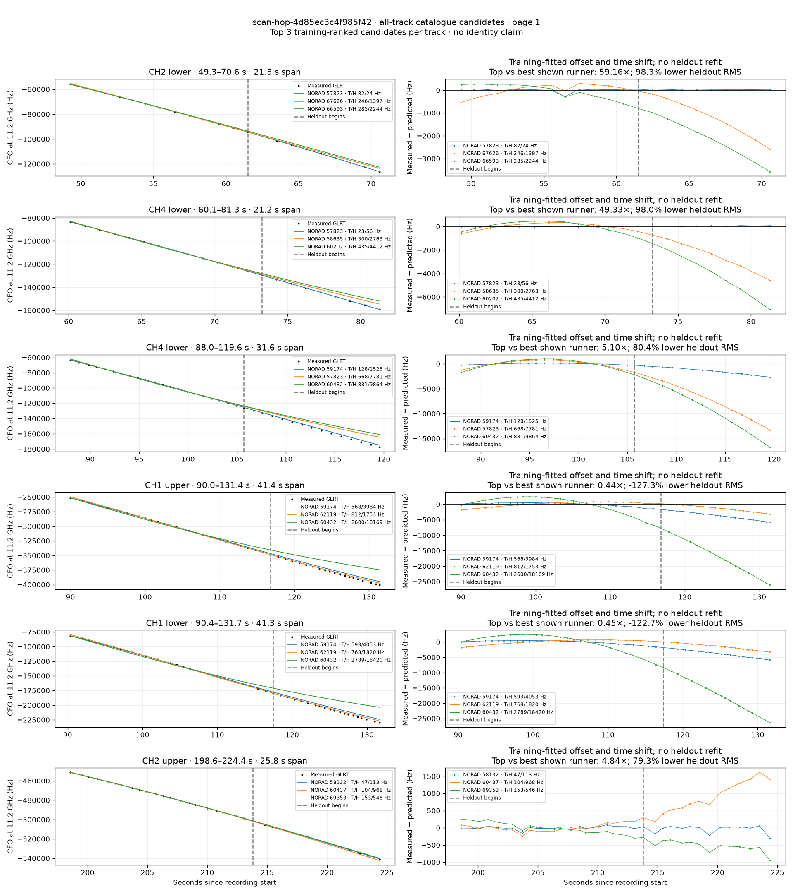
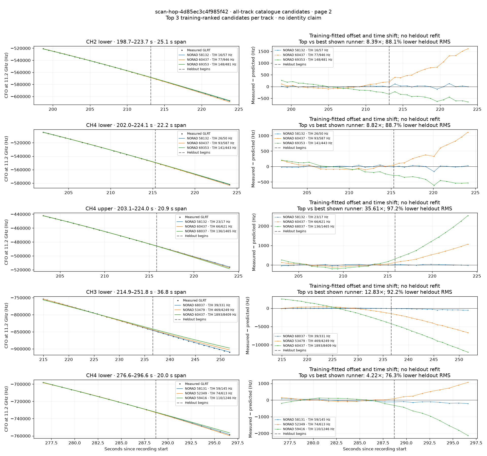

# All track overlays: scan-hop-4d85ec3c4f985f42

Recorded **2026-09-14T21:50:12.467072Z**, RX0, 10 MS/s. All **11 eligible tracks** are shown in chronological order.

[Recording assessment](scan-hop-4d85ec3c4f985f42.md) · [Candidate RMS and gains](scan-hop-4d85ec3c4f985f42-candidates.md)

Each row matches the requested view: measured GLRT CFO and the top three training-ranked TLE curves on the left, residuals on the right. Offset and time shift are fitted only on the first 60%; the last 40% is held out. These are candidate diagnostics, not satellite identifications.

RMS cells below are `training / heldout` in Hz. Runner-up 1 and 2 are training ranks two and three. The gain compares the top TLE with whichever of those two has lower heldout RMS.

| Track | Top TLE, train / heldout RMS | Runner-up 1, train / heldout RMS | Runner-up 2, train / heldout RMS | Top vs best shown runner, heldout |
|---|---:|---:|---:|---:|
| CH2 lower, 49.3–70.6 s | STARLINK-30407 / 57823: 82.2 / 23.6 Hz | STARLINK-36436 / 67626: 245.8 / 1396.8 Hz | STARLINK-36031 / 66593: 285.4 / 2244.1 Hz | 59.16× / 98.3% lower |
| CH4 lower, 60.1–81.3 s | STARLINK-30407 / 57823: 23.0 / 56.0 Hz | STARLINK-31018 / 58635: 300.5 / 2762.7 Hz | STARLINK-32041 / 60202: 435.2 / 4412.2 Hz | 49.33× / 98.0% lower |
| CH4 lower, 88.0–119.6 s | STARLINK-31283 / 59174: 128.0 / 1525.1 Hz | STARLINK-30407 / 57823: 668.1 / 7781.4 Hz | STARLINK-32246 / 60432: 881.3 / 9863.8 Hz | 5.10× / 80.4% lower |
| CH1 upper, 90.0–131.4 s | STARLINK-31283 / 59174: 567.6 / 3984.1 Hz | STARLINK-32535 / 62119: 811.8 / 1752.7 Hz | STARLINK-32246 / 60432: 2599.6 / 18169.1 Hz | 0.44× / -127.3% lower |
| CH1 lower, 90.4–131.7 s | STARLINK-31283 / 59174: 592.7 / 4053.4 Hz | STARLINK-32535 / 62119: 768.2 / 1819.9 Hz | STARLINK-32246 / 60432: 2788.7 / 18419.6 Hz | 0.45× / -122.7% lower |
| CH2 upper, 198.6–224.4 s | STARLINK-30770 / 58132: 46.5 / 112.7 Hz | STARLINK-32241 / 60437: 103.6 / 968.0 Hz | STARLINK-37651 / 69353: 153.2 / 545.9 Hz | 4.84× / 79.3% lower |
| CH2 lower, 198.7–223.7 s | STARLINK-30770 / 58132: 16.3 / 57.3 Hz | STARLINK-32241 / 60437: 76.6 / 945.7 Hz | STARLINK-37651 / 69353: 147.6 / 480.9 Hz | 8.39× / 88.1% lower |
| CH4 lower, 202.0–224.1 s | STARLINK-30770 / 58132: 25.8 / 50.3 Hz | STARLINK-32241 / 60437: 93.3 / 587.3 Hz | STARLINK-37651 / 69353: 141.2 / 443.3 Hz | 8.82× / 88.7% lower |
| CH4 upper, 203.1–224.0 s | STARLINK-30770 / 58132: 23.2 / 17.4 Hz | STARLINK-32241 / 60437: 66.2 / 620.6 Hz | STARLINK-36388 / 68037: 135.5 / 1465.5 Hz | 35.61× / 97.2% lower |
| CH3 lower, 214.9–251.8 s | STARLINK-36388 / 68037: 38.6 / 331.3 Hz | STARLINK-4436 / 53479: 468.5 / 4249.0 Hz | STARLINK-32241 / 60437: 1892.7 / 8409.0 Hz | 12.83× / 92.2% lower |
| CH4 lower, 276.6–296.6 s | STARLINK-30757 / 58131: 59.3 / 145.2 Hz | STARLINK-3819 / 52349: 73.8 / 613.3 Hz | STARLINK-31399 / 59416: 110.3 / 1245.8 Hz | 4.22× / 76.3% lower |

## Page 1

## Page 2

