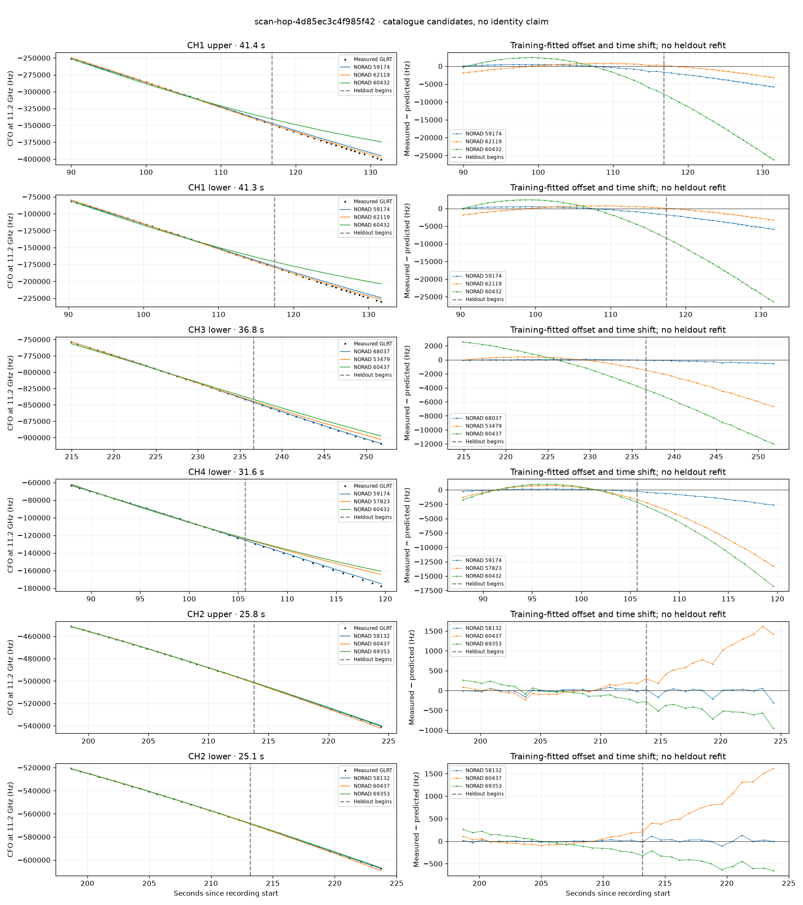

# scan-hop-4d85ec3c4f985f42

Recorded **2026-09-14T21:50:12.467072Z**, RX0, 10 MS/s.

**Candidates pass descriptive checks; no identification.** Candidates: 58132 (4 tracklets), 57823 (2 tracklets), 68037 (1 tracklets).

Counts are correlated lane tracklets, not independent detections or satellite counts. A recording can contain multiple transmitters; these are not one-label-per-file assignments.

Solid curves include a per-track constant carrier offset fitted on the first 60% of observations. The final 40% is held out. A close curve is not identity evidence by itself.

Catalogue: `sha256:5e48341ac859002618ed02192863efc22858a3e23cfba4b9b18348f0378e9657`. Orbital-only exclusions: STARLINK-34343 DEB (NORAD 69730; SGP4 [6]), STARLINK-37793 (NORAD 100286; SGP4 [1]).

| Lane | Recording seconds | Top 3 training NORADs | Train / heldout RMS (Hz) | Leader heldout rank | Assessment |
|---|---:|---|---:|---:|---|
| CH4 lower | 60.1–81.3 | 57823, 58635, 60202 | 23.0 / 56.0 | 1 | Passes descriptive checks; candidate only |
| CH4 lower | 88.0–119.6 | 59174, 57823, 60432 | 128.0 / 1525.1 | 2 | leader changes on heldout; 500s control fits as well or better |
| CH1 upper | 90.0–131.4 | 59174, 62119, 60432 | 567.6 / 3984.1 | 2 | leader changes on heldout; radio drift fits as well or better; -500s control fits as well or better; 500s control fits as well or better |
| CH1 lower | 90.4–131.7 | 59174, 62119, 60432 | 592.7 / 4053.4 | 2 | leader changes on heldout; radio drift fits as well or better; -500s control fits as well or better; 500s control fits as well or better |
| CH2 upper | 198.6–224.4 | 58132, 60437, 69353 | 46.5 / 112.7 | 1 | Passes descriptive checks; candidate only |
| CH2 lower | 198.7–223.7 | 58132, 60437, 69353 | 16.3 / 57.3 | 1 | Passes descriptive checks; candidate only |
| CH4 lower | 202.0–224.1 | 58132, 60437, 69353 | 25.8 / 50.3 | 1 | Passes descriptive checks; candidate only |
| CH4 upper | 203.1–224.0 | 58132, 60437, 68037 | 23.2 / 17.4 | 1 | Passes descriptive checks; candidate only |
| CH3 lower | 214.9–251.8 | 68037, 53479, 60437 | 38.6 / 331.3 | 1 | Passes descriptive checks; candidate only |
| CH4 lower | 276.6–296.6 | 58131, 52349, 59416 | 59.3 / 145.2 | 1 | Passes descriptive checks; candidate only |
| CH2 lower | 49.3–70.6 | 57823, 67626, 66593 | 82.2 / 23.6 | 1 | Passes descriptive checks; candidate only |

[Full candidate, control and measured-CFO evidence](scan-hop-4d85ec3c4f985f42.json.gz).
