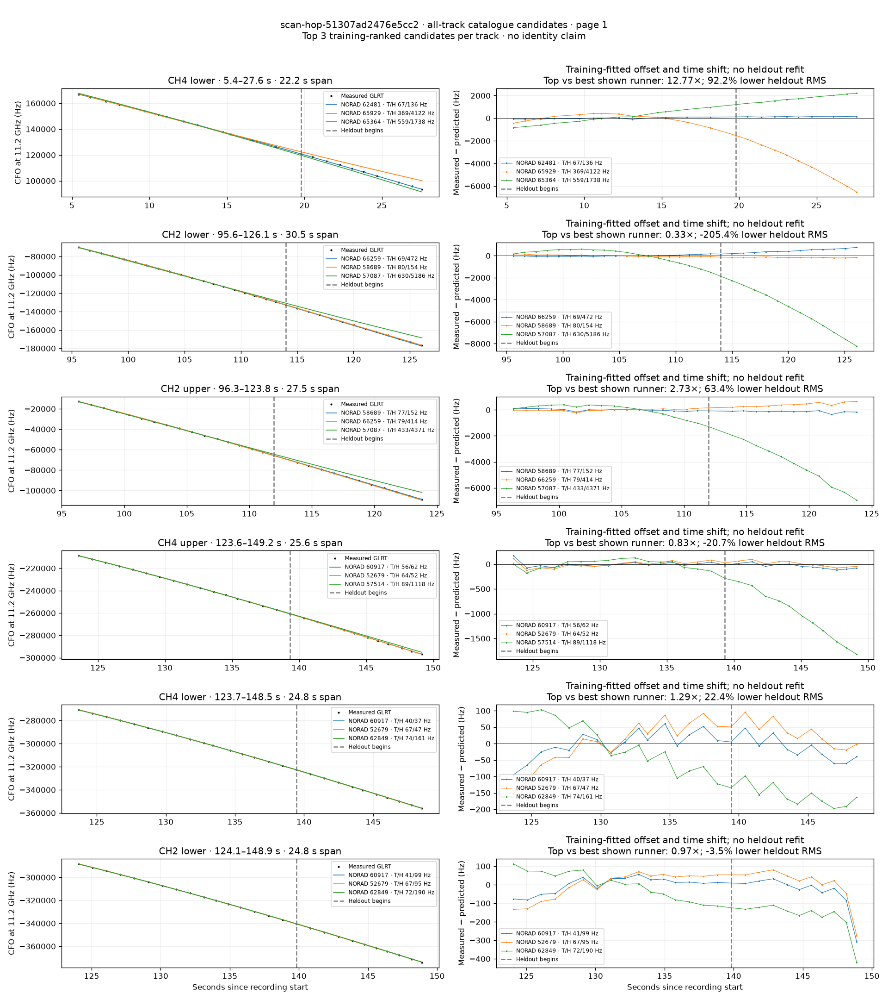
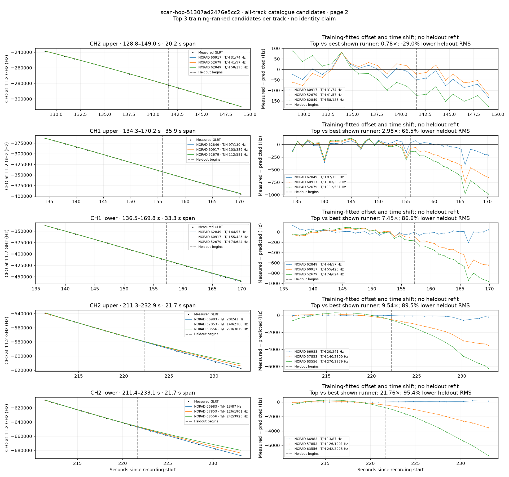

# All track overlays: scan-hop-51307ad2476e5cc2

Recorded **2026-09-14T19:00:12.796060Z**, RX0, 10 MS/s. All **11 eligible tracks** are shown in chronological order.

[Recording assessment](scan-hop-51307ad2476e5cc2.md) · [Candidate RMS and gains](scan-hop-51307ad2476e5cc2-candidates.md)

Each row matches the requested view: measured GLRT CFO and the top three training-ranked TLE curves on the left, residuals on the right. Offset and time shift are fitted only on the first 60%; the last 40% is held out. These are candidate diagnostics, not satellite identifications.

RMS cells below are `training / heldout` in Hz. Runner-up 1 and 2 are training ranks two and three. The gain compares the top TLE with whichever of those two has lower heldout RMS.

| Track | Top TLE, train / heldout RMS | Runner-up 1, train / heldout RMS | Runner-up 2, train / heldout RMS | Top vs best shown runner, heldout |
|---|---:|---:|---:|---:|
| CH4 lower, 5.4–27.6 s | STARLINK-32753 / 62481: 66.9 / 136.1 Hz | STARLINK-35175 / 65929: 369.3 / 4121.9 Hz | STARLINK-34729 / 65364: 558.8 / 1738.1 Hz | 12.77× / 92.2% lower |
| CH2 lower, 95.6–126.1 s | STARLINK-35529 / 66259: 69.1 / 471.8 Hz | STARLINK-31106 / 58689: 79.7 / 154.5 Hz | STARLINK-6251 / 57087: 630.4 / 5186.4 Hz | 0.33× / -205.4% lower |
| CH2 upper, 96.3–123.8 s | STARLINK-31106 / 58689: 77.0 / 151.5 Hz | STARLINK-35529 / 66259: 78.7 / 413.7 Hz | STARLINK-6251 / 57087: 433.1 / 4370.8 Hz | 2.73× / 63.4% lower |
| CH4 upper, 123.6–149.2 s | STARLINK-32369 / 60917: 55.8 / 62.3 Hz | STARLINK-4031 / 52679: 64.3 / 51.7 Hz | STARLINK-30231 / 57514: 89.2 / 1118.4 Hz | 0.83× / -20.7% lower |
| CH4 lower, 123.7–148.5 s | STARLINK-32369 / 60917: 40.1 / 36.7 Hz | STARLINK-4031 / 52679: 67.4 / 47.3 Hz | STARLINK-32809 / 62849: 74.2 / 160.6 Hz | 1.29× / 22.4% lower |
| CH2 lower, 124.1–148.9 s | STARLINK-32369 / 60917: 41.2 / 98.5 Hz | STARLINK-4031 / 52679: 67.4 / 95.2 Hz | STARLINK-32809 / 62849: 71.8 / 189.8 Hz | 0.97× / -3.5% lower |
| CH2 upper, 128.8–149.0 s | STARLINK-32369 / 60917: 31.5 / 74.0 Hz | STARLINK-4031 / 52679: 40.8 / 57.3 Hz | STARLINK-32809 / 62849: 58.3 / 135.2 Hz | 0.78× / -29.0% lower |
| CH1 upper, 134.3–170.2 s | STARLINK-32809 / 62849: 97.2 / 130.4 Hz | STARLINK-32369 / 60917: 103.1 / 389.4 Hz | STARLINK-4031 / 52679: 112.2 / 580.9 Hz | 2.98× / 66.5% lower |
| CH1 lower, 136.5–169.8 s | STARLINK-32809 / 62849: 44.5 / 57.1 Hz | STARLINK-32369 / 60917: 54.8 / 425.2 Hz | STARLINK-4031 / 52679: 73.7 / 623.8 Hz | 7.45× / 86.6% lower |
| CH2 upper, 211.3–232.9 s | STARLINK-36145 / 66983: 19.5 / 241.1 Hz | STARLINK-30404 / 57853: 140.1 / 2299.7 Hz | STARLINK-11626 / 63556: 270.2 / 3879.5 Hz | 9.54× / 89.5% lower |
| CH2 lower, 211.4–233.1 s | STARLINK-36145 / 66983: 13.3 / 87.4 Hz | STARLINK-30404 / 57853: 125.6 / 1901.5 Hz | STARLINK-11626 / 63556: 241.8 / 3924.9 Hz | 21.76× / 95.4% lower |

## Page 1

## Page 2

