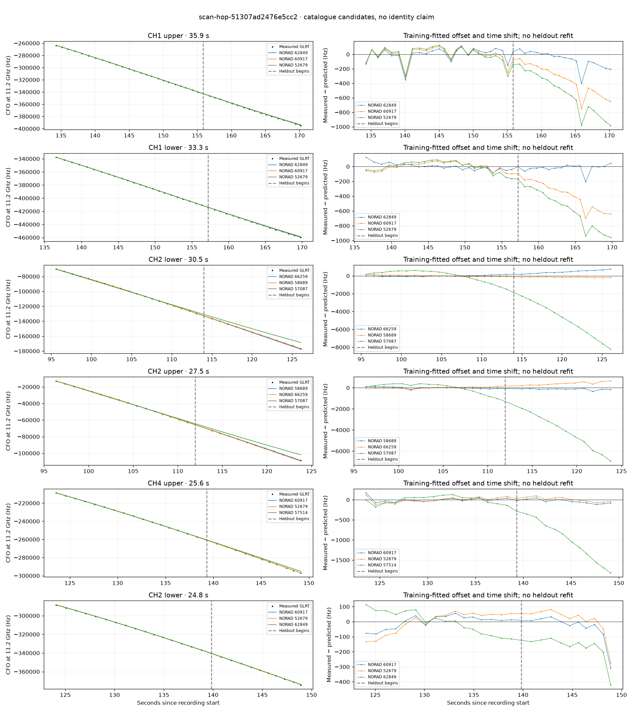

# scan-hop-51307ad2476e5cc2

Recorded **2026-09-14T19:00:12.796060Z**, RX0, 10 MS/s.

**Candidates pass descriptive checks; no identification.** Candidates: 62849 (2 tracklets), 66983 (2 tracklets), 62481 (1 tracklets).

[Satellite RMS comparisons and top-1 gains](scan-hop-51307ad2476e5cc2-candidates.md).

[Measured CFO/TLE overlays for every track](scan-hop-51307ad2476e5cc2-all-tracks.md).

Counts are correlated lane tracklets, not independent detections or satellite counts. A recording can contain multiple transmitters; these are not one-label-per-file assignments.

Solid curves include a per-track constant carrier offset fitted on the first 60% of observations. The final 40% is held out. A close curve is not identity evidence by itself.

Catalogue: `sha256:f027c02cbe99846bc1b1e0b5a10d35c7fe22c60b64c3ddd0a6bf0efe667659cd`. Orbital-only exclusions: STARLINK-34343 DEB (NORAD 69730; SGP4 [6]), STARLINK-37793 (NORAD 100286; SGP4 [1, 6]).

| Lane | Recording seconds | Top 3 training NORADs | Train / heldout RMS (Hz) | Leader heldout rank | Assessment |
|---|---:|---|---:|---:|---|
| CH4 lower | 5.4–27.6 | 62481, 65929, 65364 | 66.9 / 136.1 | 1 | Passes descriptive checks; candidate only |
| CH2 upper | 96.3–123.8 | 58689, 66259, 57087 | 77.0 / 151.5 | 1 | Passes descriptive checks; candidate only |
| CH4 upper | 123.6–149.2 | 60917, 52679, 57514 | 55.8 / 62.3 | 2 | leader changes on heldout; time-shift boundary |
| CH4 lower | 123.7–148.5 | 60917, 52679, 62849 | 40.1 / 36.7 | 1 | time-shift boundary |
| CH2 lower | 124.1–148.9 | 60917, 52679, 62849 | 41.2 / 98.5 | 2 | leader changes on heldout; time-shift boundary |
| CH2 upper | 128.8–149.0 | 60917, 52679, 62849 | 31.5 / 74.0 | 2 | leader changes on heldout; time-shift boundary |
| CH1 upper | 134.3–170.2 | 62849, 60917, 52679 | 97.2 / 130.4 | 1 | Passes descriptive checks; candidate only |
| CH1 lower | 136.5–169.8 | 62849, 60917, 52679 | 44.5 / 57.1 | 1 | Passes descriptive checks; candidate only |
| CH2 upper | 211.3–232.9 | 66983, 57853, 63556 | 19.5 / 241.1 | 1 | Passes descriptive checks; candidate only |
| CH2 lower | 211.4–233.1 | 66983, 57853, 63556 | 13.3 / 87.4 | 1 | Passes descriptive checks; candidate only |
| CH2 lower | 95.6–126.1 | 66259, 58689, 57087 | 69.1 / 471.8 | 2 | leader changes on heldout |

[Full candidate, control and measured-CFO evidence](scan-hop-51307ad2476e5cc2.json.gz).
