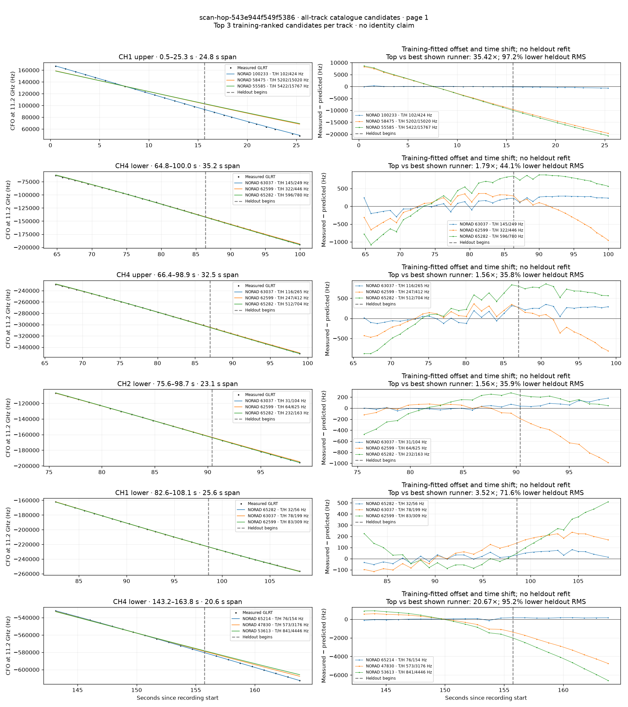
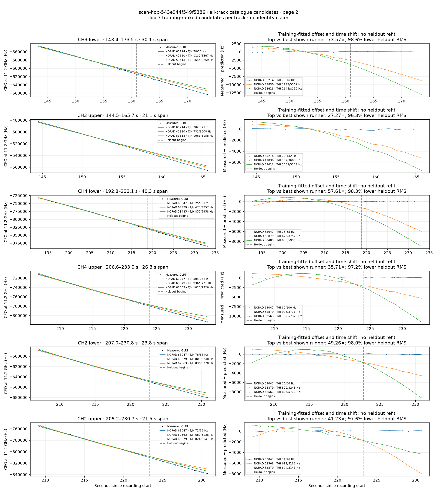
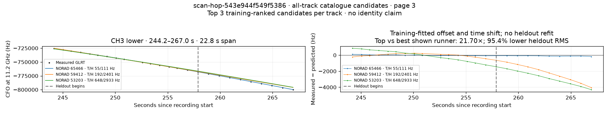

# All track overlays: scan-hop-543e944f549f5386

Recorded **2026-09-14T17:30:12.494100Z**, RX0, 10 MS/s. All **13 eligible tracks** are shown in chronological order.

[Recording assessment](scan-hop-543e944f549f5386.md) · [Candidate RMS and gains](scan-hop-543e944f549f5386-candidates.md)

Each row matches the requested view: measured GLRT CFO and the top three training-ranked TLE curves on the left, residuals on the right. Offset and time shift are fitted only on the first 60%; the last 40% is held out. These are candidate diagnostics, not satellite identifications.

RMS cells below are `training / heldout` in Hz. Runner-up 1 and 2 are training ranks two and three. The gain compares the top TLE with whichever of those two has lower heldout RMS.

| Track | Top TLE, train / heldout RMS | Runner-up 1, train / heldout RMS | Runner-up 2, train / heldout RMS | Top vs best shown runner, heldout |
|---|---:|---:|---:|---:|
| CH1 upper, 0.5–25.3 s | STARLINK-38188 / 100233: 101.5 / 424.1 Hz | STARLINK-30941 / 58475: 5201.5 / 15020.0 Hz | STARLINK-5769 / 55585: 5421.6 / 15766.9 Hz | 35.42× / 97.2% lower |
| CH4 lower, 64.8–100.0 s | STARLINK-32810 / 63037: 144.5 / 249.3 Hz | STARLINK-11529 / 62599: 321.5 / 446.3 Hz | STARLINK-35021 / 65282: 596.2 / 780.5 Hz | 1.79× / 44.1% lower |
| CH4 upper, 66.4–98.9 s | STARLINK-32810 / 63037: 116.2 / 264.7 Hz | STARLINK-11529 / 62599: 247.0 / 412.4 Hz | STARLINK-35021 / 65282: 511.5 / 704.1 Hz | 1.56× / 35.8% lower |
| CH2 lower, 75.6–98.7 s | STARLINK-32810 / 63037: 31.1 / 104.3 Hz | STARLINK-11529 / 62599: 64.3 / 625.2 Hz | STARLINK-35021 / 65282: 231.5 / 162.6 Hz | 1.56× / 35.9% lower |
| CH1 lower, 82.6–108.1 s | STARLINK-35021 / 65282: 31.8 / 56.5 Hz | STARLINK-32810 / 63037: 78.4 / 198.7 Hz | STARLINK-11529 / 62599: 83.0 / 308.9 Hz | 3.52× / 71.6% lower |
| CH4 lower, 143.2–163.8 s | STARLINK-34511 / 65214: 75.6 / 153.6 Hz | STARLINK-2419 / 47830: 572.6 / 3176.0 Hz | STARLINK-4655 / 53613: 841.5 / 4446.4 Hz | 20.67× / 95.2% lower |
| CH3 lower, 143.4–173.5 s | STARLINK-34511 / 65214: 77.5 / 75.7 Hz | STARLINK-2419 / 47830: 1137.0 / 5567.1 Hz | STARLINK-4655 / 53613: 1645.4 / 8258.8 Hz | 73.57× / 98.6% lower |
| CH3 upper, 144.5–165.7 s | STARLINK-34511 / 65214: 70.0 / 132.3 Hz | STARLINK-2419 / 47830: 731.9 / 3608.5 Hz | STARLINK-4655 / 53613: 1063.0 / 5157.8 Hz | 27.27× / 96.3% lower |
| CH4 lower, 192.8–233.1 s | STARLINK-32590 / 63047: 25.2 / 65.2 Hz | STARLINK-33812 / 63879: 475.5 / 3757.1 Hz | STARLINK-30979 / 58485: 855.2 / 5957.7 Hz | 57.61× / 98.3% lower |
| CH4 upper, 206.6–233.0 s | STARLINK-32590 / 63047: 30.1 / 105.6 Hz | STARLINK-33812 / 63879: 936.4 / 3770.8 Hz | STARLINK-11536 / 62563: 1024.6 / 7326.3 Hz | 35.71× / 97.2% lower |
| CH2 lower, 207.0–230.8 s | STARLINK-32590 / 63047: 76.4 / 65.9 Hz | STARLINK-33812 / 63879: 809.2 / 3248.1 Hz | STARLINK-11536 / 62563: 835.9 / 5778.4 Hz | 49.26× / 98.0% lower |
| CH2 upper, 209.2–230.7 s | STARLINK-32590 / 63047: 70.9 / 76.2 Hz | STARLINK-11536 / 62563: 683.2 / 5136.3 Hz | STARLINK-33812 / 63879: 823.7 / 3141.3 Hz | 41.23× / 97.6% lower |
| CH3 lower, 244.2–267.0 s | STARLINK-35027 / 65466: 55.3 / 110.6 Hz | STARLINK-31568 / 59412: 192.0 / 2401.2 Hz | STARLINK-4409 / 53203: 647.6 / 2933.5 Hz | 21.70× / 95.4% lower |

## Page 1

## Page 2

## Page 3

