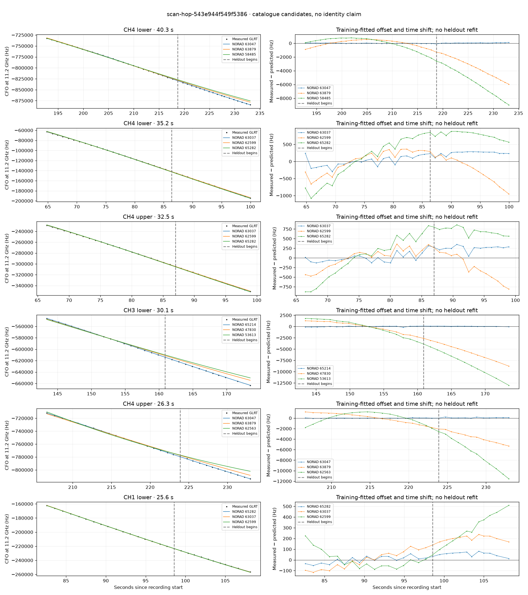

# scan-hop-543e944f549f5386

Recorded **2026-09-14T17:30:12.494100Z**, RX0, 10 MS/s.

**Candidates pass descriptive checks; no identification.** Candidates: 63047 (4 tracklets), 63037 (3 tracklets), 65214 (3 tracklets).

[Satellite RMS comparisons and top-1 gains](scan-hop-543e944f549f5386-candidates.md).

[Measured CFO/TLE overlays for every track](scan-hop-543e944f549f5386-all-tracks.md).

Counts are correlated lane tracklets, not independent detections or satellite counts. A recording can contain multiple transmitters; these are not one-label-per-file assignments.

Solid curves include a per-track constant carrier offset fitted on the first 60% of observations. The final 40% is held out. A close curve is not identity evidence by itself.

Catalogue: `sha256:f027c02cbe99846bc1b1e0b5a10d35c7fe22c60b64c3ddd0a6bf0efe667659cd`. Orbital-only exclusions: STARLINK-34343 DEB (NORAD 69730; SGP4 [6]), STARLINK-37793 (NORAD 100286; SGP4 [6]).

| Lane | Recording seconds | Top 3 training NORADs | Train / heldout RMS (Hz) | Leader heldout rank | Assessment |
|---|---:|---|---:|---:|---|
| CH1 upper | 0.5–25.3 | 100233, 58475, 55585 | 101.5 / 424.1 | 1 | Passes descriptive checks; candidate only |
| CH4 lower | 64.8–100.0 | 63037, 62599, 65282 | 144.5 / 249.3 | 1 | Passes descriptive checks; candidate only |
| CH4 upper | 66.4–98.9 | 63037, 62599, 65282 | 116.2 / 264.7 | 1 | Passes descriptive checks; candidate only |
| CH2 lower | 75.6–98.7 | 63037, 62599, 65282 | 31.1 / 104.3 | 1 | Passes descriptive checks; candidate only |
| CH1 lower | 82.6–108.1 | 65282, 63037, 62599 | 31.8 / 56.5 | 1 | Passes descriptive checks; candidate only |
| CH4 lower | 143.2–163.8 | 65214, 47830, 53613 | 75.6 / 153.6 | 1 | Passes descriptive checks; candidate only |
| CH3 lower | 143.4–173.5 | 65214, 47830, 53613 | 77.5 / 75.7 | 1 | Passes descriptive checks; candidate only |
| CH3 upper | 144.5–165.7 | 65214, 47830, 53613 | 70.0 / 132.3 | 1 | Passes descriptive checks; candidate only |
| CH4 lower | 192.8–233.1 | 63047, 63879, 58485 | 25.2 / 65.2 | 1 | Passes descriptive checks; candidate only |
| CH4 upper | 206.6–233.0 | 63047, 63879, 62563 | 30.1 / 105.6 | 1 | Passes descriptive checks; candidate only |
| CH2 lower | 207.0–230.8 | 63047, 63879, 62563 | 76.4 / 65.9 | 1 | Passes descriptive checks; candidate only |
| CH2 upper | 209.2–230.7 | 63047, 62563, 63879 | 70.9 / 76.2 | 1 | Passes descriptive checks; candidate only |
| CH3 lower | 244.2–267.0 | 65466, 59412, 53203 | 55.3 / 110.6 | 1 | -500s control fits as well or better |

[Full candidate, control and measured-CFO evidence](scan-hop-543e944f549f5386.json.gz).
