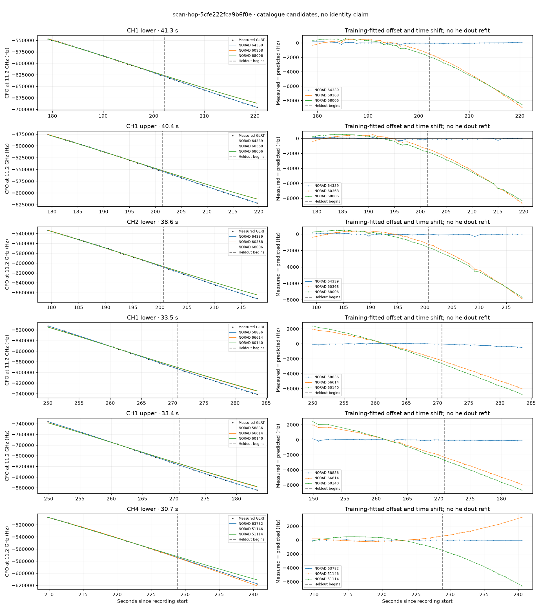

# scan-hop-5cfe222fca9b6f0e

Recorded **2026-09-14T21:10:12.525115Z**, RX0, 10 MS/s.

**Candidates pass descriptive checks; no identification.** Candidates: 64339 (4 tracklets), 63782 (4 tracklets), 57673 (3 tracklets).

[Satellite RMS comparisons and top-1 gains](scan-hop-5cfe222fca9b6f0e-candidates.md).

[Measured CFO/TLE overlays for every track](scan-hop-5cfe222fca9b6f0e-all-tracks.md).

Counts are correlated lane tracklets, not independent detections or satellite counts. A recording can contain multiple transmitters; these are not one-label-per-file assignments.

Solid curves include a per-track constant carrier offset fitted on the first 60% of observations. The final 40% is held out. A close curve is not identity evidence by itself.

Catalogue: `sha256:889e7736a313d5543eb60d5bad6841ef1ba92f93f691d8af8bb2a30aafee825e`. Orbital-only exclusions: STARLINK-34343 DEB (NORAD 69730; SGP4 [6]), STARLINK-37793 (NORAD 100286; SGP4 [1]).

| Lane | Recording seconds | Top 3 training NORADs | Train / heldout RMS (Hz) | Leader heldout rank | Assessment |
|---|---:|---|---:|---:|---|
| CH3 lower | 42.0–62.9 | 68267, 57717, 59399 | 28.6 / 41.4 | 1 | Passes descriptive checks; candidate only |
| CH1 lower | 93.8–119.0 | 57673, 63783, 67992 | 66.8 / 113.5 | 1 | Passes descriptive checks; candidate only |
| CH1 upper | 94.2–118.6 | 57673, 63783, 67992 | 76.3 / 104.4 | 1 | Passes descriptive checks; candidate only |
| CH2 upper | 94.4–115.5 | 57673, 63783, 67992 | 89.3 / 116.8 | 1 | Passes descriptive checks; candidate only |
| CH1 lower | 179.1–220.4 | 64339, 60368, 68006 | 108.0 / 54.8 | 1 | Passes descriptive checks; candidate only |
| CH1 upper | 179.2–219.7 | 64339, 60368, 68006 | 115.0 / 87.5 | 1 | Passes descriptive checks; candidate only |
| CH2 lower | 179.3–217.9 | 64339, 60368, 68006 | 78.8 / 94.8 | 1 | Passes descriptive checks; candidate only |
| CH2 upper | 180.1–203.5 | 64339, 60368, 68006 | 56.5 / 102.4 | 1 | Passes descriptive checks; candidate only |
| CH4 upper | 209.6–239.6 | 63782, 51146, 51114 | 41.6 / 57.7 | 1 | Passes descriptive checks; candidate only |
| CH4 lower | 209.8–240.6 | 63782, 51146, 51114 | 27.7 / 43.9 | 1 | Passes descriptive checks; candidate only |
| CH1 upper | 249.9–283.3 | 58836, 66614, 60140 | 63.4 / 95.4 | 1 | Passes descriptive checks; candidate only |
| CH1 lower | 250.0–283.5 | 58836, 66614, 60140 | 43.5 / 275.8 | 1 | Passes descriptive checks; candidate only |
| CH3 lower | 253.2–276.5 | 66614, 60140, 58836 | 35.5 / 126.4 | 1 | Passes descriptive checks; candidate only |
| CH1 upper | 207.1–229.7 | 63782, 51146, 51114 | 16.6 / 67.8 | 1 | Passes descriptive checks; candidate only |
| CH1 lower | 213.0–239.9 | 63782, 51146, 51114 | 25.4 / 54.1 | 1 | Passes descriptive checks; candidate only |

[Full candidate, control and measured-CFO evidence](scan-hop-5cfe222fca9b6f0e.json.gz).
