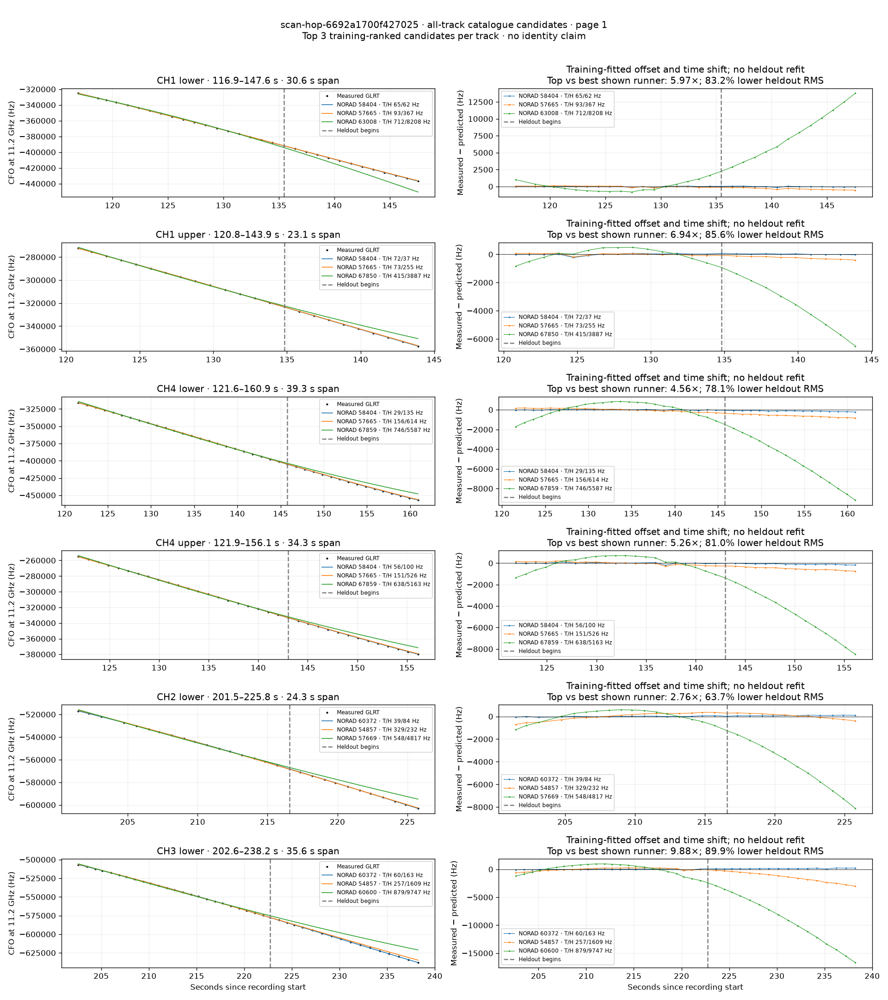
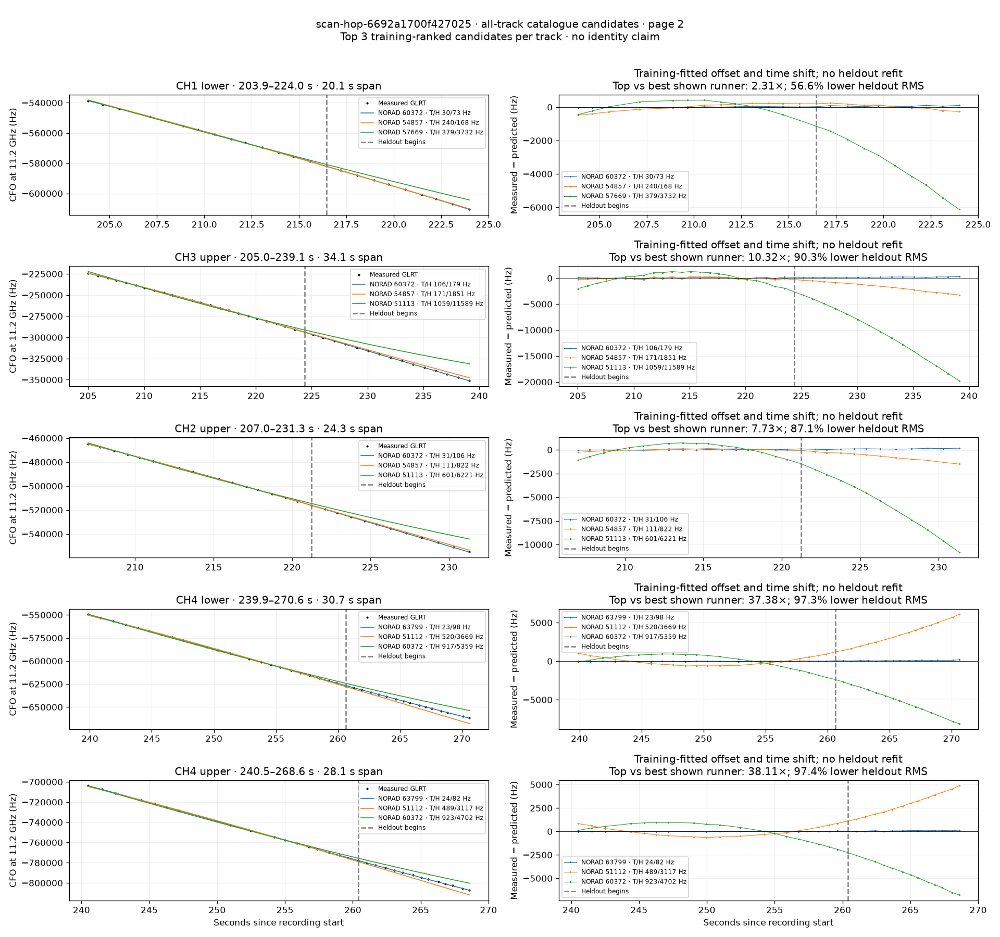

# All track overlays: scan-hop-6692a1700f427025

Recorded **2026-09-14T21:00:12.623792Z**, RX0, 10 MS/s. All **11 eligible tracks** are shown in chronological order.

[Recording assessment](scan-hop-6692a1700f427025.md) · [Candidate RMS and gains](scan-hop-6692a1700f427025-candidates.md)

Each row matches the requested view: measured GLRT CFO and the top three training-ranked TLE curves on the left, residuals on the right. Offset and time shift are fitted only on the first 60%; the last 40% is held out. These are candidate diagnostics, not satellite identifications.

RMS cells below are `training / heldout` in Hz. Runner-up 1 and 2 are training ranks two and three. The gain compares the top TLE with whichever of those two has lower heldout RMS.

| Track | Top TLE, train / heldout RMS | Runner-up 1, train / heldout RMS | Runner-up 2, train / heldout RMS | Top vs best shown runner, heldout |
|---|---:|---:|---:|---:|
| CH1 lower, 116.9–147.6 s | STARLINK-30876 / 58404: 65.2 / 61.5 Hz | STARLINK-30298 / 57665: 92.7 / 367.1 Hz | STARLINK-11405 / 63008: 712.2 / 8208.4 Hz | 5.97× / 83.2% lower |
| CH1 upper, 120.8–143.9 s | STARLINK-30876 / 58404: 72.4 / 36.7 Hz | STARLINK-30298 / 57665: 73.2 / 254.7 Hz | STARLINK-36840 / 67850: 415.1 / 3887.4 Hz | 6.94× / 85.6% lower |
| CH4 lower, 121.6–160.9 s | STARLINK-30876 / 58404: 29.0 / 134.7 Hz | STARLINK-30298 / 57665: 155.9 / 613.9 Hz | STARLINK-36393 / 67859: 746.3 / 5587.3 Hz | 4.56× / 78.1% lower |
| CH4 upper, 121.9–156.1 s | STARLINK-30876 / 58404: 55.8 / 99.9 Hz | STARLINK-30298 / 57665: 150.6 / 525.5 Hz | STARLINK-36393 / 67859: 638.0 / 5163.4 Hz | 5.26× / 81.0% lower |
| CH2 lower, 201.5–225.8 s | STARLINK-32268 / 60372: 39.1 / 84.0 Hz | STARLINK-5078 / 54857: 328.5 / 231.6 Hz | STARLINK-30271 / 57669: 547.5 / 4816.9 Hz | 2.76× / 63.7% lower |
| CH3 lower, 202.6–238.2 s | STARLINK-32268 / 60372: 59.6 / 162.9 Hz | STARLINK-5078 / 54857: 257.4 / 1608.9 Hz | STARLINK-31923 / 60600: 878.8 / 9746.9 Hz | 9.88× / 89.9% lower |
| CH1 lower, 203.9–224.0 s | STARLINK-32268 / 60372: 29.8 / 72.7 Hz | STARLINK-5078 / 54857: 240.1 / 167.7 Hz | STARLINK-30271 / 57669: 379.2 / 3731.9 Hz | 2.31× / 56.6% lower |
| CH3 upper, 205.0–239.1 s | STARLINK-32268 / 60372: 106.5 / 179.4 Hz | STARLINK-5078 / 54857: 170.9 / 1850.6 Hz | STARLINK-3372 / 51113: 1058.9 / 11588.7 Hz | 10.32× / 90.3% lower |
| CH2 upper, 207.0–231.3 s | STARLINK-32268 / 60372: 31.4 / 106.3 Hz | STARLINK-5078 / 54857: 110.8 / 822.0 Hz | STARLINK-3372 / 51113: 600.6 / 6221.5 Hz | 7.73× / 87.1% lower |
| CH4 lower, 239.9–270.6 s | STARLINK-33899 / 63799: 22.9 / 98.1 Hz | STARLINK-3374 / 51112: 519.8 / 3668.7 Hz | STARLINK-32268 / 60372: 917.0 / 5359.2 Hz | 37.38× / 97.3% lower |
| CH4 upper, 240.5–268.6 s | STARLINK-33899 / 63799: 24.2 / 81.8 Hz | STARLINK-3374 / 51112: 489.4 / 3117.1 Hz | STARLINK-32268 / 60372: 923.0 / 4702.0 Hz | 38.11× / 97.4% lower |

## Page 1

## Page 2

