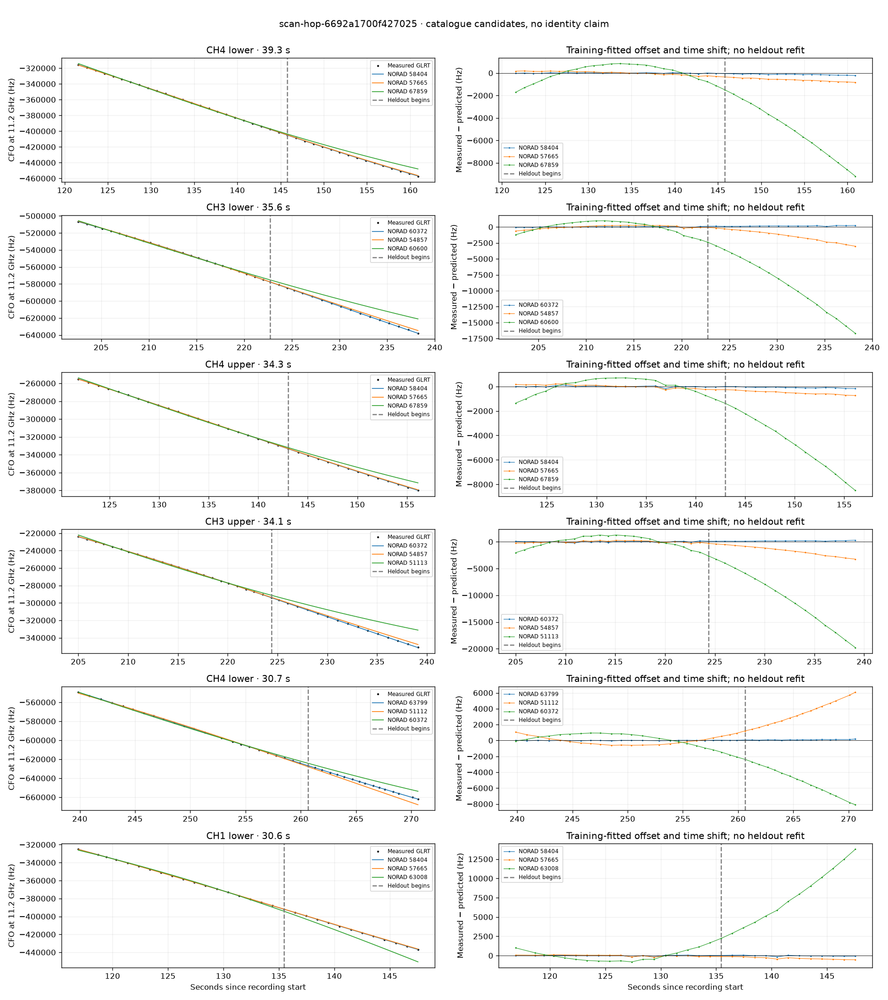

# scan-hop-6692a1700f427025

Recorded **2026-09-14T21:00:12.623792Z**, RX0, 10 MS/s.

**Candidates pass descriptive checks; no identification.** Candidates: 58404 (4 tracklets), 60372 (3 tracklets).

[Satellite RMS comparisons and top-1 gains](scan-hop-6692a1700f427025-candidates.md).

Counts are correlated lane tracklets, not independent detections or satellite counts. A recording can contain multiple transmitters; these are not one-label-per-file assignments.

Solid curves include a per-track constant carrier offset fitted on the first 60% of observations. The final 40% is held out. A close curve is not identity evidence by itself.

Catalogue: `sha256:889e7736a313d5543eb60d5bad6841ef1ba92f93f691d8af8bb2a30aafee825e`. Orbital-only exclusions: STARLINK-34343 DEB (NORAD 69730; SGP4 [6]), STARLINK-37793 (NORAD 100286; SGP4 [1]).

| Lane | Recording seconds | Top 3 training NORADs | Train / heldout RMS (Hz) | Leader heldout rank | Assessment |
|---|---:|---|---:|---:|---|
| CH1 lower | 116.9–147.6 | 58404, 57665, 63008 | 65.2 / 61.5 | 1 | Passes descriptive checks; candidate only |
| CH1 upper | 120.8–143.9 | 58404, 57665, 67850 | 72.4 / 36.7 | 1 | Passes descriptive checks; candidate only |
| CH4 lower | 121.6–160.9 | 58404, 57665, 67859 | 29.0 / 134.7 | 1 | Passes descriptive checks; candidate only |
| CH4 upper | 121.9–156.1 | 58404, 57665, 67859 | 55.8 / 99.9 | 1 | Passes descriptive checks; candidate only |
| CH2 lower | 201.5–225.8 | 60372, 54857, 57669 | 39.1 / 84.0 | 1 | Passes descriptive checks; candidate only |
| CH3 lower | 202.6–238.2 | 60372, 54857, 60600 | 59.6 / 162.9 | 1 | -500s control fits as well or better |
| CH1 lower | 203.9–224.0 | 60372, 54857, 57669 | 29.8 / 72.7 | 1 | Passes descriptive checks; candidate only |
| CH3 upper | 205.0–239.1 | 60372, 54857, 51113 | 106.5 / 179.4 | 1 | -500s control fits as well or better |
| CH2 upper | 207.0–231.3 | 60372, 54857, 51113 | 31.4 / 106.3 | 1 | Passes descriptive checks; candidate only |
| CH4 lower | 239.9–270.6 | 63799, 51112, 60372 | 22.9 / 98.1 | 1 | -500s control fits as well or better |
| CH4 upper | 240.5–268.6 | 63799, 51112, 60372 | 24.2 / 81.8 | 1 | -500s control fits as well or better |

[Full candidate, control and measured-CFO evidence](scan-hop-6692a1700f427025.json.gz).
