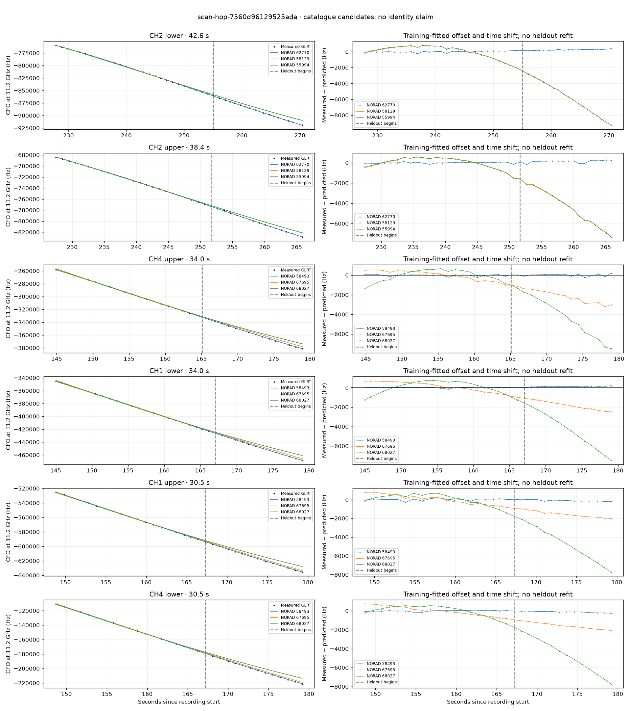

# scan-hop-7560d96129525ada

Recorded **2026-09-14T21:40:12.492486Z**, RX0, 10 MS/s.

**Candidates pass descriptive checks; no identification.** Candidates: 58493 (4 tracklets), 60201 (3 tracklets), 62760 (2 tracklets).

[Satellite RMS comparisons and top-1 gains](scan-hop-7560d96129525ada-candidates.md).

Counts are correlated lane tracklets, not independent detections or satellite counts. A recording can contain multiple transmitters; these are not one-label-per-file assignments.

Solid curves include a per-track constant carrier offset fitted on the first 60% of observations. The final 40% is held out. A close curve is not identity evidence by itself.

Catalogue: `sha256:5e48341ac859002618ed02192863efc22858a3e23cfba4b9b18348f0378e9657`. Orbital-only exclusions: STARLINK-34343 DEB (NORAD 69730; SGP4 [6]), STARLINK-37793 (NORAD 100286; SGP4 [1]).

| Lane | Recording seconds | Top 3 training NORADs | Train / heldout RMS (Hz) | Leader heldout rank | Assessment |
|---|---:|---|---:|---:|---|
| CH4 upper | 115.3–135.5 | 56010, 68027, 62129 | 26.8 / 42.0 | 1 | Passes descriptive checks; candidate only |
| CH4 upper | 144.9–178.9 | 58493, 67695, 68027 | 87.3 / 118.9 | 1 | Passes descriptive checks; candidate only |
| CH1 lower | 145.0–179.1 | 58493, 67695, 68027 | 42.9 / 111.6 | 1 | Passes descriptive checks; candidate only |
| CH4 lower | 148.7–179.2 | 58493, 67695, 68027 | 58.8 / 131.5 | 1 | Passes descriptive checks; candidate only |
| CH1 upper | 148.8–179.3 | 58493, 67695, 68027 | 103.9 / 127.8 | 1 | Passes descriptive checks; candidate only |
| CH2 upper | 168.4–193.8 | 62760, 58009, 59891 | 65.0 / 83.9 | 1 | Passes descriptive checks; candidate only |
| CH2 lower | 168.6–194.1 | 62760, 58009, 59891 | 87.3 / 72.1 | 1 | Passes descriptive checks; candidate only |
| CH4 upper | 202.6–231.1 | 60201, 62760, 64236 | 27.1 / 31.4 | 1 | Passes descriptive checks; candidate only |
| CH4 lower | 206.7–231.7 | 60201, 62760, 64236 | 25.9 / 42.0 | 1 | Passes descriptive checks; candidate only |
| CH1 upper | 211.8–232.0 | 60201, 62760, 62560 | 68.4 / 73.3 | 1 | Passes descriptive checks; candidate only |
| CH2 upper | 227.5–265.9 | 62770, 58129, 55994 | 59.8 / 175.0 | 1 | -500s control fits as well or better |
| CH2 lower | 227.8–270.4 | 62770, 58129, 55994 | 90.5 / 235.5 | 1 | Passes descriptive checks; candidate only |
| CH1 lower | 245.3–268.1 | 62770, 45710, 60434 | 108.7 / 164.5 | 1 | -500s control fits as well or better |
| CH1 upper | 247.1–268.3 | 62770, 45710, 60434 | 60.1 / 89.7 | 1 | Passes descriptive checks; candidate only |

[Full candidate, control and measured-CFO evidence](scan-hop-7560d96129525ada.json.gz).
