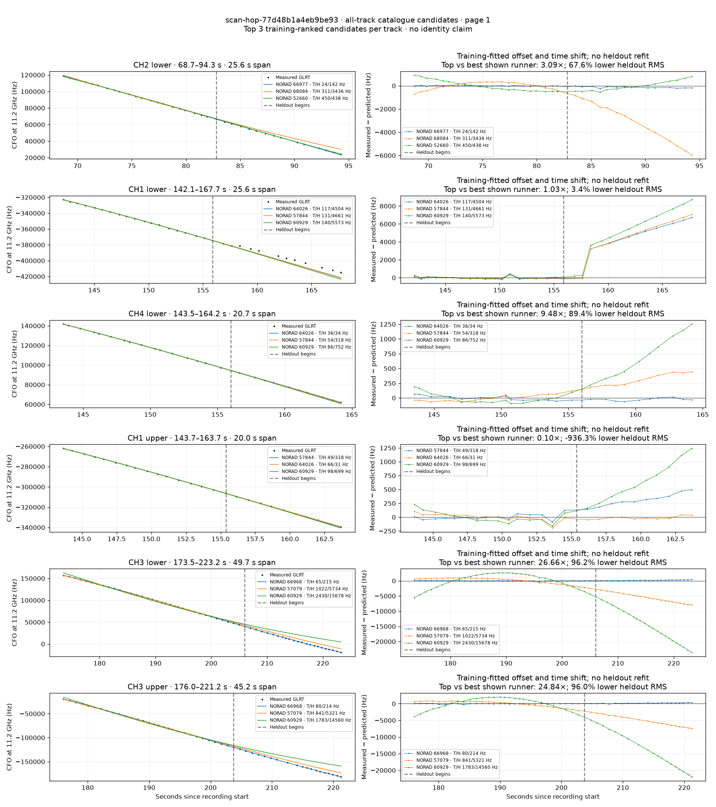
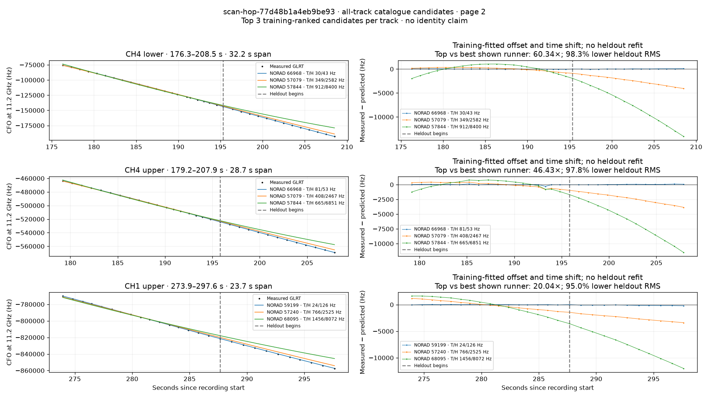

# All track overlays: scan-hop-77d48b1a4eb9be93

Recorded **2026-09-14T19:10:12.741503Z**, RX0, 10 MS/s. All **9 eligible tracks** are shown in chronological order.

[Recording assessment](scan-hop-77d48b1a4eb9be93.md) · [Candidate RMS and gains](scan-hop-77d48b1a4eb9be93-candidates.md)

Each row matches the requested view: measured GLRT CFO and the top three training-ranked TLE curves on the left, residuals on the right. Offset and time shift are fitted only on the first 60%; the last 40% is held out. These are candidate diagnostics, not satellite identifications.

RMS cells below are `training / heldout` in Hz. Runner-up 1 and 2 are training ranks two and three. The gain compares the top TLE with whichever of those two has lower heldout RMS.

| Track | Top TLE, train / heldout RMS | Runner-up 1, train / heldout RMS | Runner-up 2, train / heldout RMS | Top vs best shown runner, heldout |
|---|---:|---:|---:|---:|
| CH2 lower, 68.7–94.3 s | STARLINK-35770 / 66977: 24.3 / 141.9 Hz | STARLINK-37037 / 68084: 311.4 / 3436.4 Hz | STARLINK-4081 / 52660: 450.3 / 437.9 Hz | 3.09× / 67.6% lower |
| CH1 lower, 142.1–167.7 s | STARLINK-33992 / 64026: 117.0 / 4503.6 Hz | STARLINK-30292 / 57844: 131.1 / 4660.8 Hz | STARLINK-11240 [DTC] / 60929: 139.9 / 5572.7 Hz | 1.03× / 3.4% lower |
| CH4 lower, 143.5–164.2 s | STARLINK-33992 / 64026: 35.6 / 33.6 Hz | STARLINK-30292 / 57844: 54.2 / 318.3 Hz | STARLINK-11240 [DTC] / 60929: 85.9 / 751.6 Hz | 9.48× / 89.4% lower |
| CH1 upper, 143.7–163.7 s | STARLINK-30292 / 57844: 49.4 / 317.7 Hz | STARLINK-33992 / 64026: 65.7 / 30.7 Hz | STARLINK-11240 [DTC] / 60929: 98.2 / 698.7 Hz | 0.10× / -936.3% lower |
| CH3 lower, 173.5–223.2 s | STARLINK-36152 / 66968: 64.6 / 215.1 Hz | STARLINK-6245 / 57079: 1022.0 / 5733.9 Hz | STARLINK-11240 [DTC] / 60929: 2430.1 / 15678.5 Hz | 26.66× / 96.2% lower |
| CH3 upper, 176.0–221.2 s | STARLINK-36152 / 66968: 79.6 / 214.2 Hz | STARLINK-6245 / 57079: 840.9 / 5321.5 Hz | STARLINK-11240 [DTC] / 60929: 1782.5 / 14559.7 Hz | 24.84× / 96.0% lower |
| CH4 lower, 176.3–208.5 s | STARLINK-36152 / 66968: 29.6 / 42.8 Hz | STARLINK-6245 / 57079: 349.2 / 2581.5 Hz | STARLINK-30292 / 57844: 911.7 / 8399.8 Hz | 60.34× / 98.3% lower |
| CH4 upper, 179.2–207.9 s | STARLINK-36152 / 66968: 81.1 / 53.1 Hz | STARLINK-6245 / 57079: 408.0 / 2467.3 Hz | STARLINK-30292 / 57844: 664.6 / 6851.1 Hz | 46.43× / 97.8% lower |
| CH1 upper, 273.9–297.6 s | STARLINK-31567 / 59199: 24.3 / 126.0 Hz | STARLINK-6351 / 57240: 766.3 / 2525.2 Hz | STARLINK-36790 / 68095: 1455.7 / 8071.9 Hz | 20.04× / 95.0% lower |

## Page 1

## Page 2

