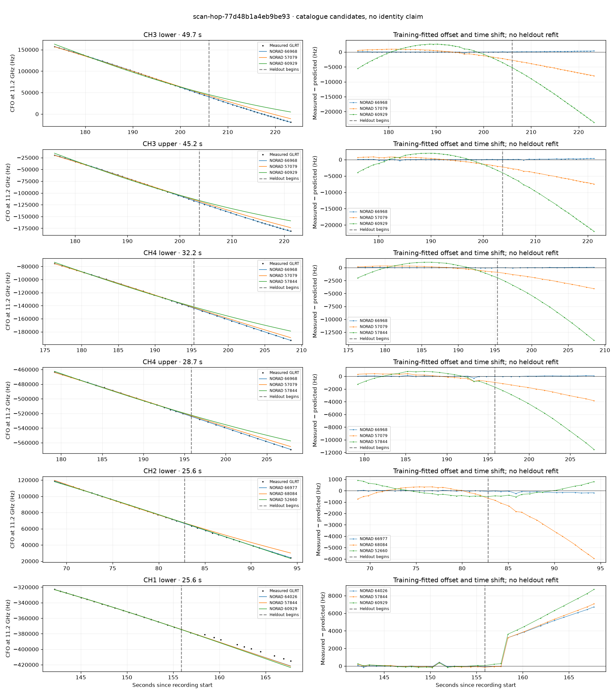

# scan-hop-77d48b1a4eb9be93

Recorded **2026-09-14T19:10:12.741503Z**, RX0, 10 MS/s.

**Candidates pass descriptive checks; no identification.** Candidates: 66968 (4 tracklets), 66977 (1 tracklets), 64026 (1 tracklets).

[Satellite RMS comparisons and top-1 gains](scan-hop-77d48b1a4eb9be93-candidates.md).

[Measured CFO/TLE overlays for every track](scan-hop-77d48b1a4eb9be93-all-tracks.md).

Counts are correlated lane tracklets, not independent detections or satellite counts. A recording can contain multiple transmitters; these are not one-label-per-file assignments.

Solid curves include a per-track constant carrier offset fitted on the first 60% of observations. The final 40% is held out. A close curve is not identity evidence by itself.

Catalogue: `sha256:4b2095c8131c06da613b154fc073602a412fc2bfa0847667b2c078799384e2ac`. Orbital-only exclusions: None.

| Lane | Recording seconds | Top 3 training NORADs | Train / heldout RMS (Hz) | Leader heldout rank | Assessment |
|---|---:|---|---:|---:|---|
| CH2 lower | 68.7–94.3 | 66977, 68084, 52660 | 24.3 / 141.9 | 1 | Passes descriptive checks; candidate only |
| CH1 lower | 142.1–167.7 | 64026, 57844, 60929 | 117.0 / 4503.6 | 8 | leader changes on heldout; radio drift fits as well or better; -500s control fits as well or better; 500s control fits as well or better |
| CH4 lower | 143.5–164.2 | 64026, 57844, 60929 | 35.6 / 33.6 | 1 | Passes descriptive checks; candidate only |
| CH1 upper | 143.7–163.7 | 57844, 64026, 60929 | 49.4 / 317.7 | 2 | leader changes on heldout |
| CH3 lower | 173.5–223.2 | 66968, 57079, 60929 | 64.6 / 215.1 | 1 | Passes descriptive checks; candidate only |
| CH3 upper | 176.0–221.2 | 66968, 57079, 60929 | 79.6 / 214.2 | 1 | Passes descriptive checks; candidate only |
| CH4 lower | 176.3–208.5 | 66968, 57079, 57844 | 29.6 / 42.8 | 1 | Passes descriptive checks; candidate only |
| CH4 upper | 179.2–207.9 | 66968, 57079, 57844 | 81.1 / 53.1 | 1 | Passes descriptive checks; candidate only |
| CH1 upper | 273.9–297.6 | 59199, 57240, 68095 | 24.3 / 126.0 | 1 | Passes descriptive checks; candidate only |

[Full candidate, control and measured-CFO evidence](scan-hop-77d48b1a4eb9be93.json.gz).
