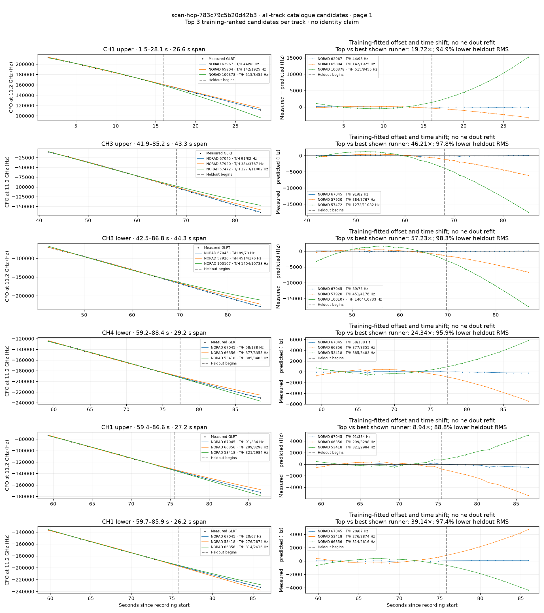
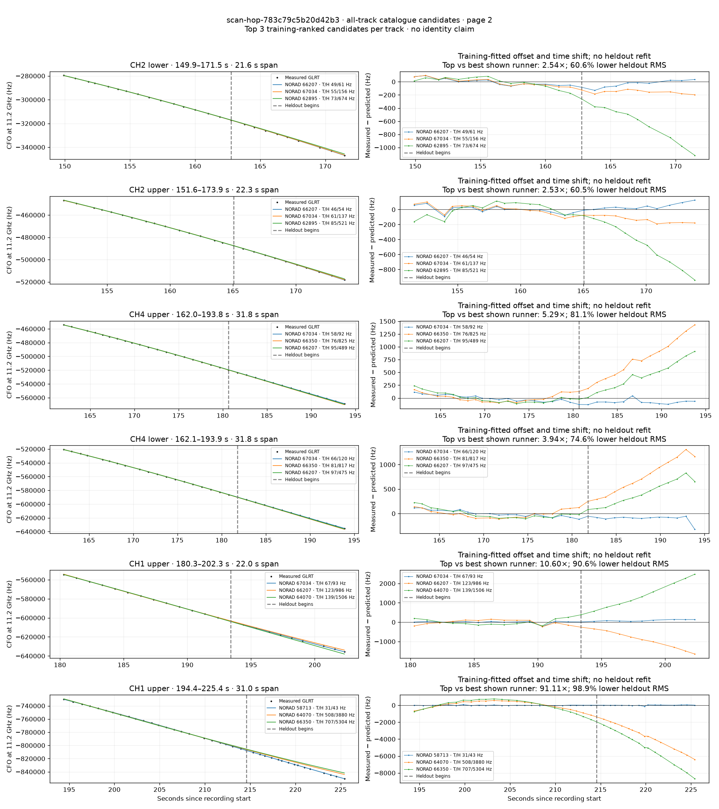
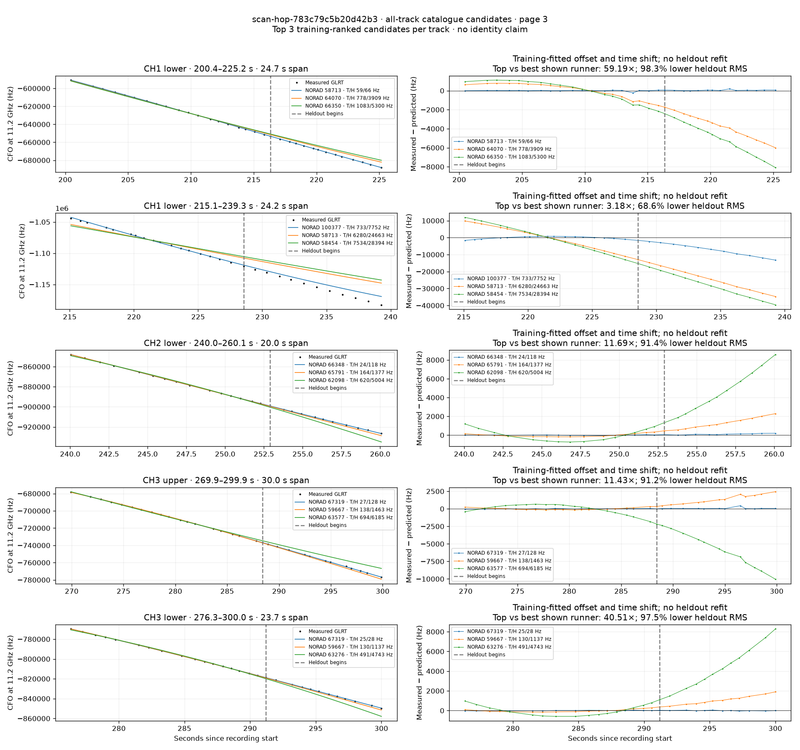

# All track overlays: scan-hop-783c79c5b20d42b3

Recorded **2026-09-14T15:40:12.828072Z**, RX0, 10 MS/s. All **17 eligible tracks** are shown in chronological order.

[Recording assessment](scan-hop-783c79c5b20d42b3.md) · [Candidate RMS and gains](scan-hop-783c79c5b20d42b3-candidates.md)

Each row matches the requested view: measured GLRT CFO and the top three training-ranked TLE curves on the left, residuals on the right. Offset and time shift are fitted only on the first 60%; the last 40% is held out. These are candidate diagnostics, not satellite identifications.

RMS cells below are `training / heldout` in Hz. Runner-up 1 and 2 are training ranks two and three. The gain compares the top TLE with whichever of those two has lower heldout RMS.

| Track | Top TLE, train / heldout RMS | Runner-up 1, train / heldout RMS | Runner-up 2, train / heldout RMS | Top vs best shown runner, heldout |
|---|---:|---:|---:|---:|
| CH1 upper, 1.5–28.1 s | STARLINK-32897 / 62967: 43.9 / 97.6 Hz | STARLINK-35266 / 65804: 141.9 / 1924.5 Hz | STARLINK-38302 / 100378: 515.4 / 8455.0 Hz | 19.72× / 94.9% lower |
| CH3 upper, 41.9–85.2 s | STARLINK-35891 / 67045: 91.2 / 81.5 Hz | STARLINK-30485 / 57920: 383.9 / 3766.9 Hz | STARLINK-30204 / 57472: 1273.4 / 11082.3 Hz | 46.21× / 97.8% lower |
| CH3 lower, 42.5–86.8 s | STARLINK-35891 / 67045: 88.6 / 73.0 Hz | STARLINK-30485 / 57920: 450.6 / 4176.4 Hz | STARLINK-37864 / 100107: 1404.1 / 10732.8 Hz | 57.23× / 98.3% lower |
| CH4 lower, 59.2–88.4 s | STARLINK-35891 / 67045: 58.2 / 137.8 Hz | STARLINK-35851 / 66356: 376.9 / 3354.7 Hz | STARLINK-4481 / 53418: 384.6 / 3483.4 Hz | 24.34× / 95.9% lower |
| CH1 upper, 59.4–86.6 s | STARLINK-35891 / 67045: 90.7 / 333.9 Hz | STARLINK-35851 / 66356: 299.5 / 3298.0 Hz | STARLINK-4481 / 53418: 321.0 / 2984.3 Hz | 8.94× / 88.8% lower |
| CH1 lower, 59.7–85.9 s | STARLINK-35891 / 67045: 19.5 / 66.8 Hz | STARLINK-4481 / 53418: 275.8 / 2874.2 Hz | STARLINK-35851 / 66356: 314.4 / 2615.9 Hz | 39.14× / 97.4% lower |
| CH2 lower, 149.9–171.5 s | STARLINK-35747 / 66207: 48.6 / 61.4 Hz | STARLINK-36140 / 67034: 54.8 / 155.7 Hz | STARLINK-32901 / 62895: 72.8 / 673.7 Hz | 2.54× / 60.6% lower |
| CH2 upper, 151.6–173.9 s | STARLINK-35747 / 66207: 46.1 / 54.1 Hz | STARLINK-36140 / 67034: 61.3 / 137.0 Hz | STARLINK-32901 / 62895: 85.5 / 521.5 Hz | 2.53× / 60.5% lower |
| CH4 upper, 162.0–193.8 s | STARLINK-36140 / 67034: 58.0 / 92.4 Hz | STARLINK-35829 / 66350: 76.3 / 825.0 Hz | STARLINK-35747 / 66207: 94.6 / 489.0 Hz | 5.29× / 81.1% lower |
| CH4 lower, 162.1–193.9 s | STARLINK-36140 / 67034: 66.4 / 120.4 Hz | STARLINK-35829 / 66350: 80.9 / 817.1 Hz | STARLINK-35747 / 66207: 96.8 / 474.5 Hz | 3.94× / 74.6% lower |
| CH1 upper, 180.3–202.3 s | STARLINK-36140 / 67034: 67.5 / 93.0 Hz | STARLINK-35747 / 66207: 123.1 / 985.8 Hz | STARLINK-11713 / 64070: 139.0 / 1505.5 Hz | 10.60× / 90.6% lower |
| CH1 upper, 194.4–225.4 s | STARLINK-30973 / 58713: 31.1 / 42.6 Hz | STARLINK-11713 / 64070: 508.2 / 3880.0 Hz | STARLINK-35829 / 66350: 706.8 / 5304.2 Hz | 91.11× / 98.9% lower |
| CH1 lower, 200.4–225.2 s | STARLINK-30973 / 58713: 58.9 / 66.0 Hz | STARLINK-11713 / 64070: 778.2 / 3908.8 Hz | STARLINK-35829 / 66350: 1082.7 / 5300.4 Hz | 59.19× / 98.3% lower |
| CH1 lower, 215.1–239.3 s | STARLINK-38307 / 100377: 732.5 / 7751.8 Hz | STARLINK-30973 / 58713: 6279.8 / 24663.2 Hz | STARLINK-30966 / 58454: 7534.1 / 28394.1 Hz | 3.18× / 68.6% lower |
| CH2 lower, 240.0–260.1 s | STARLINK-35849 / 66348: 24.2 / 117.8 Hz | STARLINK-35330 / 65791: 163.9 / 1376.9 Hz | STARLINK-11386 / 62098: 619.8 / 5004.0 Hz | 11.69× / 91.4% lower |
| CH3 upper, 269.9–299.9 s | STARLINK-36470 / 67319: 27.3 / 128.0 Hz | STARLINK-31913 / 59667: 138.0 / 1463.0 Hz | STARLINK-33632 / 63577: 694.2 / 6184.8 Hz | 11.43× / 91.2% lower |
| CH3 lower, 276.3–300.0 s | STARLINK-36470 / 67319: 24.6 / 28.1 Hz | STARLINK-31913 / 59667: 129.8 / 1136.8 Hz | STARLINK-11623 / 63276: 491.1 / 4743.4 Hz | 40.51× / 97.5% lower |

## Page 1

## Page 2

## Page 3

