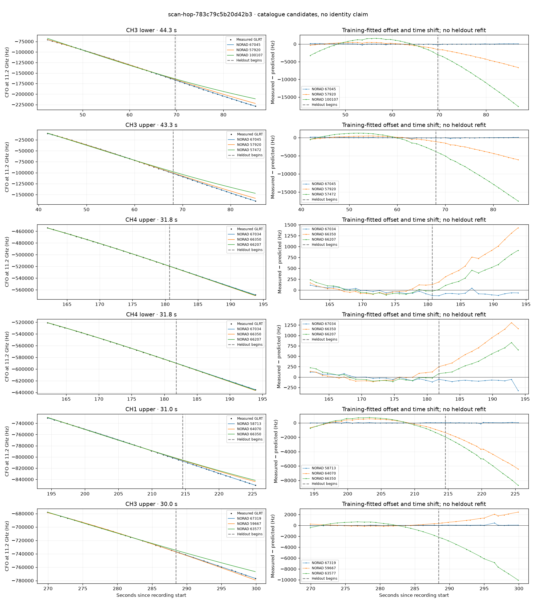

# scan-hop-783c79c5b20d42b3

Recorded **2026-09-14T15:40:12.828072Z**, RX0, 10 MS/s.

**Candidates pass descriptive checks; no identification.** Candidates: 67045 (5 tracklets), 66207 (2 tracklets), 67034 (2 tracklets).

[Satellite RMS comparisons and top-1 gains](scan-hop-783c79c5b20d42b3-candidates.md).

[Measured CFO/TLE overlays for every track](scan-hop-783c79c5b20d42b3-all-tracks.md).

Counts are correlated lane tracklets, not independent detections or satellite counts. A recording can contain multiple transmitters; these are not one-label-per-file assignments.

Solid curves include a per-track constant carrier offset fitted on the first 60% of observations. The final 40% is held out. A close curve is not identity evidence by itself.

Catalogue: `sha256:f623da8623d574a387a40f84f1b4e813d76f1f993d2759f7aa9a8c002a1c272e`. Orbital-only exclusions: STARLINK-1770 (NORAD 46383; SGP4 []), STARLINK-34343 DEB (NORAD 69730; SGP4 [6]), STARLINK-37793 (NORAD 100286; SGP4 [6]).

| Lane | Recording seconds | Top 3 training NORADs | Train / heldout RMS (Hz) | Leader heldout rank | Assessment |
|---|---:|---|---:|---:|---|
| CH1 upper | 1.5–28.1 | 62967, 65804, 100378 | 43.9 / 97.6 | 1 | Passes descriptive checks; candidate only |
| CH3 upper | 41.9–85.2 | 67045, 57920, 57472 | 91.2 / 81.5 | 1 | Passes descriptive checks; candidate only |
| CH3 lower | 42.5–86.8 | 67045, 57920, 100107 | 88.6 / 73.0 | 1 | Passes descriptive checks; candidate only |
| CH4 lower | 59.2–88.4 | 67045, 66356, 53418 | 58.2 / 137.8 | 1 | Passes descriptive checks; candidate only |
| CH1 upper | 59.4–86.6 | 67045, 66356, 53418 | 90.7 / 333.9 | 1 | Passes descriptive checks; candidate only |
| CH1 lower | 59.7–85.9 | 67045, 53418, 66356 | 19.5 / 66.8 | 1 | Passes descriptive checks; candidate only |
| CH2 lower | 149.9–171.5 | 66207, 67034, 62895 | 48.6 / 61.4 | 1 | Passes descriptive checks; candidate only |
| CH2 upper | 151.6–173.9 | 66207, 67034, 62895 | 46.1 / 54.1 | 1 | Passes descriptive checks; candidate only |
| CH4 upper | 162.0–193.8 | 67034, 66350, 66207 | 58.0 / 92.4 | 1 | Passes descriptive checks; candidate only |
| CH4 lower | 162.1–193.9 | 67034, 66350, 66207 | 66.4 / 120.4 | 1 | Passes descriptive checks; candidate only |
| CH1 upper | 180.3–202.3 | 67034, 66207, 64070 | 67.5 / 93.0 | 1 | 500s control fits as well or better |
| CH1 lower | 200.4–225.2 | 58713, 64070, 66350 | 58.9 / 66.0 | 1 | Passes descriptive checks; candidate only |
| CH2 lower | 240.0–260.1 | 66348, 65791, 62098 | 24.2 / 117.8 | 1 | Passes descriptive checks; candidate only |
| CH3 upper | 269.9–299.9 | 67319, 59667, 63577 | 27.3 / 128.0 | 1 | Passes descriptive checks; candidate only |
| CH3 lower | 276.3–300.0 | 67319, 59667, 63276 | 24.6 / 28.1 | 1 | Passes descriptive checks; candidate only |
| CH1 upper | 194.4–225.4 | 58713, 64070, 66350 | 31.1 / 42.6 | 1 | Passes descriptive checks; candidate only |
| CH1 lower | 215.1–239.3 | 100377, 58713, 58454 | 732.5 / 7751.8 | 1 | radio drift fits as well or better; -500s control fits as well or better |

[Full candidate, control and measured-CFO evidence](scan-hop-783c79c5b20d42b3.json.gz).
