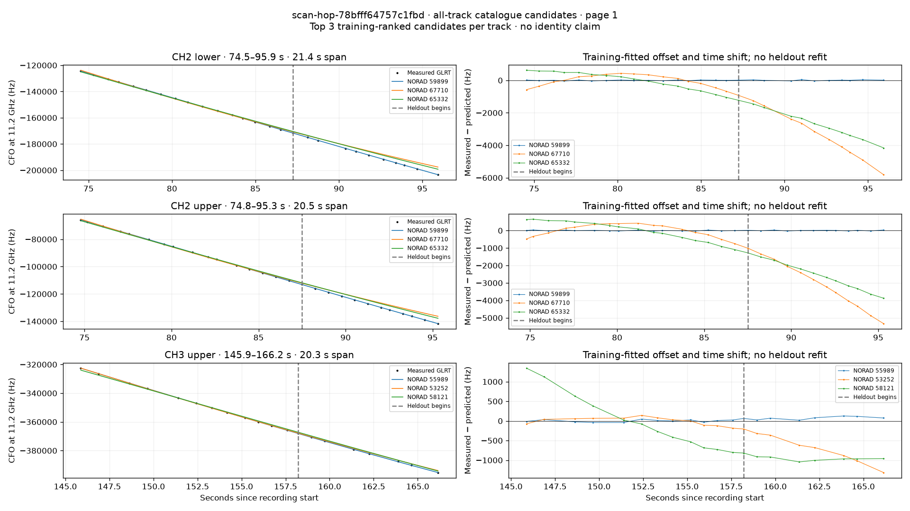

# All track overlays: scan-hop-78bfff64757c1fbd

Recorded **2026-09-14T21:30:12.462465Z**, RX0, 10 MS/s. All **3 eligible tracks** are shown in chronological order.

[Recording assessment](scan-hop-78bfff64757c1fbd.md) · [Candidate RMS and gains](scan-hop-78bfff64757c1fbd-candidates.md)

Each row matches the requested view: measured GLRT CFO and the top three training-ranked TLE curves on the left, residuals on the right. Offset and time shift are fitted only on the first 60%; the last 40% is held out. These are candidate diagnostics, not satellite identifications.

## Page 1

