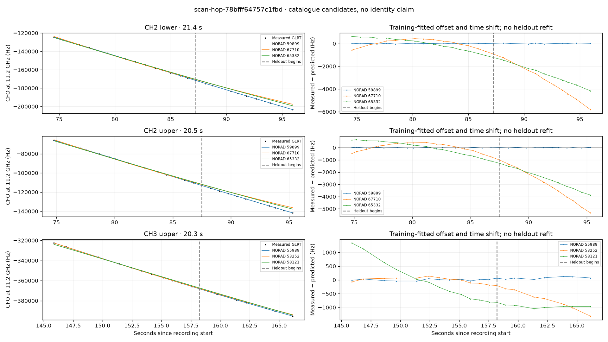

# scan-hop-78bfff64757c1fbd

Recorded **2026-09-14T21:30:12.462465Z**, RX0, 10 MS/s.

**Candidates pass descriptive checks; no identification.** Candidates: 59899 (2 tracklets).

[Satellite RMS comparisons and top-1 gains](scan-hop-78bfff64757c1fbd-candidates.md).

Counts are correlated lane tracklets, not independent detections or satellite counts. A recording can contain multiple transmitters; these are not one-label-per-file assignments.

Solid curves include a per-track constant carrier offset fitted on the first 60% of observations. The final 40% is held out. A close curve is not identity evidence by itself.

Catalogue: `sha256:5e48341ac859002618ed02192863efc22858a3e23cfba4b9b18348f0378e9657`. Orbital-only exclusions: STARLINK-34343 DEB (NORAD 69730; SGP4 [6]), STARLINK-37793 (NORAD 100286; SGP4 [1]).

| Lane | Recording seconds | Top 3 training NORADs | Train / heldout RMS (Hz) | Leader heldout rank | Assessment |
|---|---:|---|---:|---:|---|
| CH2 lower | 74.5–95.9 | 59899, 67710, 65332 | 20.8 / 26.9 | 1 | Passes descriptive checks; candidate only |
| CH2 upper | 74.8–95.3 | 59899, 67710, 65332 | 20.9 / 19.2 | 1 | Passes descriptive checks; candidate only |
| CH3 upper | 145.9–166.2 | 55989, 53252, 58121 | 28.9 / 80.1 | 1 | -500s control fits as well or better |

[Full candidate, control and measured-CFO evidence](scan-hop-78bfff64757c1fbd.json.gz).
