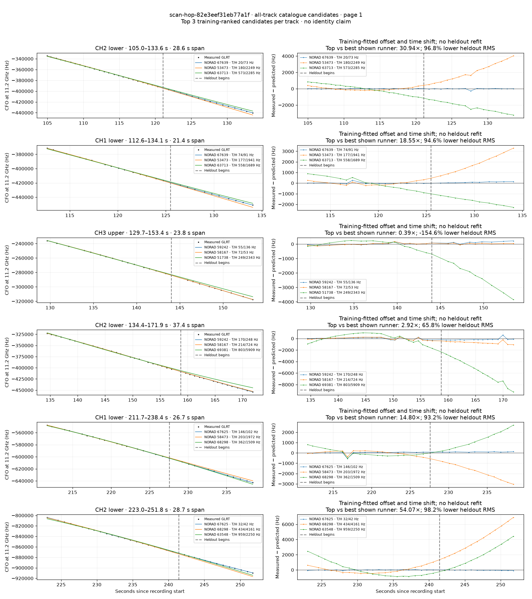
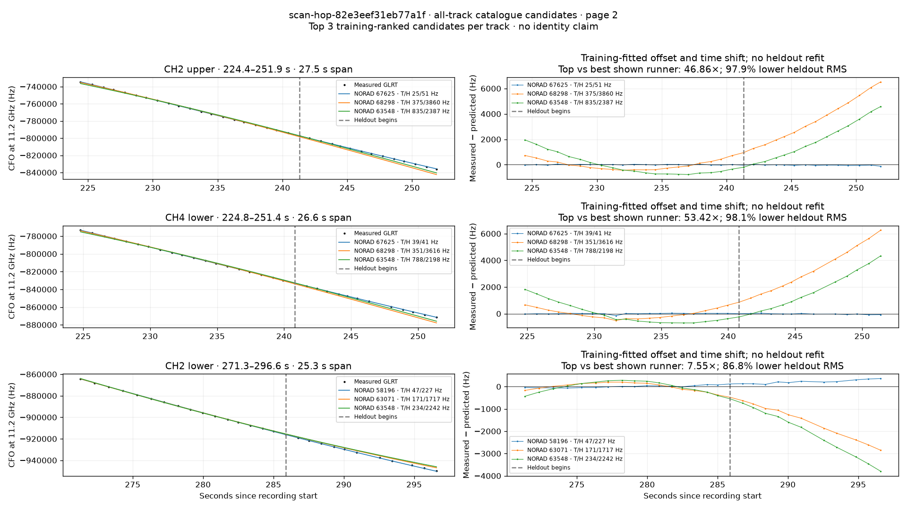

# All track overlays: scan-hop-82e3eef31eb77a1f

Recorded **2026-09-14T22:20:12.556934Z**, RX0, 10 MS/s. All **9 eligible tracks** are shown in chronological order.

[Recording assessment](scan-hop-82e3eef31eb77a1f.md) · [Candidate RMS and gains](scan-hop-82e3eef31eb77a1f-candidates.md)

Each row matches the requested view: measured GLRT CFO and the top three training-ranked TLE curves on the left, residuals on the right. Offset and time shift are fitted only on the first 60%; the last 40% is held out. These are candidate diagnostics, not satellite identifications.

RMS cells below are `training / heldout` in Hz. Runner-up 1 and 2 are training ranks two and three. The gain compares the top TLE with whichever of those two has lower heldout RMS.

| Track | Top TLE, train / heldout RMS | Runner-up 1, train / heldout RMS | Runner-up 2, train / heldout RMS | Top vs best shown runner, heldout |
|---|---:|---:|---:|---:|
| CH2 lower, 105.0–133.6 s | STARLINK-36595 / 67639: 20.4 / 72.7 Hz | STARLINK-4383 / 53473: 180.1 / 2249.0 Hz | STARLINK-33773 / 63713: 572.7 / 2285.0 Hz | 30.94× / 96.8% lower |
| CH1 lower, 112.6–134.1 s | STARLINK-36595 / 67639: 73.9 / 91.1 Hz | STARLINK-4383 / 53473: 176.9 / 1940.8 Hz | STARLINK-33773 / 63713: 558.1 / 1688.7 Hz | 18.55× / 94.6% lower |
| CH3 upper, 129.7–153.4 s | STARLINK-31423 / 59242: 55.4 / 135.7 Hz | STARLINK-30811 / 58167: 71.5 / 53.3 Hz | STARLINK-3515 / 51738: 248.5 / 2342.5 Hz | 0.39× / -154.6% lower |
| CH2 lower, 134.4–171.9 s | STARLINK-31423 / 59242: 170.1 / 247.7 Hz | STARLINK-30811 / 58167: 214.0 / 723.9 Hz | STARLINK-37427 / 69381: 803.2 / 5908.9 Hz | 2.92× / 65.8% lower |
| CH1 lower, 211.7–238.4 s | STARLINK-36438 / 67625: 146.0 / 102.0 Hz | STARLINK-30947 / 58473: 203.5 / 1971.5 Hz | STARLINK-36355 / 68298: 362.1 / 1509.4 Hz | 14.80× / 93.2% lower |
| CH2 lower, 223.0–251.8 s | STARLINK-36438 / 67625: 32.0 / 41.6 Hz | STARLINK-36355 / 68298: 433.8 / 4161.5 Hz | STARLINK-11669 / 63548: 959.0 / 2249.7 Hz | 54.07× / 98.2% lower |
| CH2 upper, 224.4–251.9 s | STARLINK-36438 / 67625: 24.8 / 50.9 Hz | STARLINK-36355 / 68298: 375.1 / 3859.8 Hz | STARLINK-11669 / 63548: 834.6 / 2386.6 Hz | 46.86× / 97.9% lower |
| CH4 lower, 224.8–251.4 s | STARLINK-36438 / 67625: 39.1 / 41.1 Hz | STARLINK-36355 / 68298: 351.2 / 3616.1 Hz | STARLINK-11669 / 63548: 787.8 / 2198.3 Hz | 53.42× / 98.1% lower |
| CH2 lower, 271.3–296.6 s | STARLINK-30798 / 58196: 47.2 / 227.5 Hz | STARLINK-33624 / 63071: 171.5 / 1717.4 Hz | STARLINK-11669 / 63548: 233.9 / 2242.1 Hz | 7.55× / 86.8% lower |

## Page 1

## Page 2

