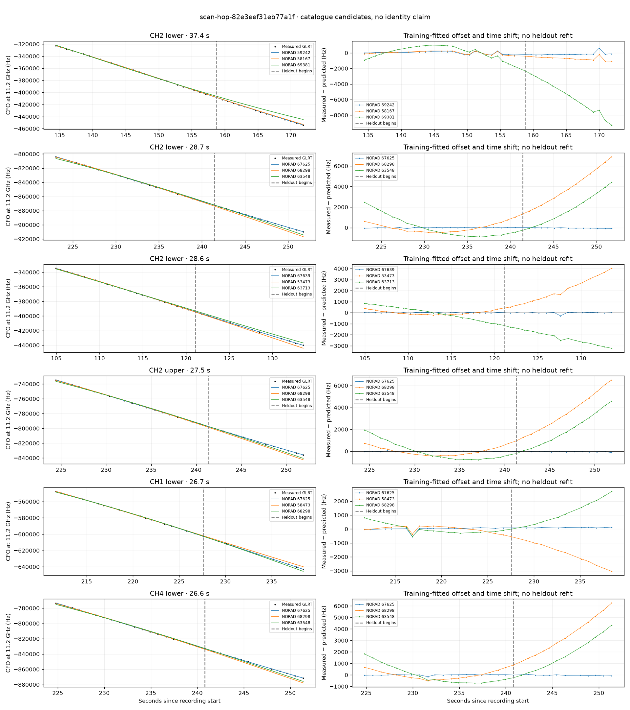

# scan-hop-82e3eef31eb77a1f

Recorded **2026-09-14T22:20:12.556934Z**, RX0, 10 MS/s.

**Candidates pass descriptive checks; no identification.** Candidates: 67625 (3 tracklets), 67639 (2 tracklets), 59242 (1 tracklets).

[Satellite RMS comparisons and top-1 gains](scan-hop-82e3eef31eb77a1f-candidates.md).

[Measured CFO/TLE overlays for every track](scan-hop-82e3eef31eb77a1f-all-tracks.md).

Counts are correlated lane tracklets, not independent detections or satellite counts. A recording can contain multiple transmitters; these are not one-label-per-file assignments.

Solid curves include a per-track constant carrier offset fitted on the first 60% of observations. The final 40% is held out. A close curve is not identity evidence by itself.

Catalogue: `sha256:d0d899a2d1da7811b03849396c03507e74e2de38d046edc9e068d12f2700ab20`. Orbital-only exclusions: STARLINK-34343 DEB (NORAD 69730; SGP4 [6]), STARLINK-37793 (NORAD 100286; SGP4 [1]).

| Lane | Recording seconds | Top 3 training NORADs | Train / heldout RMS (Hz) | Leader heldout rank | Assessment |
|---|---:|---|---:|---:|---|
| CH2 lower | 105.0–133.6 | 67639, 53473, 63713 | 20.4 / 72.7 | 1 | Passes descriptive checks; candidate only |
| CH1 lower | 112.6–134.1 | 67639, 53473, 63713 | 73.9 / 91.1 | 1 | Passes descriptive checks; candidate only |
| CH3 upper | 129.7–153.4 | 59242, 58167, 51738 | 55.4 / 135.7 | 2 | leader changes on heldout |
| CH2 lower | 134.4–171.9 | 59242, 58167, 69381 | 170.1 / 247.7 | 1 | Passes descriptive checks; candidate only |
| CH1 lower | 211.7–238.4 | 67625, 58473, 68298 | 146.0 / 102.0 | 1 | 500s control fits as well or better |
| CH2 lower | 223.0–251.8 | 67625, 68298, 63548 | 32.0 / 41.6 | 1 | Passes descriptive checks; candidate only |
| CH2 upper | 224.4–251.9 | 67625, 68298, 63548 | 24.8 / 50.9 | 1 | Passes descriptive checks; candidate only |
| CH4 lower | 224.8–251.4 | 67625, 68298, 63548 | 39.1 / 41.1 | 1 | Passes descriptive checks; candidate only |
| CH2 lower | 271.3–296.6 | 58196, 63071, 63548 | 47.2 / 227.5 | 1 | Passes descriptive checks; candidate only |

[Full candidate, control and measured-CFO evidence](scan-hop-82e3eef31eb77a1f.json.gz).
