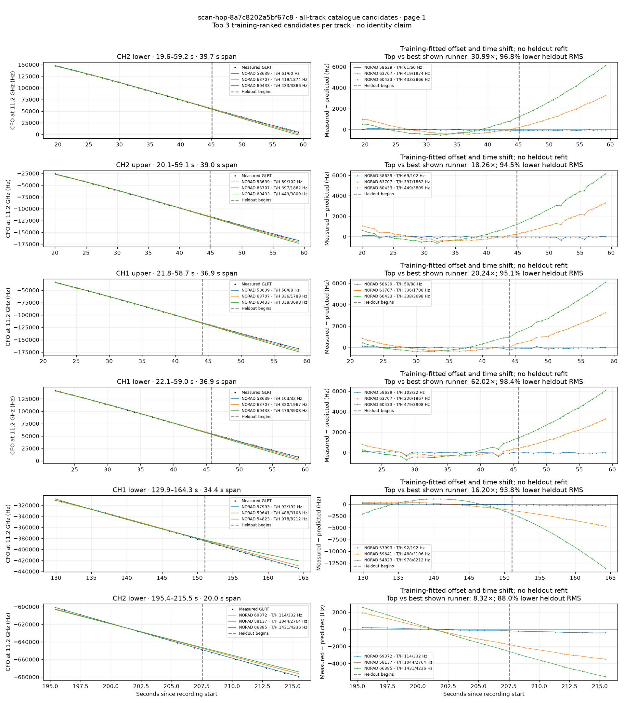
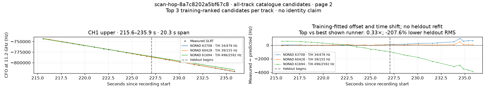

# All track overlays: scan-hop-8a7c8202a5bf67c8

Recorded **2026-09-14T22:00:12.420019Z**, RX0, 10 MS/s. All **7 eligible tracks** are shown in chronological order.

[Recording assessment](scan-hop-8a7c8202a5bf67c8.md) · [Candidate RMS and gains](scan-hop-8a7c8202a5bf67c8-candidates.md)

Each row matches the requested view: measured GLRT CFO and the top three training-ranked TLE curves on the left, residuals on the right. Offset and time shift are fitted only on the first 60%; the last 40% is held out. These are candidate diagnostics, not satellite identifications.

RMS cells below are `training / heldout` in Hz. Runner-up 1 and 2 are training ranks two and three. The gain compares the top TLE with whichever of those two has lower heldout RMS.

| Track | Top TLE, train / heldout RMS | Runner-up 1, train / heldout RMS | Runner-up 2, train / heldout RMS | Top vs best shown runner, heldout |
|---|---:|---:|---:|---:|
| CH2 lower, 19.6–59.2 s | STARLINK-31070 / 58639: 60.8 / 60.5 Hz | STARLINK-33982 / 63707: 419.2 / 1874.3 Hz | STARLINK-32183 / 60433: 433.0 / 3866.1 Hz | 30.99× / 96.8% lower |
| CH2 upper, 20.1–59.1 s | STARLINK-31070 / 58639: 68.5 / 102.0 Hz | STARLINK-33982 / 63707: 396.6 / 1862.1 Hz | STARLINK-32183 / 60433: 448.6 / 3808.9 Hz | 18.26× / 94.5% lower |
| CH1 upper, 21.8–58.7 s | STARLINK-31070 / 58639: 50.1 / 88.3 Hz | STARLINK-33982 / 63707: 335.7 / 1787.7 Hz | STARLINK-32183 / 60433: 338.1 / 3698.3 Hz | 20.24× / 95.1% lower |
| CH1 lower, 22.1–59.0 s | STARLINK-31070 / 58639: 102.9 / 31.7 Hz | STARLINK-33982 / 63707: 320.0 / 1967.3 Hz | STARLINK-32183 / 60433: 478.9 / 3908.5 Hz | 62.02× / 98.4% lower |
| CH1 lower, 129.9–164.3 s | STARLINK-30536 / 57993: 92.0 / 191.8 Hz | STARLINK-31804 / 59641: 487.6 / 3105.9 Hz | STARLINK-5106 / 54823: 977.7 / 8212.0 Hz | 16.20× / 93.8% lower |
| CH2 lower, 195.4–215.5 s | STARLINK-37688 / 69372: 113.6 / 332.1 Hz | STARLINK-30782 / 58137: 1044.0 / 2763.6 Hz | STARLINK-35659 / 66385: 1430.9 / 4235.6 Hz | 8.32× / 88.0% lower |
| CH1 upper, 215.6–235.9 s | STARLINK-33915 / 63708: 33.9 / 476.1 Hz | STARLINK-32193 / 60428: 38.8 / 154.8 Hz | STARLINK-11348 / 61694: 496.3 / 2592.3 Hz | 0.33× / -207.6% lower |

## Page 1

## Page 2

