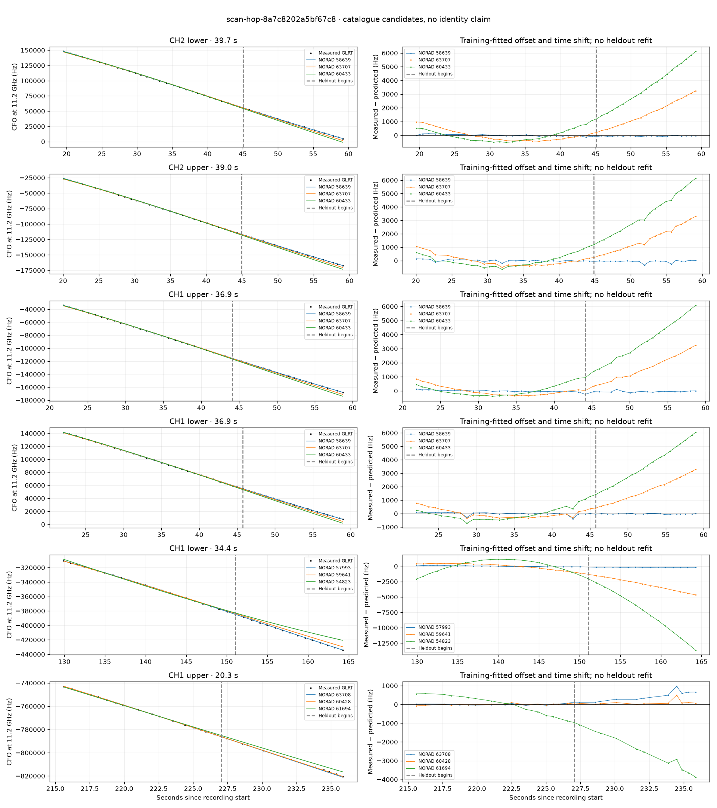

# scan-hop-8a7c8202a5bf67c8

Recorded **2026-09-14T22:00:12.420019Z**, RX0, 10 MS/s.

**Candidates pass descriptive checks; no identification.** Candidates: 58639 (4 tracklets).

Counts are correlated lane tracklets, not independent detections or satellite counts. A recording can contain multiple transmitters; these are not one-label-per-file assignments.

Solid curves include a per-track constant carrier offset fitted on the first 60% of observations. The final 40% is held out. A close curve is not identity evidence by itself.

Catalogue: `sha256:5e48341ac859002618ed02192863efc22858a3e23cfba4b9b18348f0378e9657`. Orbital-only exclusions: STARLINK-34343 DEB (NORAD 69730; SGP4 [6]), STARLINK-37793 (NORAD 100286; SGP4 [1]).

| Lane | Recording seconds | Top 3 training NORADs | Train / heldout RMS (Hz) | Leader heldout rank | Assessment |
|---|---:|---|---:|---:|---|
| CH2 lower | 19.6–59.2 | 58639, 63707, 60433 | 60.8 / 60.5 | 1 | Passes descriptive checks; candidate only |
| CH2 upper | 20.1–59.1 | 58639, 63707, 60433 | 68.5 / 102.0 | 1 | Passes descriptive checks; candidate only |
| CH1 upper | 21.8–58.7 | 58639, 63707, 60433 | 50.1 / 88.3 | 1 | Passes descriptive checks; candidate only |
| CH1 lower | 22.1–59.0 | 58639, 63707, 60433 | 102.9 / 31.7 | 1 | Passes descriptive checks; candidate only |
| CH1 lower | 129.9–164.3 | 57993, 59641, 54823 | 92.0 / 191.8 | 1 | -500s control fits as well or better |
| CH2 lower | 195.4–215.5 | 69372, 58137, 66385 | 113.6 / 332.1 | 1 | -500s control fits as well or better |
| CH1 upper | 215.6–235.9 | 63708, 60428, 61694 | 33.9 / 476.1 | 2 | leader changes on heldout; time-shift boundary; -500s control fits as well or better |

[Full candidate, control and measured-CFO evidence](scan-hop-8a7c8202a5bf67c8.json.gz).
