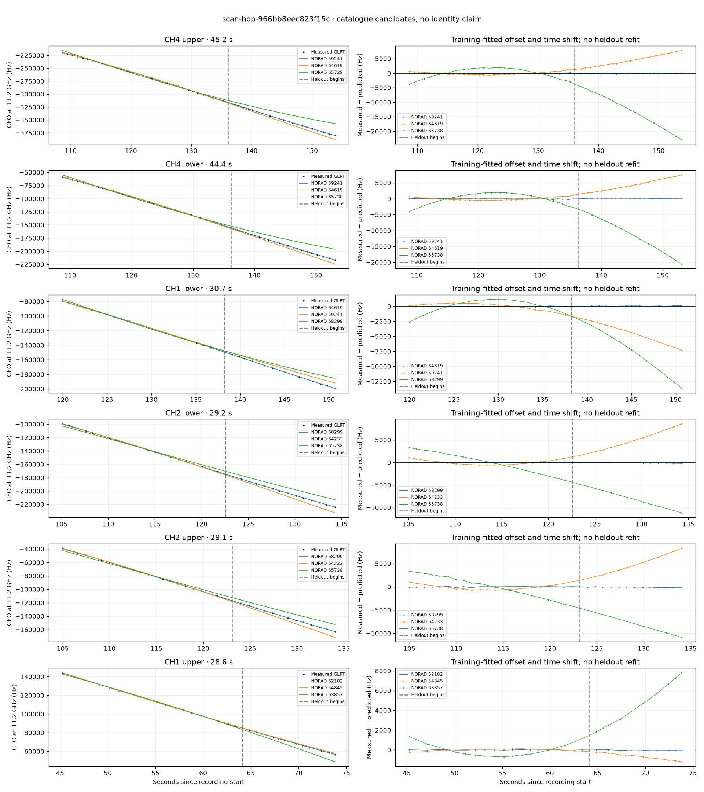

# scan-hop-966bb8eec823f15c

Recorded **2026-09-14T22:30:12.607184Z**, RX0, 10 MS/s.

**Candidates pass descriptive checks; no identification.** Candidates: 62182 (2 tracklets), 68299 (2 tracklets), 59241 (2 tracklets).

[Satellite RMS comparisons and top-1 gains](scan-hop-966bb8eec823f15c-candidates.md).

Counts are correlated lane tracklets, not independent detections or satellite counts. A recording can contain multiple transmitters; these are not one-label-per-file assignments.

Solid curves include a per-track constant carrier offset fitted on the first 60% of observations. The final 40% is held out. A close curve is not identity evidence by itself.

Catalogue: `sha256:d0d899a2d1da7811b03849396c03507e74e2de38d046edc9e068d12f2700ab20`. Orbital-only exclusions: STARLINK-34343 DEB (NORAD 69730; SGP4 [6]), STARLINK-37793 (NORAD 100286; SGP4 [1]).

| Lane | Recording seconds | Top 3 training NORADs | Train / heldout RMS (Hz) | Leader heldout rank | Assessment |
|---|---:|---|---:|---:|---|
| CH1 upper | 45.2–73.8 | 62182, 54845, 63857 | 20.6 / 50.0 | 1 | Passes descriptive checks; candidate only |
| CH1 lower | 47.5–73.3 | 62182, 54845, 63857 | 20.2 / 49.8 | 1 | Passes descriptive checks; candidate only |
| CH4 lower | 78.0–103.7 | 67618, 65738, 68299 | 54.1 / 130.2 | 1 | Passes descriptive checks; candidate only |
| CH2 upper | 105.0–134.1 | 68299, 64233, 65738 | 81.8 / 101.9 | 1 | Passes descriptive checks; candidate only |
| CH2 lower | 105.1–134.3 | 68299, 64233, 65738 | 47.1 / 120.4 | 1 | Passes descriptive checks; candidate only |
| CH4 upper | 108.6–153.8 | 59241, 64619, 65738 | 97.1 / 81.6 | 1 | Passes descriptive checks; candidate only |
| CH4 lower | 108.7–153.1 | 59241, 64619, 65738 | 82.9 / 39.7 | 1 | Passes descriptive checks; candidate only |
| CH1 lower | 119.9–150.7 | 64619, 59241, 68299 | 42.7 / 68.6 | 1 | Passes descriptive checks; candidate only |
| CH1 upper | 122.2–149.6 | 64619, 59241, 68299 | 36.9 / 56.9 | 1 | Passes descriptive checks; candidate only |

[Full candidate, control and measured-CFO evidence](scan-hop-966bb8eec823f15c.json.gz).
