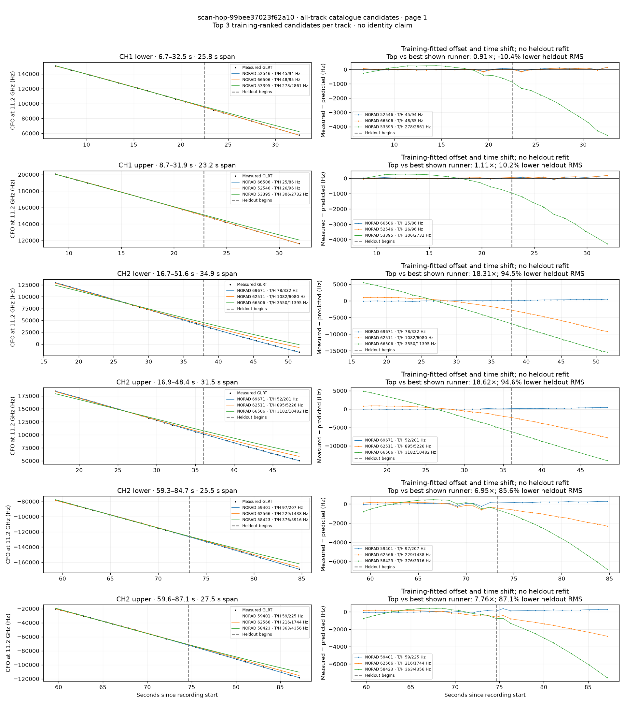
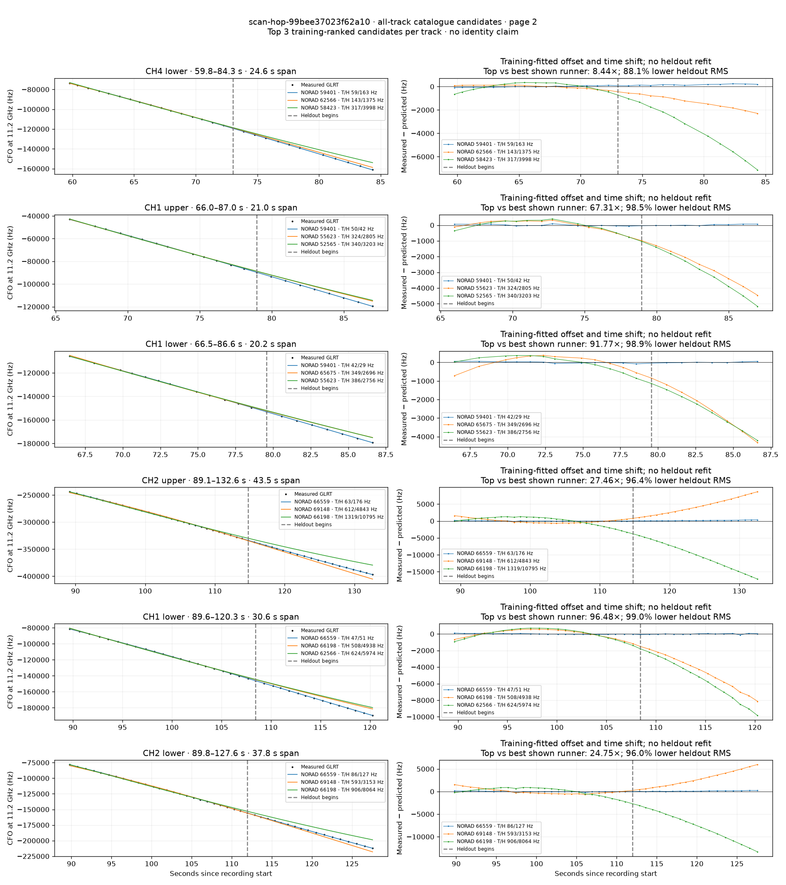
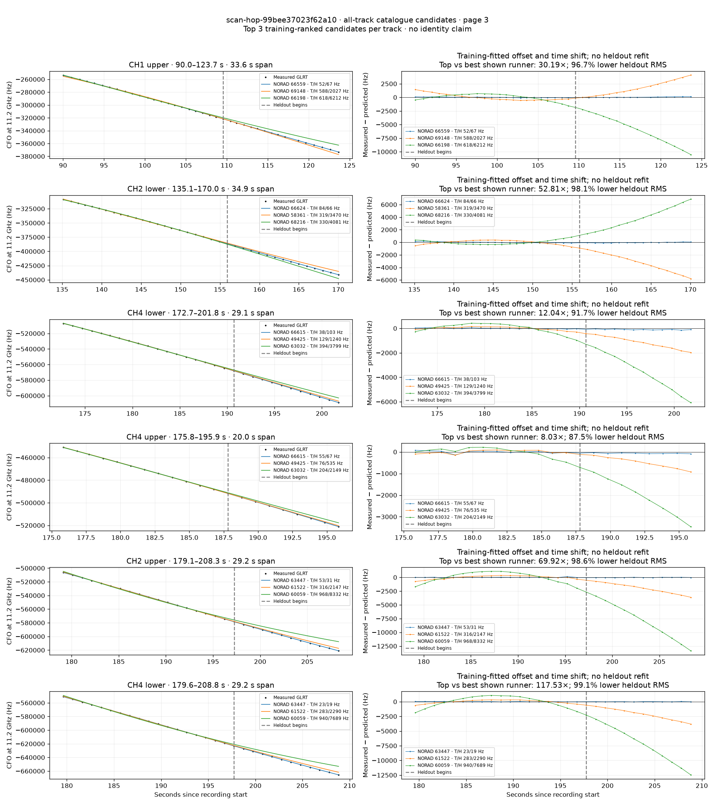
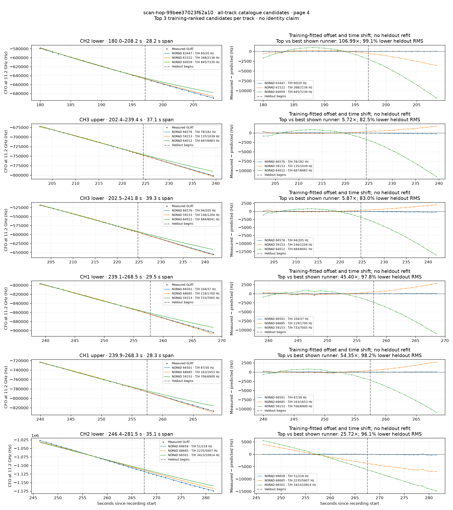
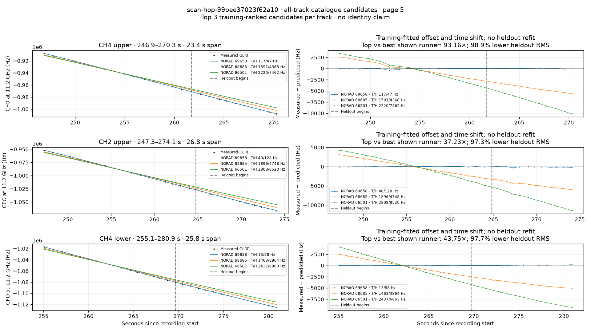

# All track overlays: scan-hop-99bee37023f62a10

Recorded **2026-09-14T17:00:12.924859Z**, RX0, 10 MS/s. All **27 eligible tracks** are shown in chronological order.

[Recording assessment](scan-hop-99bee37023f62a10.md) · [Candidate RMS and gains](scan-hop-99bee37023f62a10-candidates.md)

Each row matches the requested view: measured GLRT CFO and the top three training-ranked TLE curves on the left, residuals on the right. Offset and time shift are fitted only on the first 60%; the last 40% is held out. These are candidate diagnostics, not satellite identifications.

RMS cells below are `training / heldout` in Hz. Runner-up 1 and 2 are training ranks two and three. The gain compares the top TLE with whichever of those two has lower heldout RMS.

| Track | Top TLE, train / heldout RMS | Runner-up 1, train / heldout RMS | Runner-up 2, train / heldout RMS | Top vs best shown runner, heldout |
|---|---:|---:|---:|---:|
| CH1 lower, 6.7–32.5 s | STARLINK-3948 / 52546: 45.1 / 94.2 Hz | STARLINK-34765 / 66506: 48.2 / 85.4 Hz | STARLINK-4534 / 53395: 277.8 / 2861.4 Hz | 0.91× / -10.4% lower |
| CH1 upper, 8.7–31.9 s | STARLINK-34765 / 66506: 24.9 / 86.2 Hz | STARLINK-3948 / 52546: 25.5 / 96.0 Hz | STARLINK-4534 / 53395: 305.7 / 2732.4 Hz | 1.11× / 10.2% lower |
| CH2 lower, 16.7–51.6 s | STARLINK-37949 / 69671: 78.2 / 332.0 Hz | STARLINK-11452 / 62511: 1082.2 / 6080.0 Hz | STARLINK-34765 / 66506: 3550.3 / 11394.7 Hz | 18.31× / 94.5% lower |
| CH2 upper, 16.9–48.4 s | STARLINK-37949 / 69671: 52.3 / 280.6 Hz | STARLINK-11452 / 62511: 894.8 / 5225.8 Hz | STARLINK-34765 / 66506: 3181.9 / 10481.7 Hz | 18.62× / 94.6% lower |
| CH2 lower, 59.3–84.7 s | STARLINK-31507 / 59401: 97.3 / 207.0 Hz | STARLINK-11525 / 62566: 228.6 / 1437.7 Hz | STARLINK-30900 / 58423: 376.5 / 3915.6 Hz | 6.95× / 85.6% lower |
| CH2 upper, 59.6–87.1 s | STARLINK-31507 / 59401: 58.8 / 224.7 Hz | STARLINK-11525 / 62566: 216.0 / 1744.4 Hz | STARLINK-30900 / 58423: 363.4 / 4355.5 Hz | 7.76× / 87.1% lower |
| CH4 lower, 59.8–84.3 s | STARLINK-31507 / 59401: 59.3 / 162.9 Hz | STARLINK-11525 / 62566: 142.6 / 1375.0 Hz | STARLINK-30900 / 58423: 316.8 / 3998.0 Hz | 8.44× / 88.1% lower |
| CH1 upper, 66.0–87.0 s | STARLINK-31507 / 59401: 50.5 / 41.7 Hz | STARLINK-5698 / 55623: 324.1 / 2804.7 Hz | STARLINK-3911 / 52565: 340.1 / 3203.3 Hz | 67.31× / 98.5% lower |
| CH1 lower, 66.5–86.6 s | STARLINK-31507 / 59401: 42.4 / 29.4 Hz | STARLINK-34749 / 65675: 348.8 / 2695.9 Hz | STARLINK-5698 / 55623: 386.3 / 2755.5 Hz | 91.77× / 98.9% lower |
| CH2 upper, 89.1–132.6 s | STARLINK-35419 / 66559: 62.9 / 176.4 Hz | STARLINK-37395 / 69148: 611.6 / 4842.7 Hz | STARLINK-35518 / 66198: 1318.8 / 10795.0 Hz | 27.46× / 96.4% lower |
| CH1 lower, 89.6–120.3 s | STARLINK-35419 / 66559: 46.8 / 51.2 Hz | STARLINK-35518 / 66198: 507.7 / 4937.8 Hz | STARLINK-11525 / 62566: 624.5 / 5974.4 Hz | 96.48× / 99.0% lower |
| CH2 lower, 89.8–127.6 s | STARLINK-35419 / 66559: 86.2 / 127.4 Hz | STARLINK-37395 / 69148: 592.8 / 3153.2 Hz | STARLINK-35518 / 66198: 905.8 / 8064.2 Hz | 24.75× / 96.0% lower |
| CH1 upper, 90.0–123.7 s | STARLINK-35419 / 66559: 51.8 / 67.1 Hz | STARLINK-37395 / 69148: 588.3 / 2026.5 Hz | STARLINK-35518 / 66198: 618.5 / 6211.9 Hz | 30.19× / 96.7% lower |
| CH2 lower, 135.1–170.0 s | STARLINK-35927 / 66624: 84.1 / 65.7 Hz | STARLINK-30885 / 58361: 319.4 / 3469.6 Hz | STARLINK-37014 / 68216: 329.5 / 4080.8 Hz | 52.81× / 98.1% lower |
| CH4 lower, 172.7–201.8 s | STARLINK-35988 / 66615: 37.7 / 103.0 Hz | STARLINK-3139 / 49425: 129.0 / 1239.8 Hz | STARLINK-32776 / 63032: 394.0 / 3798.8 Hz | 12.04× / 91.7% lower |
| CH4 upper, 175.8–195.9 s | STARLINK-35988 / 66615: 54.8 / 66.6 Hz | STARLINK-3139 / 49425: 75.7 / 535.0 Hz | STARLINK-32776 / 63032: 203.7 / 2148.5 Hz | 8.03× / 87.5% lower |
| CH2 upper, 179.1–208.3 s | STARLINK-33799 / 63447: 53.1 / 30.7 Hz | STARLINK-32260 / 61522: 315.7 / 2147.5 Hz | STARLINK-11181 / 60059: 968.3 / 8332.3 Hz | 69.92× / 98.6% lower |
| CH4 lower, 179.6–208.8 s | STARLINK-33799 / 63447: 23.3 / 19.5 Hz | STARLINK-32260 / 61522: 283.0 / 2290.2 Hz | STARLINK-11181 / 60059: 939.8 / 7689.3 Hz | 117.53× / 99.1% lower |
| CH2 lower, 180.0–208.2 s | STARLINK-33799 / 63447: 60.1 / 20.0 Hz | STARLINK-32260 / 61522: 267.9 / 2135.5 Hz | STARLINK-11181 / 60059: 844.8 / 7230.0 Hz | 106.99× / 99.1% lower |
| CH3 upper, 202.4–239.4 s | STARLINK-35814 / 66576: 78.3 / 181.6 Hz | STARLINK-31308 / 59153: 135.3 / 1038.7 Hz | STARLINK-34078 / 64012: 686.7 / 6882.8 Hz | 5.72× / 82.5% lower |
| CH3 lower, 202.5–241.8 s | STARLINK-35814 / 66576: 94.0 / 205.2 Hz | STARLINK-31308 / 59153: 146.5 / 1204.4 Hz | STARLINK-34078 / 64012: 683.9 / 8040.8 Hz | 5.87× / 83.0% lower |
| CH1 lower, 239.1–268.5 s | STARLINK-35897 / 66501: 104.4 / 37.4 Hz | STARLINK-36278 / 68685: 219.0 / 1700.1 Hz | STARLINK-31308 / 59153: 733.2 / 7005.3 Hz | 45.40× / 97.8% lower |
| CH1 upper, 239.9–268.3 s | STARLINK-35897 / 66501: 87.2 / 30.4 Hz | STARLINK-36278 / 68685: 162.6 / 1653.3 Hz | STARLINK-31308 / 59153: 706.2 / 6899.6 Hz | 54.35× / 98.2% lower |
| CH2 lower, 246.4–281.5 s | STARLINK-37851 / 69658: 51.1 / 218.0 Hz | STARLINK-36278 / 68685: 2234.6 / 5607.0 Hz | STARLINK-35897 / 66501: 3423.0 / 10914.4 Hz | 25.72× / 96.1% lower |
| CH4 upper, 246.9–270.3 s | STARLINK-37851 / 69658: 117.2 / 46.9 Hz | STARLINK-36278 / 68685: 1590.5 / 4368.3 Hz | STARLINK-35897 / 66501: 2220.4 / 7462.4 Hz | 93.16× / 98.9% lower |
| CH2 upper, 247.3–274.1 s | STARLINK-37851 / 69658: 39.8 / 127.5 Hz | STARLINK-36278 / 68685: 1895.8 / 4748.2 Hz | STARLINK-35897 / 66501: 2808.2 / 8520.2 Hz | 37.23× / 97.3% lower |
| CH4 lower, 255.1–280.9 s | STARLINK-37851 / 69658: 13.4 / 88.3 Hz | STARLINK-36278 / 68685: 1463.3 / 3864.0 Hz | STARLINK-35897 / 66501: 2437.5 / 6862.6 Hz | 43.75× / 97.7% lower |

## Page 1

## Page 2

## Page 3

## Page 4

## Page 5

