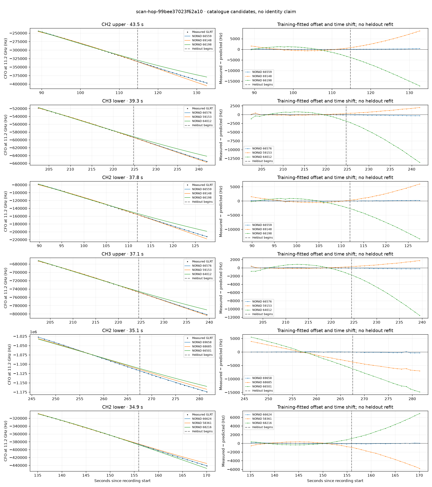

# scan-hop-99bee37023f62a10

Recorded **2026-09-14T17:00:12.924859Z**, RX0, 10 MS/s.

**Candidates pass descriptive checks; no identification.** Candidates: 59401 (5 tracklets), 66559 (4 tracklets), 69658 (4 tracklets).

[Satellite RMS comparisons and top-1 gains](scan-hop-99bee37023f62a10-candidates.md).

Counts are correlated lane tracklets, not independent detections or satellite counts. A recording can contain multiple transmitters; these are not one-label-per-file assignments.

Solid curves include a per-track constant carrier offset fitted on the first 60% of observations. The final 40% is held out. A close curve is not identity evidence by itself.

Catalogue: `sha256:f623da8623d574a387a40f84f1b4e813d76f1f993d2759f7aa9a8c002a1c272e`. Orbital-only exclusions: STARLINK-1770 (NORAD 46383; SGP4 []), STARLINK-34343 DEB (NORAD 69730; SGP4 [6]), STARLINK-37793 (NORAD 100286; SGP4 [6]).

| Lane | Recording seconds | Top 3 training NORADs | Train / heldout RMS (Hz) | Leader heldout rank | Assessment |
|---|---:|---|---:|---:|---|
| CH1 lower | 6.7–32.5 | 52546, 66506, 53395 | 45.1 / 94.2 | 2 | leader changes on heldout |
| CH1 upper | 8.7–31.9 | 66506, 52546, 53395 | 24.9 / 86.2 | 1 | Passes descriptive checks; candidate only |
| CH2 lower | 16.7–51.6 | 69671, 62511, 66506 | 78.2 / 332.0 | 1 | Passes descriptive checks; candidate only |
| CH2 upper | 16.9–48.4 | 69671, 62511, 66506 | 52.3 / 280.6 | 1 | Passes descriptive checks; candidate only |
| CH2 lower | 59.3–84.7 | 59401, 62566, 58423 | 97.3 / 207.0 | 1 | Passes descriptive checks; candidate only |
| CH2 upper | 59.6–87.1 | 59401, 62566, 58423 | 58.8 / 224.7 | 1 | Passes descriptive checks; candidate only |
| CH4 lower | 59.8–84.3 | 59401, 62566, 58423 | 59.3 / 162.9 | 1 | Passes descriptive checks; candidate only |
| CH1 upper | 66.0–87.0 | 59401, 55623, 52565 | 50.5 / 41.7 | 1 | Passes descriptive checks; candidate only |
| CH1 lower | 66.5–86.6 | 59401, 65675, 55623 | 42.4 / 29.4 | 1 | Passes descriptive checks; candidate only |
| CH2 upper | 89.1–132.6 | 66559, 69148, 66198 | 62.9 / 176.4 | 1 | Passes descriptive checks; candidate only |
| CH1 lower | 89.6–120.3 | 66559, 66198, 62566 | 46.8 / 51.2 | 1 | Passes descriptive checks; candidate only |
| CH2 lower | 89.8–127.6 | 66559, 69148, 66198 | 86.2 / 127.4 | 1 | Passes descriptive checks; candidate only |
| CH1 upper | 90.0–123.7 | 66559, 69148, 66198 | 51.8 / 67.1 | 1 | Passes descriptive checks; candidate only |
| CH2 lower | 135.1–170.0 | 66624, 58361, 68216 | 84.1 / 65.7 | 1 | Passes descriptive checks; candidate only |
| CH4 lower | 172.7–201.8 | 66615, 49425, 63032 | 37.7 / 103.0 | 1 | Passes descriptive checks; candidate only |
| CH4 upper | 175.8–195.9 | 66615, 49425, 63032 | 54.8 / 66.6 | 1 | Passes descriptive checks; candidate only |
| CH2 upper | 179.1–208.3 | 63447, 61522, 60059 | 53.1 / 30.7 | 1 | Passes descriptive checks; candidate only |
| CH2 lower | 180.0–208.2 | 63447, 61522, 60059 | 60.1 / 20.0 | 1 | Passes descriptive checks; candidate only |
| CH3 upper | 202.4–239.4 | 66576, 59153, 64012 | 78.3 / 181.6 | 1 | Passes descriptive checks; candidate only |
| CH3 lower | 202.5–241.8 | 66576, 59153, 64012 | 94.0 / 205.2 | 1 | Passes descriptive checks; candidate only |
| CH1 lower | 239.1–268.5 | 66501, 68685, 59153 | 104.4 / 37.4 | 1 | Passes descriptive checks; candidate only |
| CH1 upper | 239.9–268.3 | 66501, 68685, 59153 | 87.2 / 30.4 | 1 | Passes descriptive checks; candidate only |
| CH2 lower | 246.4–281.5 | 69658, 68685, 66501 | 51.1 / 218.0 | 1 | Passes descriptive checks; candidate only |
| CH4 upper | 246.9–270.3 | 69658, 68685, 66501 | 117.2 / 46.9 | 1 | Passes descriptive checks; candidate only |
| CH2 upper | 247.3–274.1 | 69658, 68685, 66501 | 39.8 / 127.5 | 1 | Passes descriptive checks; candidate only |
| CH4 lower | 255.1–280.9 | 69658, 68685, 66501 | 13.4 / 88.3 | 1 | Passes descriptive checks; candidate only |
| CH4 lower | 179.6–208.8 | 63447, 61522, 60059 | 23.3 / 19.5 | 1 | Passes descriptive checks; candidate only |

[Full candidate, control and measured-CFO evidence](scan-hop-99bee37023f62a10.json.gz).
