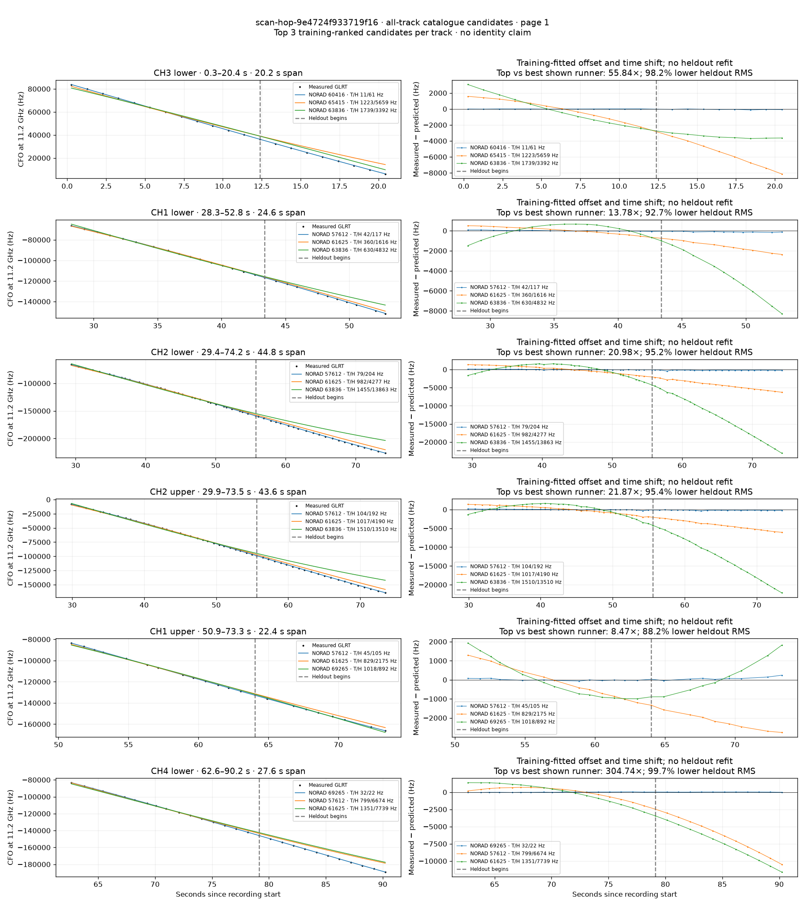
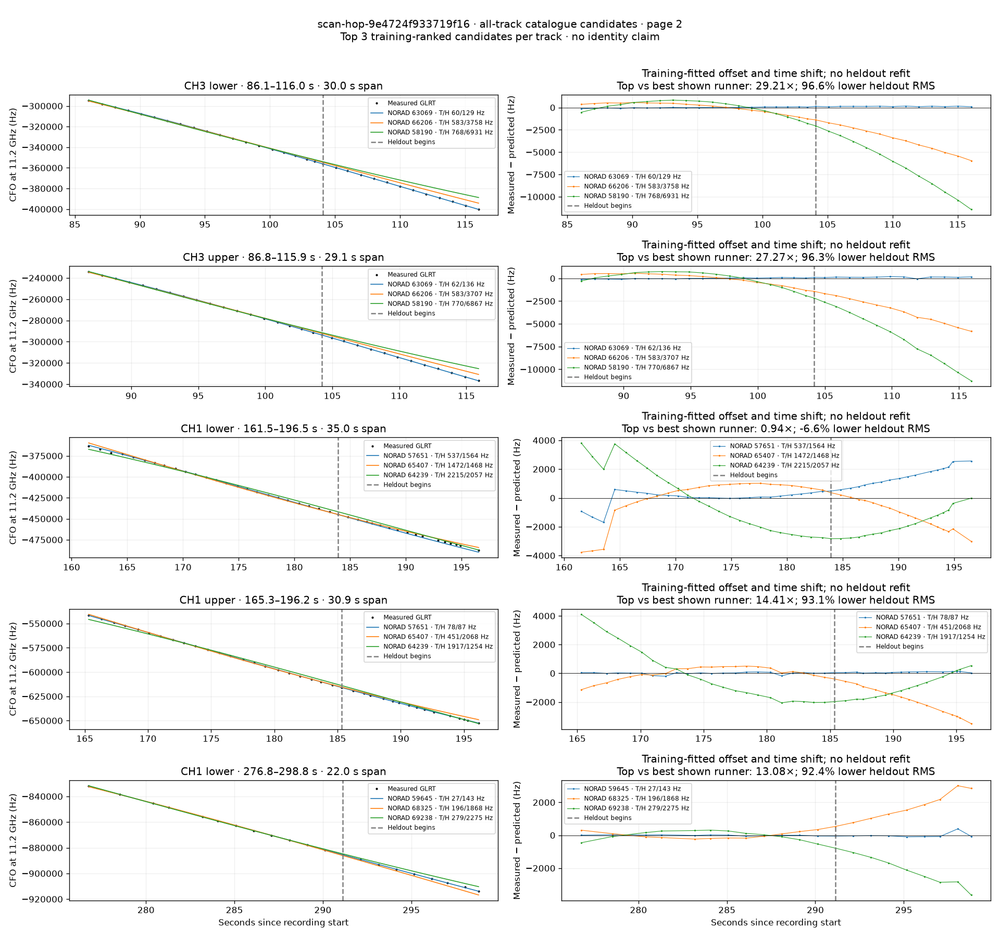

# All track overlays: scan-hop-9e4724f933719f16

Recorded **2026-09-14T23:00:12.633367Z**, RX0, 10 MS/s. All **11 eligible tracks** are shown in chronological order.

[Recording assessment](scan-hop-9e4724f933719f16.md) · [Candidate RMS and gains](scan-hop-9e4724f933719f16-candidates.md)

Each row matches the requested view: measured GLRT CFO and the top three training-ranked TLE curves on the left, residuals on the right. Offset and time shift are fitted only on the first 60%; the last 40% is held out. These are candidate diagnostics, not satellite identifications.

RMS cells below are `training / heldout` in Hz. Runner-up 1 and 2 are training ranks two and three. The gain compares the top TLE with whichever of those two has lower heldout RMS.

| Track | Top TLE, train / heldout RMS | Runner-up 1, train / heldout RMS | Runner-up 2, train / heldout RMS | Top vs best shown runner, heldout |
|---|---:|---:|---:|---:|
| CH3 lower, 0.3–20.4 s | STARLINK-32197 / 60416: 11.4 / 60.7 Hz | STARLINK-34238 / 65415: 1223.4 / 5659.1 Hz | STARLINK-34018 / 63836: 1739.1 / 3392.1 Hz | 55.84× / 98.2% lower |
| CH1 lower, 28.3–52.8 s | STARLINK-30245 / 57612: 41.9 / 117.3 Hz | STARLINK-32365 / 61625: 360.1 / 1615.7 Hz | STARLINK-34018 / 63836: 630.5 / 4832.1 Hz | 13.78× / 92.7% lower |
| CH2 lower, 29.4–74.2 s | STARLINK-30245 / 57612: 79.4 / 203.8 Hz | STARLINK-32365 / 61625: 982.3 / 4276.7 Hz | STARLINK-34018 / 63836: 1455.4 / 13863.2 Hz | 20.98× / 95.2% lower |
| CH2 upper, 29.9–73.5 s | STARLINK-30245 / 57612: 104.4 / 191.6 Hz | STARLINK-32365 / 61625: 1016.7 / 4190.0 Hz | STARLINK-34018 / 63836: 1509.9 / 13510.2 Hz | 21.87× / 95.4% lower |
| CH1 upper, 50.9–73.3 s | STARLINK-30245 / 57612: 44.7 / 105.3 Hz | STARLINK-32365 / 61625: 828.7 / 2174.8 Hz | STARLINK-37435 / 69265: 1018.3 / 891.9 Hz | 8.47× / 88.2% lower |
| CH4 lower, 62.6–90.2 s | STARLINK-37435 / 69265: 31.9 / 21.9 Hz | STARLINK-30245 / 57612: 798.9 / 6674.4 Hz | STARLINK-32365 / 61625: 1350.6 / 7739.4 Hz | 304.74× / 99.7% lower |
| CH3 lower, 86.1–116.0 s | STARLINK-33620 / 63069: 59.5 / 128.7 Hz | STARLINK-35748 / 66206: 583.2 / 3758.4 Hz | STARLINK-30820 / 58190: 768.5 / 6930.9 Hz | 29.21× / 96.6% lower |
| CH3 upper, 86.8–115.9 s | STARLINK-33620 / 63069: 61.6 / 135.9 Hz | STARLINK-35748 / 66206: 583.0 / 3707.0 Hz | STARLINK-30820 / 58190: 770.1 / 6867.3 Hz | 27.27× / 96.3% lower |
| CH1 lower, 161.5–196.5 s | STARLINK-30294 / 57651: 536.7 / 1563.7 Hz | STARLINK-35035 / 65407: 1472.1 / 1467.6 Hz | STARLINK-11683 / 64239: 2215.2 / 2057.4 Hz | 0.94× / -6.6% lower |
| CH1 upper, 165.3–196.2 s | STARLINK-30294 / 57651: 77.8 / 87.0 Hz | STARLINK-35035 / 65407: 451.2 / 2067.8 Hz | STARLINK-11683 / 64239: 1917.0 / 1253.8 Hz | 14.41× / 93.1% lower |
| CH1 lower, 276.8–298.8 s | STARLINK-31795 / 59645: 26.7 / 142.8 Hz | STARLINK-36309 / 68325: 196.4 / 1868.2 Hz | STARLINK-37665 / 69238: 279.3 / 2274.5 Hz | 13.08× / 92.4% lower |

## Page 1

## Page 2

