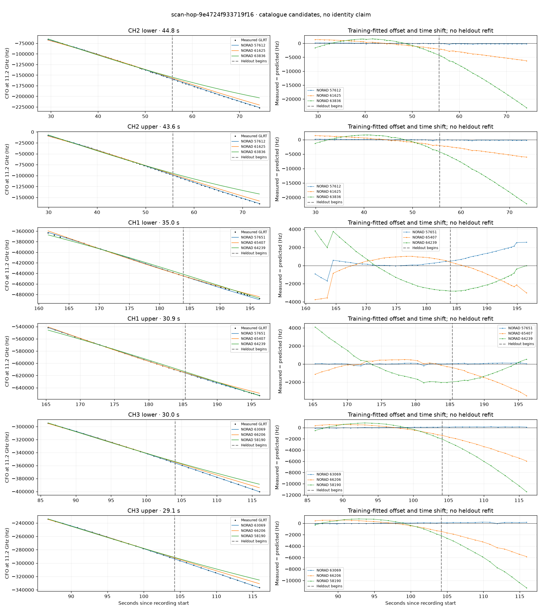

# scan-hop-9e4724f933719f16

Recorded **2026-09-14T23:00:12.633367Z**, RX0, 10 MS/s.

**Candidates pass descriptive checks; no identification.** Candidates: 57612 (4 tracklets), 63069 (2 tracklets), 60416 (1 tracklets).

Counts are correlated lane tracklets, not independent detections or satellite counts. A recording can contain multiple transmitters; these are not one-label-per-file assignments.

Solid curves include a per-track constant carrier offset fitted on the first 60% of observations. The final 40% is held out. A close curve is not identity evidence by itself.

Catalogue: `sha256:d0d899a2d1da7811b03849396c03507e74e2de38d046edc9e068d12f2700ab20`. Orbital-only exclusions: STARLINK-34343 DEB (NORAD 69730; SGP4 [6]), STARLINK-37793 (NORAD 100286; SGP4 [1]).

| Lane | Recording seconds | Top 3 training NORADs | Train / heldout RMS (Hz) | Leader heldout rank | Assessment |
|---|---:|---|---:|---:|---|
| CH3 lower | 0.3–20.4 | 60416, 65415, 63836 | 11.4 / 60.7 | 1 | Passes descriptive checks; candidate only |
| CH1 lower | 28.3–52.8 | 57612, 61625, 63836 | 41.9 / 117.3 | 1 | Passes descriptive checks; candidate only |
| CH2 lower | 29.4–74.2 | 57612, 61625, 63836 | 79.4 / 203.8 | 1 | Passes descriptive checks; candidate only |
| CH2 upper | 29.9–73.5 | 57612, 61625, 63836 | 104.4 / 191.6 | 1 | Passes descriptive checks; candidate only |
| CH1 upper | 50.9–73.3 | 57612, 61625, 69265 | 44.7 / 105.3 | 1 | Passes descriptive checks; candidate only |
| CH4 lower | 62.6–90.2 | 69265, 57612, 61625 | 31.9 / 21.9 | 1 | Passes descriptive checks; candidate only |
| CH3 lower | 86.1–116.0 | 63069, 66206, 58190 | 59.5 / 128.7 | 1 | Passes descriptive checks; candidate only |
| CH3 upper | 86.8–115.9 | 63069, 66206, 58190 | 61.6 / 135.9 | 1 | Passes descriptive checks; candidate only |
| CH1 lower | 161.5–196.5 | 57651, 65407, 64239 | 536.7 / 1563.7 | 2 | leader changes on heldout; time-shift boundary; radio drift fits as well or better; -500s control fits as well or better |
| CH1 upper | 165.3–196.2 | 57651, 65407, 64239 | 77.8 / 87.0 | 1 | Passes descriptive checks; candidate only |
| CH1 lower | 276.8–298.8 | 59645, 68325, 69238 | 26.7 / 142.8 | 1 | Passes descriptive checks; candidate only |

[Full candidate, control and measured-CFO evidence](scan-hop-9e4724f933719f16.json.gz).
