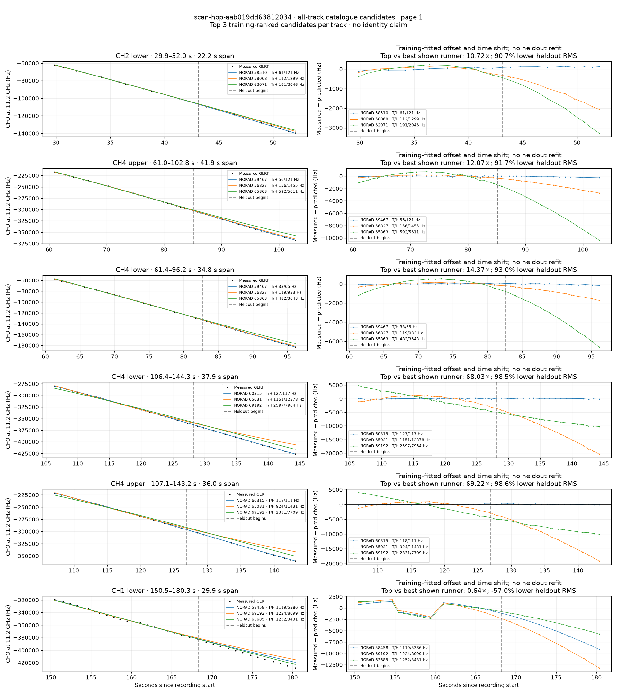
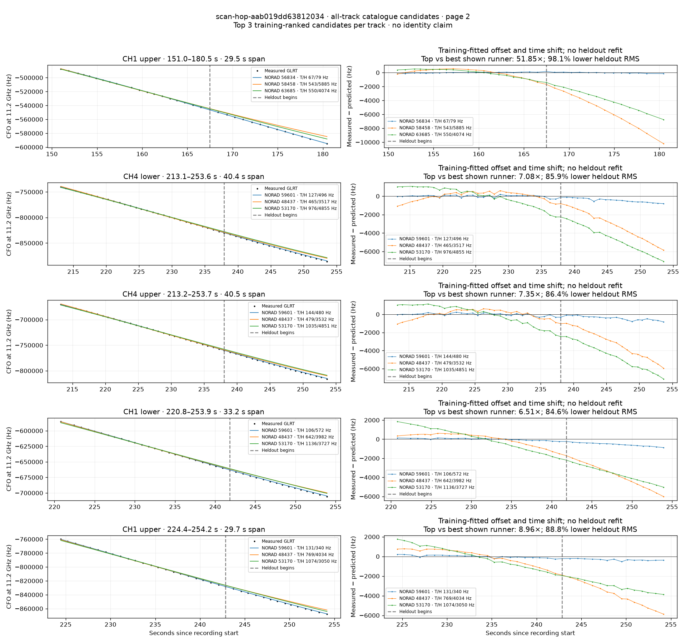

# All track overlays: scan-hop-aab019dd63812034

Recorded **2026-09-14T20:00:12.557912Z**, RX0, 10 MS/s. All **11 eligible tracks** are shown in chronological order.

[Recording assessment](scan-hop-aab019dd63812034.md) · [Candidate RMS and gains](scan-hop-aab019dd63812034-candidates.md)

Each row matches the requested view: measured GLRT CFO and the top three training-ranked TLE curves on the left, residuals on the right. Offset and time shift are fitted only on the first 60%; the last 40% is held out. These are candidate diagnostics, not satellite identifications.

RMS cells below are `training / heldout` in Hz. Runner-up 1 and 2 are training ranks two and three. The gain compares the top TLE with whichever of those two has lower heldout RMS.

| Track | Top TLE, train / heldout RMS | Runner-up 1, train / heldout RMS | Runner-up 2, train / heldout RMS | Top vs best shown runner, heldout |
|---|---:|---:|---:|---:|
| CH2 lower, 29.9–52.0 s | STARLINK-30989 / 58510: 60.6 / 121.2 Hz | STARLINK-30569 / 58068: 112.0 / 1299.0 Hz | STARLINK-32553 / 62071: 191.3 / 2046.3 Hz | 10.72× / 90.7% lower |
| CH4 upper, 61.0–102.8 s | STARLINK-31592 / 59467: 56.2 / 120.5 Hz | STARLINK-30151 / 56827: 155.6 / 1455.1 Hz | STARLINK-35469 / 65863: 592.4 / 5611.5 Hz | 12.07× / 91.7% lower |
| CH4 lower, 61.4–96.2 s | STARLINK-31592 / 59467: 32.7 / 65.0 Hz | STARLINK-30151 / 56827: 119.5 / 933.4 Hz | STARLINK-35469 / 65863: 481.5 / 3643.1 Hz | 14.37× / 93.0% lower |
| CH4 lower, 106.4–144.3 s | STARLINK-32194 / 60315: 127.1 / 117.1 Hz | STARLINK-34677 / 65031: 1150.6 / 12378.3 Hz | STARLINK-37424 / 69192: 2596.6 / 7964.2 Hz | 68.03× / 98.5% lower |
| CH4 upper, 107.1–143.2 s | STARLINK-32194 / 60315: 118.2 / 111.4 Hz | STARLINK-34677 / 65031: 924.3 / 11431.1 Hz | STARLINK-37424 / 69192: 2331.1 / 7708.7 Hz | 69.22× / 98.6% lower |
| CH1 lower, 150.5–180.3 s | STARLINK-30962 / 58458: 1119.0 / 5385.5 Hz | STARLINK-37424 / 69192: 1224.2 / 8099.1 Hz | STARLINK-33847 / 63685: 1252.4 / 3430.5 Hz | 0.64× / -57.0% lower |
| CH1 upper, 151.0–180.5 s | STARLINK-30069 / 56834: 67.4 / 78.6 Hz | STARLINK-30962 / 58458: 543.3 / 5884.9 Hz | STARLINK-33847 / 63685: 550.3 / 4073.9 Hz | 51.85× / 98.1% lower |
| CH4 lower, 213.1–253.6 s | STARLINK-31770 / 59601: 127.2 / 496.5 Hz | STARLINK-2642 / 48437: 464.9 / 3517.1 Hz | STARLINK-4095 / 53170: 975.9 / 4854.6 Hz | 7.08× / 85.9% lower |
| CH4 upper, 213.2–253.7 s | STARLINK-31770 / 59601: 144.2 / 480.3 Hz | STARLINK-2642 / 48437: 478.9 / 3531.9 Hz | STARLINK-4095 / 53170: 1035.2 / 4850.7 Hz | 7.35× / 86.4% lower |
| CH1 lower, 220.8–253.9 s | STARLINK-31770 / 59601: 106.1 / 572.4 Hz | STARLINK-2642 / 48437: 642.0 / 3981.9 Hz | STARLINK-4095 / 53170: 1136.3 / 3727.5 Hz | 6.51× / 84.6% lower |
| CH1 upper, 224.4–254.2 s | STARLINK-31770 / 59601: 131.1 / 340.5 Hz | STARLINK-2642 / 48437: 769.0 / 4033.6 Hz | STARLINK-4095 / 53170: 1074.5 / 3050.4 Hz | 8.96× / 88.8% lower |

## Page 1

## Page 2

