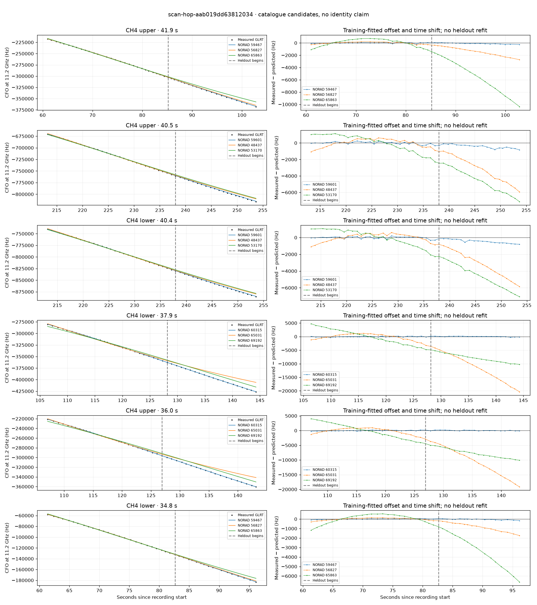

# scan-hop-aab019dd63812034

Recorded **2026-09-14T20:00:12.557912Z**, RX0, 10 MS/s.

**Candidates pass descriptive checks; no identification.** Candidates: 59601 (4 tracklets), 60315 (2 tracklets), 56834 (1 tracklets).

[Satellite RMS comparisons and top-1 gains](scan-hop-aab019dd63812034-candidates.md).

[Measured CFO/TLE overlays for every track](scan-hop-aab019dd63812034-all-tracks.md).

Counts are correlated lane tracklets, not independent detections or satellite counts. A recording can contain multiple transmitters; these are not one-label-per-file assignments.

Solid curves include a per-track constant carrier offset fitted on the first 60% of observations. The final 40% is held out. A close curve is not identity evidence by itself.

Catalogue: `sha256:4b2095c8131c06da613b154fc073602a412fc2bfa0847667b2c078799384e2ac`. Orbital-only exclusions: STARLINK-1770 (NORAD 46383; SGP4 []).

| Lane | Recording seconds | Top 3 training NORADs | Train / heldout RMS (Hz) | Leader heldout rank | Assessment |
|---|---:|---|---:|---:|---|
| CH2 lower | 29.9–52.0 | 58510, 58068, 62071 | 60.6 / 121.2 | 1 | -500s control fits as well or better; 500s control fits as well or better |
| CH4 upper | 61.0–102.8 | 59467, 56827, 65863 | 56.2 / 120.5 | 1 | 500s control fits as well or better |
| CH4 lower | 61.4–96.2 | 59467, 56827, 65863 | 32.7 / 65.0 | 1 | 500s control fits as well or better |
| CH4 lower | 106.4–144.3 | 60315, 65031, 69192 | 127.1 / 117.1 | 1 | Passes descriptive checks; candidate only |
| CH4 upper | 107.1–143.2 | 60315, 65031, 69192 | 118.2 / 111.4 | 1 | Passes descriptive checks; candidate only |
| CH1 lower | 150.5–180.3 | 58458, 69192, 63685 | 1119.0 / 5385.5 | 5 | leader changes on heldout; time-shift boundary; radio drift fits as well or better |
| CH1 upper | 151.0–180.5 | 56834, 58458, 63685 | 67.4 / 78.6 | 1 | Passes descriptive checks; candidate only |
| CH4 lower | 213.1–253.6 | 59601, 48437, 53170 | 127.2 / 496.5 | 1 | Passes descriptive checks; candidate only |
| CH4 upper | 213.2–253.7 | 59601, 48437, 53170 | 144.2 / 480.3 | 1 | Passes descriptive checks; candidate only |
| CH1 lower | 220.8–253.9 | 59601, 48437, 53170 | 106.1 / 572.4 | 1 | Passes descriptive checks; candidate only |
| CH1 upper | 224.4–254.2 | 59601, 48437, 53170 | 131.1 / 340.5 | 1 | Passes descriptive checks; candidate only |

[Full candidate, control and measured-CFO evidence](scan-hop-aab019dd63812034.json.gz).
