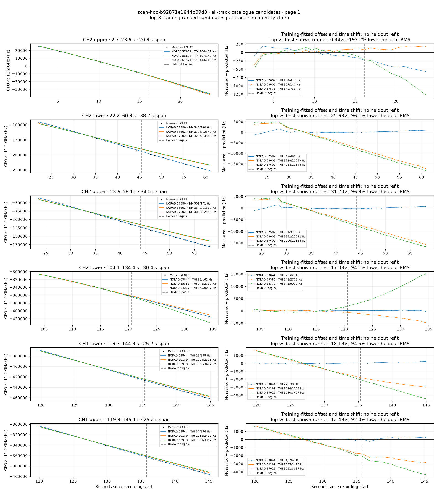
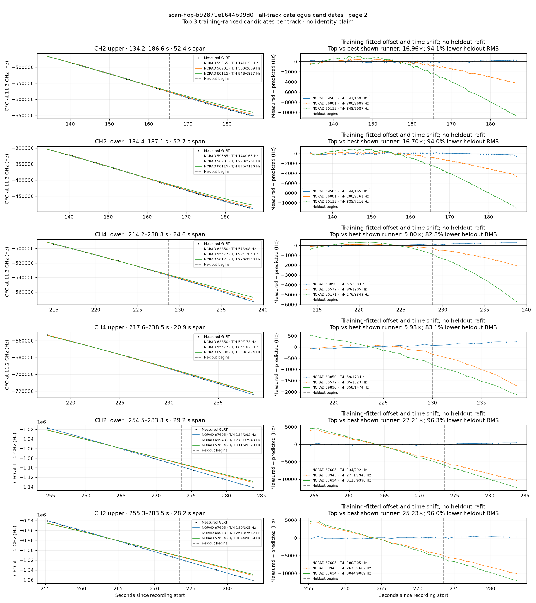

# All track overlays: scan-hop-b92871e1644b09d0

Recorded **2026-09-14T18:20:12.980561Z**, RX0, 10 MS/s. All **12 eligible tracks** are shown in chronological order.

[Recording assessment](scan-hop-b92871e1644b09d0.md) · [Candidate RMS and gains](scan-hop-b92871e1644b09d0-candidates.md)

Each row matches the requested view: measured GLRT CFO and the top three training-ranked TLE curves on the left, residuals on the right. Offset and time shift are fitted only on the first 60%; the last 40% is held out. These are candidate diagnostics, not satellite identifications.

RMS cells below are `training / heldout` in Hz. Runner-up 1 and 2 are training ranks two and three. The gain compares the top TLE with whichever of those two has lower heldout RMS.

| Track | Top TLE, train / heldout RMS | Runner-up 1, train / heldout RMS | Runner-up 2, train / heldout RMS | Top vs best shown runner, heldout |
|---|---:|---:|---:|---:|
| CH2 upper, 2.7–23.6 s | STARLINK-30166 / 57602: 104.1 / 411.2 Hz | STARLINK-31071 / 58602: 107.3 / 140.3 Hz | STARLINK-36578 / 67571: 142.9 / 766.5 Hz | 0.34× / -193.2% lower |
| CH2 lower, 22.2–60.9 s | STARLINK-36641 / 67589: 548.6 / 489.7 Hz | STARLINK-31071 / 58602: 3728.3 / 12549.4 Hz | STARLINK-30166 / 57602: 4254.5 / 13542.5 Hz | 25.63× / 96.1% lower |
| CH2 upper, 23.6–58.1 s | STARLINK-36641 / 67589: 501.4 / 371.5 Hz | STARLINK-31071 / 58602: 3341.5 / 11591.9 Hz | STARLINK-30166 / 57602: 3806.2 / 12558.3 Hz | 31.20× / 96.8% lower |
| CH2 lower, 104.1–134.4 s | STARLINK-34041 / 63844: 82.1 / 161.6 Hz | STARLINK-5767 / 55586: 241.4 / 2752.4 Hz | STARLINK-11742 / 64377: 545.1 / 9016.7 Hz | 17.03× / 94.1% lower |
| CH1 lower, 119.7–144.9 s | STARLINK-34041 / 63844: 21.8 / 137.6 Hz | STARLINK-3276 / 50189: 1023.5 / 2502.8 Hz | STARLINK-35516 / 65918: 1050.2 / 3407.0 Hz | 18.19× / 94.5% lower |
| CH1 upper, 119.9–145.1 s | STARLINK-34041 / 63844: 34.2 / 194.3 Hz | STARLINK-3276 / 50189: 1035.4 / 2426.3 Hz | STARLINK-35516 / 65918: 1081.3 / 3357.0 Hz | 12.49× / 92.0% lower |
| CH2 upper, 134.2–186.6 s | STARLINK-31388 / 59565: 140.5 / 158.6 Hz | STARLINK-6185 / 56901: 300.4 / 2689.4 Hz | STARLINK-11112 / 60115: 848.3 / 6986.8 Hz | 16.96× / 94.1% lower |
| CH2 lower, 134.4–187.1 s | STARLINK-31388 / 59565: 143.6 / 165.4 Hz | STARLINK-6185 / 56901: 289.8 / 2760.9 Hz | STARLINK-11112 / 60115: 834.8 / 7115.5 Hz | 16.70× / 94.0% lower |
| CH4 lower, 214.2–238.8 s | STARLINK-33958 / 63850: 56.8 / 207.7 Hz | STARLINK-5752 / 55577: 99.2 / 1204.6 Hz | STARLINK-3286 / 50171: 275.9 / 3342.9 Hz | 5.80× / 82.8% lower |
| CH4 upper, 217.6–238.5 s | STARLINK-33958 / 63850: 58.9 / 172.5 Hz | STARLINK-5752 / 55577: 85.4 / 1023.2 Hz | STARLINK-37621 / 69830: 357.6 / 1474.3 Hz | 5.93× / 83.1% lower |
| CH2 lower, 254.5–283.8 s | STARLINK-36281 / 67605: 134.3 / 291.9 Hz | STARLINK-37886 / 69943: 2731.0 / 7943.3 Hz | STARLINK-30323 / 57634: 3115.0 / 9398.1 Hz | 27.21× / 96.3% lower |
| CH2 upper, 255.3–283.5 s | STARLINK-36281 / 67605: 179.8 / 304.5 Hz | STARLINK-37886 / 69943: 2673.4 / 7682.1 Hz | STARLINK-30323 / 57634: 3043.7 / 9089.0 Hz | 25.23× / 96.0% lower |

## Page 1

## Page 2

