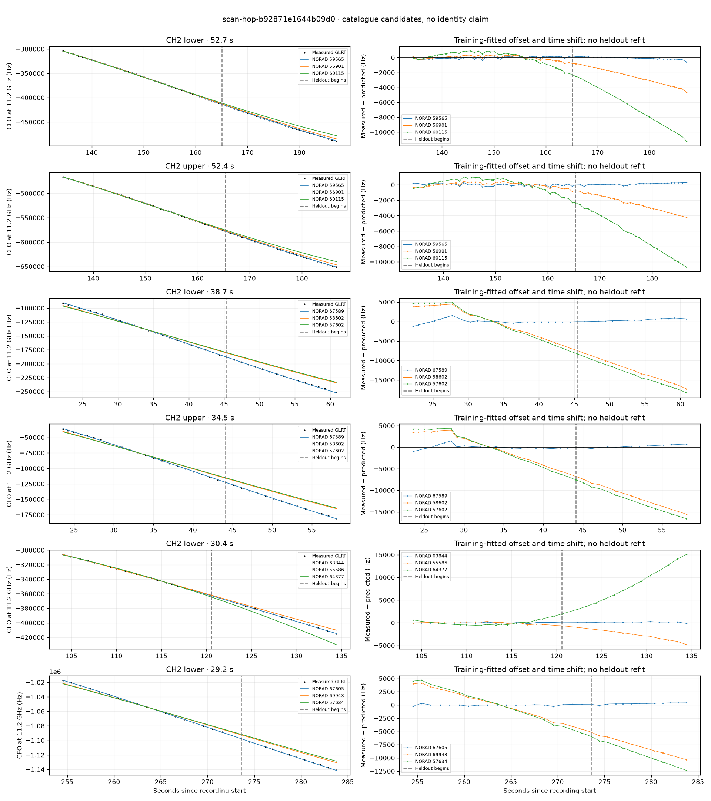

# scan-hop-b92871e1644b09d0

Recorded **2026-09-14T18:20:12.980561Z**, RX0, 10 MS/s.

**Candidates pass descriptive checks; no identification.** Candidates: 63844 (3 tracklets), 67589 (2 tracklets), 67605 (2 tracklets).

[Satellite RMS comparisons and top-1 gains](scan-hop-b92871e1644b09d0-candidates.md).

[Measured CFO/TLE overlays for every track](scan-hop-b92871e1644b09d0-all-tracks.md).

Counts are correlated lane tracklets, not independent detections or satellite counts. A recording can contain multiple transmitters; these are not one-label-per-file assignments.

Solid curves include a per-track constant carrier offset fitted on the first 60% of observations. The final 40% is held out. A close curve is not identity evidence by itself.

Catalogue: `sha256:f027c02cbe99846bc1b1e0b5a10d35c7fe22c60b64c3ddd0a6bf0efe667659cd`. Orbital-only exclusions: STARLINK-1770 (NORAD 46383; SGP4 []), STARLINK-34343 DEB (NORAD 69730; SGP4 [6]), STARLINK-37793 (NORAD 100286; SGP4 [6]).

| Lane | Recording seconds | Top 3 training NORADs | Train / heldout RMS (Hz) | Leader heldout rank | Assessment |
|---|---:|---|---:|---:|---|
| CH2 lower | 22.2–60.9 | 67589, 58602, 57602 | 548.6 / 489.7 | 1 | Passes descriptive checks; candidate only |
| CH2 upper | 23.6–58.1 | 67589, 58602, 57602 | 501.4 / 371.5 | 1 | Passes descriptive checks; candidate only |
| CH1 lower | 119.7–144.9 | 63844, 50189, 65918 | 21.8 / 137.6 | 1 | Passes descriptive checks; candidate only |
| CH1 upper | 119.9–145.1 | 63844, 50189, 65918 | 34.2 / 194.3 | 1 | Passes descriptive checks; candidate only |
| CH2 upper | 134.2–186.6 | 59565, 56901, 60115 | 140.5 / 158.6 | 1 | Passes descriptive checks; candidate only |
| CH2 lower | 134.4–187.1 | 59565, 56901, 60115 | 143.6 / 165.4 | 1 | -500s control fits as well or better |
| CH4 lower | 214.2–238.8 | 63850, 55577, 50171 | 56.8 / 207.7 | 1 | -500s control fits as well or better; 500s control fits as well or better |
| CH4 upper | 217.6–238.5 | 63850, 55577, 69830 | 58.9 / 172.5 | 1 | -500s control fits as well or better; 500s control fits as well or better |
| CH2 lower | 254.5–283.8 | 67605, 69943, 57634 | 134.3 / 291.9 | 1 | Passes descriptive checks; candidate only |
| CH2 upper | 255.3–283.5 | 67605, 69943, 57634 | 179.8 / 304.5 | 1 | Passes descriptive checks; candidate only |
| CH2 upper | 2.7–23.6 | 57602, 58602, 67571 | 104.1 / 411.2 | 2 | leader changes on heldout; radio drift fits as well or better; -500s control fits as well or better |
| CH2 lower | 104.1–134.4 | 63844, 55586, 64377 | 82.1 / 161.6 | 1 | Passes descriptive checks; candidate only |

[Full candidate, control and measured-CFO evidence](scan-hop-b92871e1644b09d0.json.gz).
