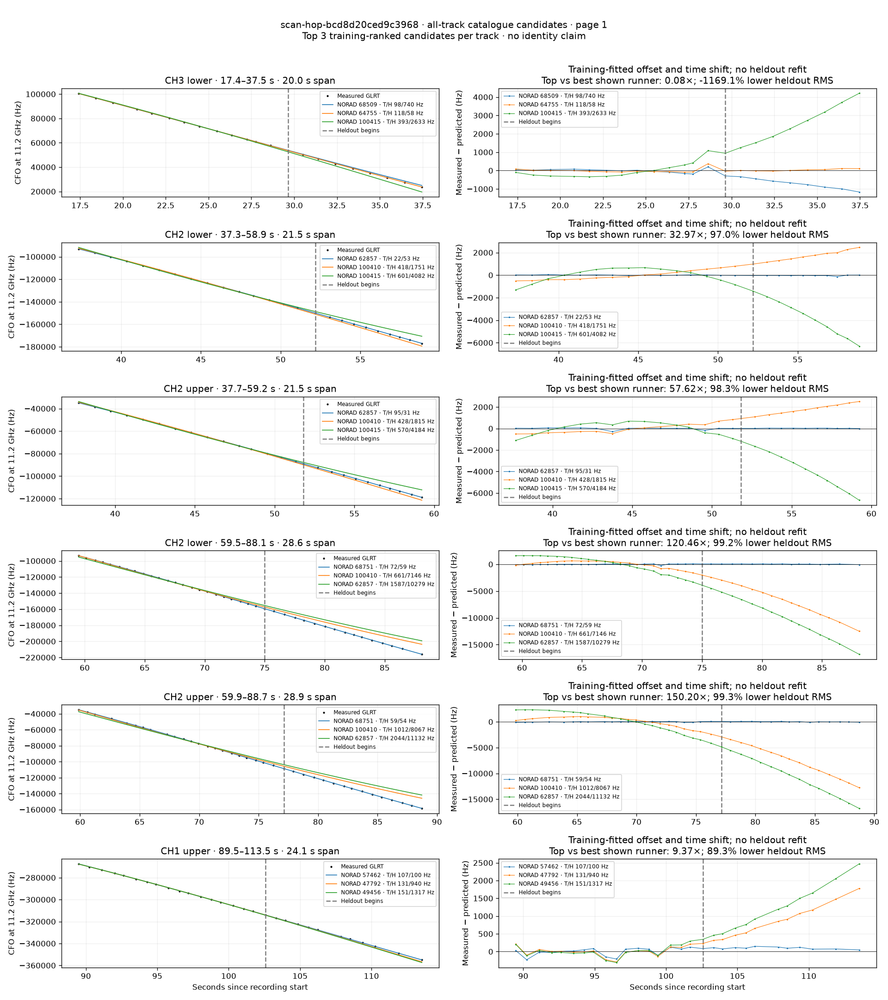
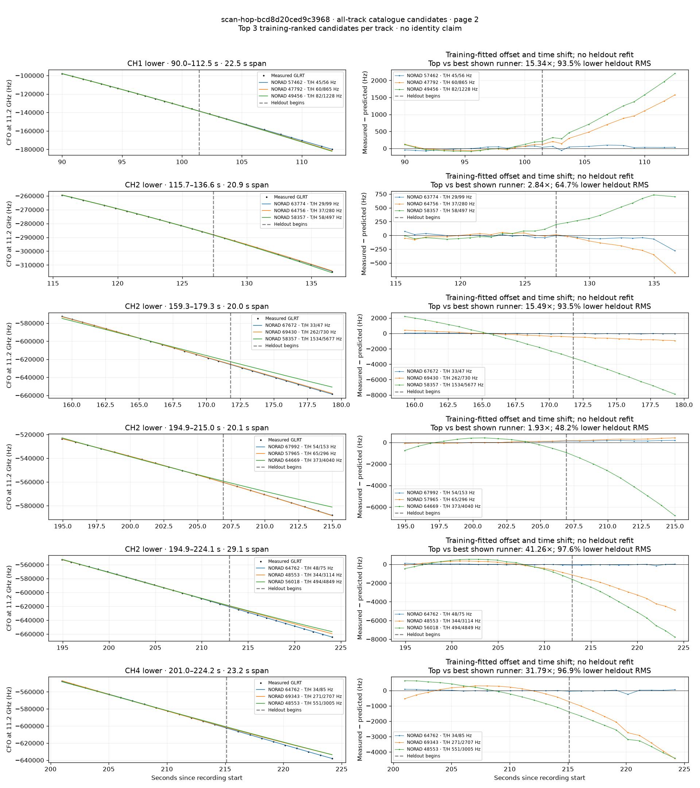
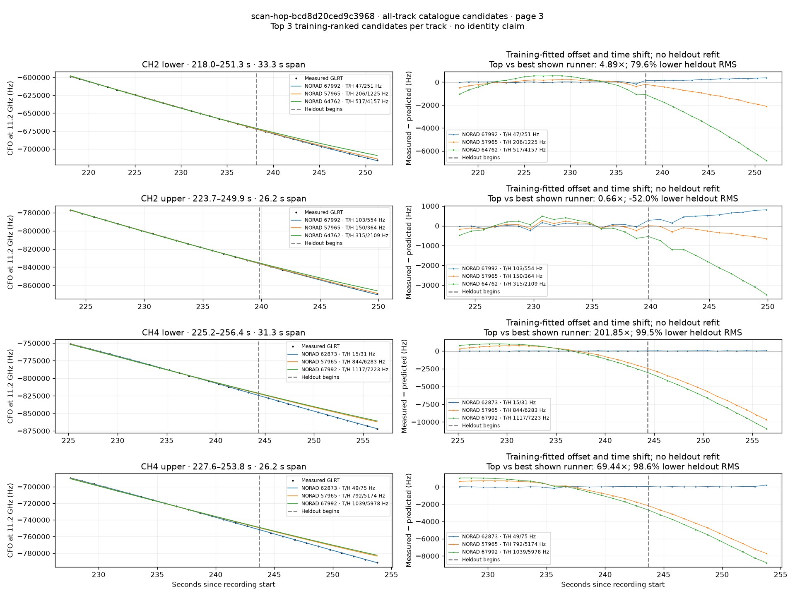

# All track overlays: scan-hop-bcd8d20ced9c3968

Recorded **2026-09-14T16:10:12.539968Z**, RX0, 10 MS/s. All **16 eligible tracks** are shown in chronological order.

[Recording assessment](scan-hop-bcd8d20ced9c3968.md) · [Candidate RMS and gains](scan-hop-bcd8d20ced9c3968-candidates.md)

Each row matches the requested view: measured GLRT CFO and the top three training-ranked TLE curves on the left, residuals on the right. Offset and time shift are fitted only on the first 60%; the last 40% is held out. These are candidate diagnostics, not satellite identifications.

RMS cells below are `training / heldout` in Hz. Runner-up 1 and 2 are training ranks two and three. The gain compares the top TLE with whichever of those two has lower heldout RMS.

| Track | Top TLE, train / heldout RMS | Runner-up 1, train / heldout RMS | Runner-up 2, train / heldout RMS | Top vs best shown runner, heldout |
|---|---:|---:|---:|---:|
| CH3 lower, 17.4–37.5 s | STARLINK-36292 / 68509: 97.5 / 740.1 Hz | STARLINK-33965 / 64755: 117.7 / 58.3 Hz | STARLINK-37762 / 100415: 393.0 / 2633.1 Hz | 0.08× / -1169.1% lower |
| CH2 lower, 37.3–58.9 s | STARLINK-32873 / 62857: 21.9 / 53.1 Hz | STARLINK-37996 / 100410: 417.6 / 1750.6 Hz | STARLINK-37762 / 100415: 601.1 / 4082.0 Hz | 32.97× / 97.0% lower |
| CH2 upper, 37.7–59.2 s | STARLINK-32873 / 62857: 95.3 / 31.5 Hz | STARLINK-37996 / 100410: 427.8 / 1814.5 Hz | STARLINK-37762 / 100415: 570.2 / 4183.9 Hz | 57.62× / 98.3% lower |
| CH2 lower, 59.5–88.1 s | STARLINK-37277 / 68751: 72.0 / 59.3 Hz | STARLINK-37996 / 100410: 661.3 / 7145.7 Hz | STARLINK-32873 / 62857: 1587.0 / 10279.3 Hz | 120.46× / 99.2% lower |
| CH2 upper, 59.9–88.7 s | STARLINK-37277 / 68751: 59.0 / 53.7 Hz | STARLINK-37996 / 100410: 1012.2 / 8067.4 Hz | STARLINK-32873 / 62857: 2044.1 / 11131.7 Hz | 150.20× / 99.3% lower |
| CH1 upper, 89.5–113.5 s | STARLINK-30088 / 57462: 107.3 / 100.3 Hz | STARLINK-2334 / 47792: 130.8 / 940.1 Hz | STARLINK-3124 / 49456: 151.4 / 1316.8 Hz | 9.37× / 89.3% lower |
| CH1 lower, 90.0–112.5 s | STARLINK-30088 / 57462: 45.3 / 56.3 Hz | STARLINK-2334 / 47792: 60.2 / 864.6 Hz | STARLINK-3124 / 49456: 82.2 / 1228.0 Hz | 15.34× / 93.5% lower |
| CH2 lower, 115.7–136.6 s | STARLINK-33914 / 63774: 29.2 / 98.8 Hz | STARLINK-34371 / 64756: 37.0 / 280.3 Hz | STARLINK-30842 / 58357: 58.4 / 497.0 Hz | 2.84× / 64.7% lower |
| CH2 lower, 159.3–179.3 s | STARLINK-36616 / 67672: 33.3 / 47.1 Hz | STARLINK-37866 / 69430: 262.1 / 729.7 Hz | STARLINK-30842 / 58357: 1534.3 / 5677.3 Hz | 15.49× / 93.5% lower |
| CH2 lower, 194.9–215.0 s | STARLINK-36950 / 67992: 54.1 / 153.1 Hz | STARLINK-30524 / 57965: 65.0 / 295.7 Hz | STARLINK-34394 / 64669: 373.5 / 4039.8 Hz | 1.93× / 48.2% lower |
| CH2 lower, 194.9–224.1 s | STARLINK-34638 / 64762: 48.3 / 75.5 Hz | STARLINK-2063 / 48553: 343.8 / 3114.4 Hz | STARLINK-5945 / 56018: 494.1 / 4849.2 Hz | 41.26× / 97.6% lower |
| CH4 lower, 201.0–224.2 s | STARLINK-34638 / 64762: 34.3 / 85.2 Hz | STARLINK-37776 / 69343: 270.9 / 2706.7 Hz | STARLINK-2063 / 48553: 550.7 / 3005.1 Hz | 31.79× / 96.9% lower |
| CH2 lower, 218.0–251.3 s | STARLINK-36950 / 67992: 46.6 / 250.5 Hz | STARLINK-30524 / 57965: 206.0 / 1225.1 Hz | STARLINK-34638 / 64762: 516.9 / 4157.3 Hz | 4.89× / 79.6% lower |
| CH2 upper, 223.7–249.9 s | STARLINK-36950 / 67992: 102.8 / 554.0 Hz | STARLINK-30524 / 57965: 150.0 / 364.5 Hz | STARLINK-34638 / 64762: 314.8 / 2109.5 Hz | 0.66× / -52.0% lower |
| CH4 lower, 225.2–256.4 s | STARLINK-32833 / 62873: 14.6 / 31.1 Hz | STARLINK-30524 / 57965: 844.1 / 6283.4 Hz | STARLINK-36950 / 67992: 1116.8 / 7222.5 Hz | 201.85× / 99.5% lower |
| CH4 upper, 227.6–253.8 s | STARLINK-32833 / 62873: 49.3 / 74.5 Hz | STARLINK-30524 / 57965: 791.8 / 5174.3 Hz | STARLINK-36950 / 67992: 1038.8 / 5977.7 Hz | 69.44× / 98.6% lower |

## Page 1

## Page 2

## Page 3

