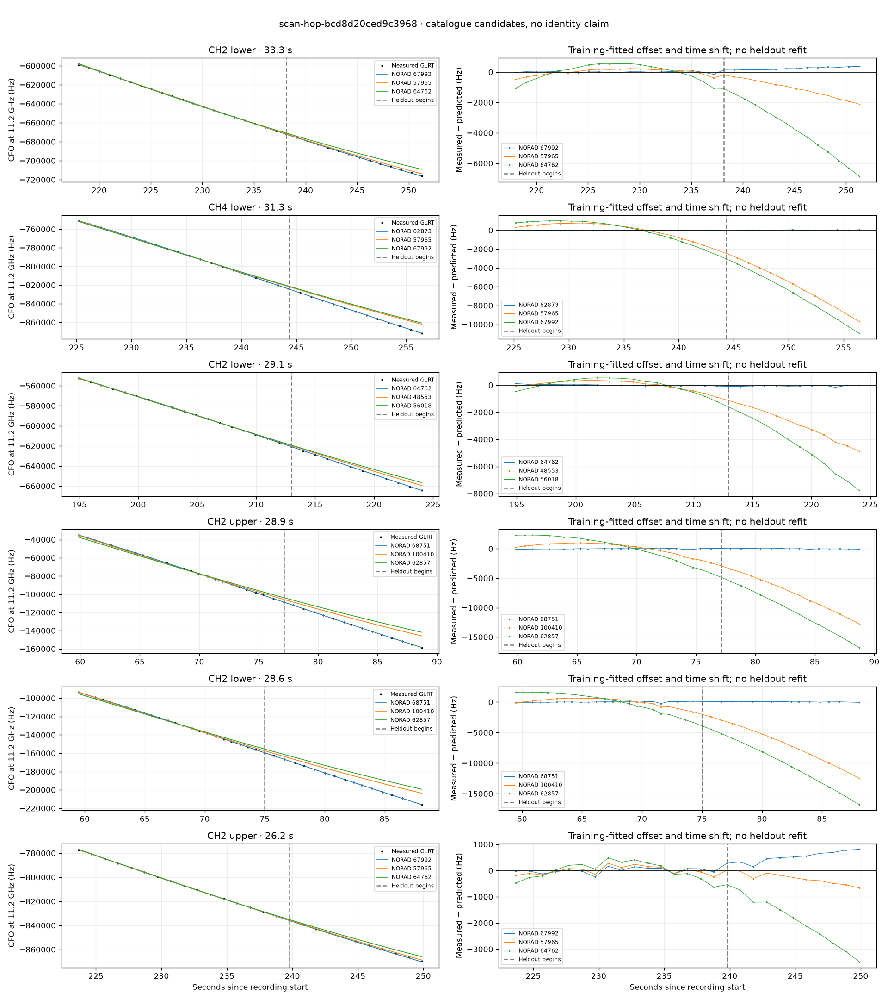

# scan-hop-bcd8d20ced9c3968

Recorded **2026-09-14T16:10:12.539968Z**, RX0, 10 MS/s.

**Candidates pass descriptive checks; no identification.** Candidates: 62857 (2 tracklets), 68751 (2 tracklets), 57462 (2 tracklets).

[Satellite RMS comparisons and top-1 gains](scan-hop-bcd8d20ced9c3968-candidates.md).

[Measured CFO/TLE overlays for every track](scan-hop-bcd8d20ced9c3968-all-tracks.md).

Counts are correlated lane tracklets, not independent detections or satellite counts. A recording can contain multiple transmitters; these are not one-label-per-file assignments.

Solid curves include a per-track constant carrier offset fitted on the first 60% of observations. The final 40% is held out. A close curve is not identity evidence by itself.

Catalogue: `sha256:f623da8623d574a387a40f84f1b4e813d76f1f993d2759f7aa9a8c002a1c272e`. Orbital-only exclusions: STARLINK-34343 DEB (NORAD 69730; SGP4 [6]), STARLINK-37793 (NORAD 100286; SGP4 [6]).

| Lane | Recording seconds | Top 3 training NORADs | Train / heldout RMS (Hz) | Leader heldout rank | Assessment |
|---|---:|---|---:|---:|---|
| CH3 lower | 17.4–37.5 | 68509, 64755, 100415 | 97.5 / 740.1 | 2 | leader changes on heldout; radio drift fits as well or better |
| CH2 lower | 37.3–58.9 | 62857, 100410, 100415 | 21.9 / 53.1 | 1 | Passes descriptive checks; candidate only |
| CH2 upper | 37.7–59.2 | 62857, 100410, 100415 | 95.3 / 31.5 | 1 | Passes descriptive checks; candidate only |
| CH2 lower | 59.5–88.1 | 68751, 100410, 62857 | 72.0 / 59.3 | 1 | Passes descriptive checks; candidate only |
| CH2 upper | 59.9–88.7 | 68751, 100410, 62857 | 59.0 / 53.7 | 1 | Passes descriptive checks; candidate only |
| CH1 upper | 89.5–113.5 | 57462, 47792, 49456 | 107.3 / 100.3 | 1 | Passes descriptive checks; candidate only |
| CH1 lower | 90.0–112.5 | 57462, 47792, 49456 | 45.3 / 56.3 | 1 | Passes descriptive checks; candidate only |
| CH2 lower | 115.7–136.6 | 63774, 64756, 58357 | 29.2 / 98.8 | 1 | radio drift fits as well or better |
| CH2 lower | 159.3–179.3 | 67672, 69430, 58357 | 33.3 / 47.1 | 1 | Passes descriptive checks; candidate only |
| CH2 lower | 194.9–215.0 | 67992, 57965, 64669 | 54.1 / 153.1 | 1 | radio drift fits as well or better; -500s control fits as well or better |
| CH4 lower | 201.0–224.2 | 64762, 69343, 48553 | 34.3 / 85.2 | 1 | Passes descriptive checks; candidate only |
| CH2 lower | 218.0–251.3 | 67992, 57965, 64762 | 46.6 / 250.5 | 1 | Passes descriptive checks; candidate only |
| CH2 upper | 223.7–249.9 | 67992, 57965, 64762 | 102.8 / 554.0 | 2 | leader changes on heldout; -500s control fits as well or better |
| CH4 lower | 225.2–256.4 | 62873, 57965, 67992 | 14.6 / 31.1 | 1 | Passes descriptive checks; candidate only |
| CH4 upper | 227.6–253.8 | 62873, 57965, 67992 | 49.3 / 74.5 | 1 | Passes descriptive checks; candidate only |
| CH2 lower | 194.9–224.1 | 64762, 48553, 56018 | 48.3 / 75.5 | 1 | Passes descriptive checks; candidate only |

[Full candidate, control and measured-CFO evidence](scan-hop-bcd8d20ced9c3968.json.gz).
