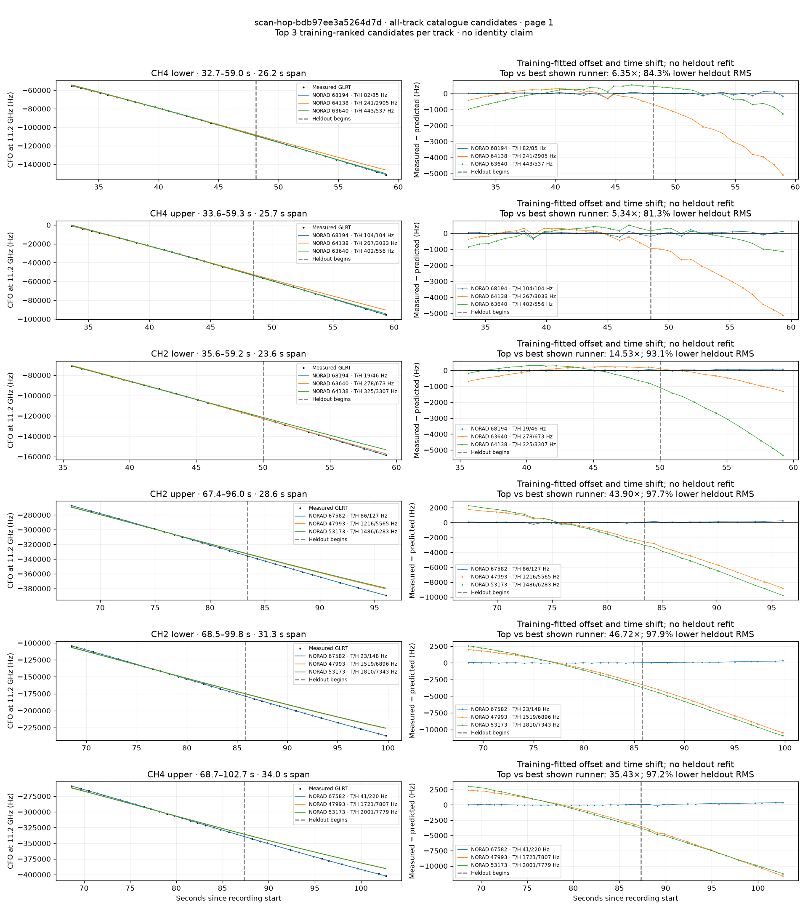
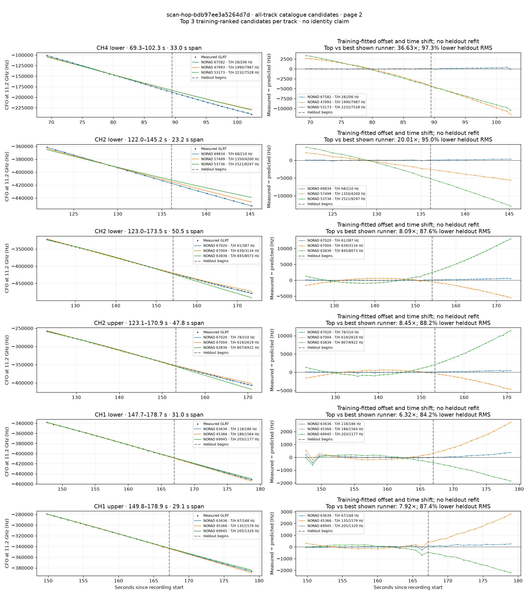
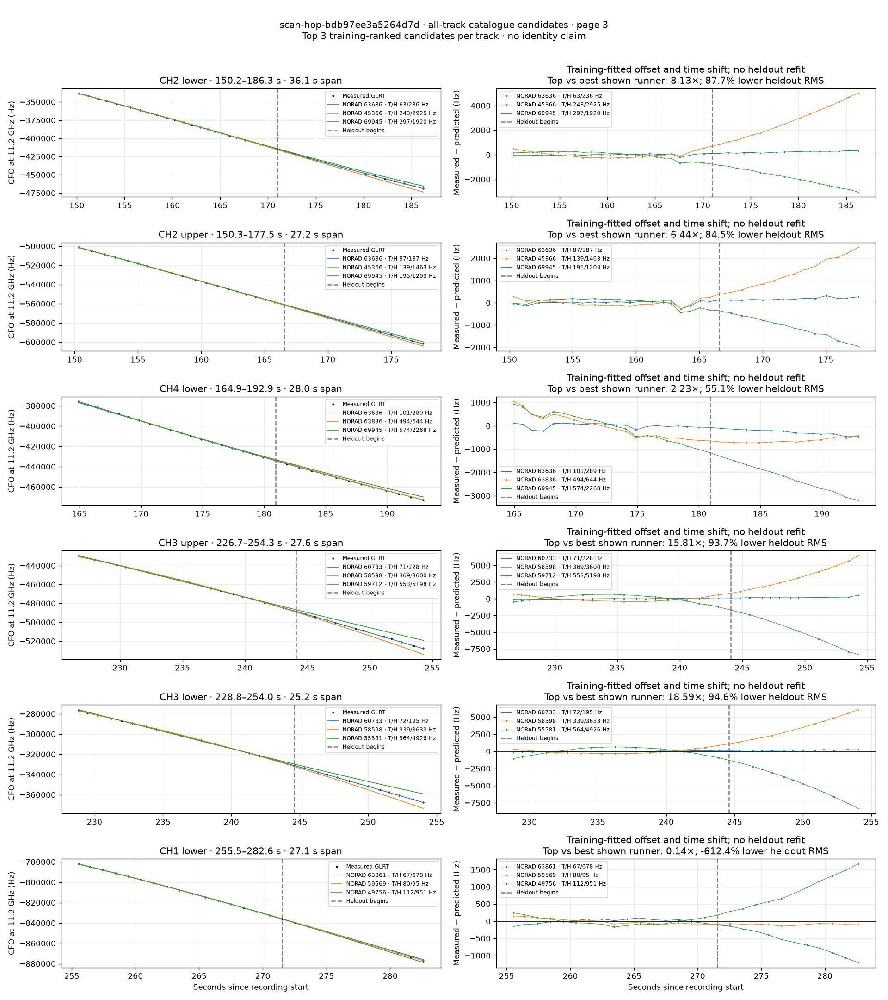
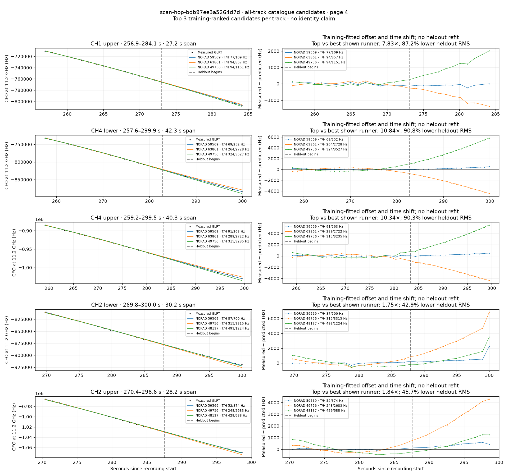

# All track overlays: scan-hop-bdb97ee3a5264d7d

Recorded **2026-09-14T18:00:12.557326Z**, RX0, 10 MS/s. All **23 eligible tracks** are shown in chronological order.

[Recording assessment](scan-hop-bdb97ee3a5264d7d.md) · [Candidate RMS and gains](scan-hop-bdb97ee3a5264d7d-candidates.md)

Each row matches the requested view: measured GLRT CFO and the top three training-ranked TLE curves on the left, residuals on the right. Offset and time shift are fitted only on the first 60%; the last 40% is held out. These are candidate diagnostics, not satellite identifications.

RMS cells below are `training / heldout` in Hz. Runner-up 1 and 2 are training ranks two and three. The gain compares the top TLE with whichever of those two has lower heldout RMS.

| Track | Top TLE, train / heldout RMS | Runner-up 1, train / heldout RMS | Runner-up 2, train / heldout RMS | Top vs best shown runner, heldout |
|---|---:|---:|---:|---:|
| CH4 lower, 32.7–59.0 s | STARLINK-37093 / 68194: 81.6 / 84.5 Hz | STARLINK-34129 / 64138: 240.8 / 2904.6 Hz | STARLINK-33859 / 63640: 442.6 / 537.0 Hz | 6.35× / 84.3% lower |
| CH4 upper, 33.6–59.3 s | STARLINK-37093 / 68194: 103.9 / 104.2 Hz | STARLINK-34129 / 64138: 267.3 / 3033.1 Hz | STARLINK-33859 / 63640: 402.2 / 556.1 Hz | 5.34× / 81.3% lower |
| CH2 lower, 35.6–59.2 s | STARLINK-37093 / 68194: 18.9 / 46.3 Hz | STARLINK-33859 / 63640: 277.5 / 672.8 Hz | STARLINK-34129 / 64138: 324.9 / 3307.2 Hz | 14.53× / 93.1% lower |
| CH2 upper, 67.4–96.0 s | STARLINK-36609 / 67582: 85.7 / 126.8 Hz | STARLINK-2273 / 47993: 1215.7 / 5565.1 Hz | STARLINK-4300 / 53173: 1485.6 / 6283.5 Hz | 43.90× / 97.7% lower |
| CH2 lower, 68.5–99.8 s | STARLINK-36609 / 67582: 23.3 / 147.6 Hz | STARLINK-2273 / 47993: 1519.3 / 6896.1 Hz | STARLINK-4300 / 53173: 1809.7 / 7342.9 Hz | 46.72× / 97.9% lower |
| CH4 upper, 68.7–102.7 s | STARLINK-36609 / 67582: 40.8 / 219.5 Hz | STARLINK-2273 / 47993: 1720.9 / 7807.0 Hz | STARLINK-4300 / 53173: 2001.0 / 7779.5 Hz | 35.43× / 97.2% lower |
| CH4 lower, 69.3–102.3 s | STARLINK-36609 / 67582: 28.0 / 205.5 Hz | STARLINK-2273 / 47993: 1990.1 / 7986.6 Hz | STARLINK-4300 / 53173: 2231.8 / 7528.1 Hz | 36.63× / 97.3% lower |
| CH2 lower, 122.0–145.2 s | STARLINK-37769 / 69834: 68.2 / 209.9 Hz | STARLINK-30169 / 57499: 1349.9 / 4200.1 Hz | STARLINK-4652 / 53736: 2520.8 / 9296.9 Hz | 20.01× / 95.0% lower |
| CH2 lower, 123.0–173.5 s | STARLINK-36172 / 67020: 61.0 / 387.2 Hz | STARLINK-35913 / 67004: 638.7 / 3133.7 Hz | STARLINK-34018 / 63836: 844.6 / 8073.4 Hz | 8.09× / 87.6% lower |
| CH2 upper, 123.1–170.9 s | STARLINK-36172 / 67020: 78.2 / 310.0 Hz | STARLINK-35913 / 67004: 619.3 / 2618.6 Hz | STARLINK-34018 / 63836: 807.5 / 6922.0 Hz | 8.45× / 88.2% lower |
| CH1 lower, 147.7–178.7 s | STARLINK-33864 / 63636: 118.3 / 186.3 Hz | STARLINK-1262 / 45366: 185.7 / 1564.5 Hz | STARLINK-37903 / 69945: 203.2 / 1177.2 Hz | 6.32× / 84.2% lower |
| CH1 upper, 149.8–178.9 s | STARLINK-33864 / 63636: 67.2 / 167.9 Hz | STARLINK-1262 / 45366: 134.6 / 1578.5 Hz | STARLINK-37903 / 69945: 205.1 / 1328.6 Hz | 7.92× / 87.4% lower |
| CH2 lower, 150.2–186.3 s | STARLINK-33864 / 63636: 63.2 / 236.2 Hz | STARLINK-1262 / 45366: 242.7 / 2924.5 Hz | STARLINK-37903 / 69945: 297.4 / 1920.3 Hz | 8.13× / 87.7% lower |
| CH2 upper, 150.3–177.5 s | STARLINK-33864 / 63636: 87.2 / 186.8 Hz | STARLINK-1262 / 45366: 138.6 / 1462.5 Hz | STARLINK-37903 / 69945: 195.1 / 1203.2 Hz | 6.44× / 84.5% lower |
| CH4 lower, 164.9–192.9 s | STARLINK-33864 / 63636: 101.0 / 288.8 Hz | STARLINK-34018 / 63836: 494.0 / 643.7 Hz | STARLINK-37903 / 69945: 574.2 / 2268.4 Hz | 2.23× / 55.1% lower |
| CH3 upper, 226.7–254.3 s | STARLINK-32253 / 60733: 70.9 / 227.7 Hz | STARLINK-31079 / 58598: 369.5 / 3599.8 Hz | STARLINK-11108 / 59712: 552.8 / 5198.0 Hz | 15.81× / 93.7% lower |
| CH3 lower, 228.8–254.0 s | STARLINK-32253 / 60733: 71.7 / 195.4 Hz | STARLINK-31079 / 58598: 339.0 / 3633.1 Hz | STARLINK-5753 / 55581: 564.4 / 4925.8 Hz | 18.59× / 94.6% lower |
| CH1 lower, 255.5–282.6 s | STARLINK-33896 / 63861: 66.6 / 678.4 Hz | STARLINK-31470 / 59569: 79.7 / 95.2 Hz | STARLINK-3207 / 49756: 111.8 / 951.0 Hz | 0.14× / -612.4% lower |
| CH1 upper, 256.9–284.1 s | STARLINK-31470 / 59569: 77.3 / 109.4 Hz | STARLINK-33896 / 63861: 93.6 / 856.7 Hz | STARLINK-3207 / 49756: 94.3 / 1151.3 Hz | 7.83× / 87.2% lower |
| CH4 lower, 257.6–299.9 s | STARLINK-31470 / 59569: 68.7 / 251.6 Hz | STARLINK-33896 / 63861: 264.5 / 2728.2 Hz | STARLINK-3207 / 49756: 324.3 / 3526.5 Hz | 10.84× / 90.8% lower |
| CH4 upper, 259.2–299.5 s | STARLINK-31470 / 59569: 90.6 / 263.2 Hz | STARLINK-33896 / 63861: 288.6 / 2721.9 Hz | STARLINK-3207 / 49756: 315.5 / 3235.1 Hz | 10.34× / 90.3% lower |
| CH2 lower, 269.8–300.0 s | STARLINK-31470 / 59569: 87.5 / 699.7 Hz | STARLINK-3207 / 49756: 315.3 / 3314.6 Hz | STARLINK-2480 / 48137: 493.0 / 1224.4 Hz | 1.75× / 42.9% lower |
| CH2 upper, 270.4–298.6 s | STARLINK-31470 / 59569: 51.7 / 374.2 Hz | STARLINK-3207 / 49756: 247.7 / 2682.6 Hz | STARLINK-2480 / 48137: 428.7 / 688.5 Hz | 1.84× / 45.7% lower |

## Page 1

## Page 2

## Page 3

## Page 4

