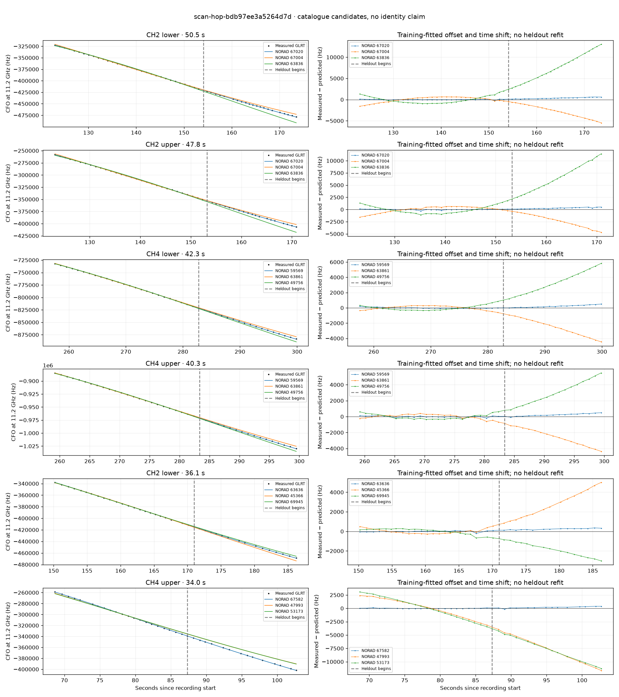

# scan-hop-bdb97ee3a5264d7d

Recorded **2026-09-14T18:00:12.557326Z**, RX0, 10 MS/s.

**Candidates pass descriptive checks; no identification.** Candidates: 67582 (4 tracklets), 59569 (4 tracklets), 68194 (3 tracklets).

[Satellite RMS comparisons and top-1 gains](scan-hop-bdb97ee3a5264d7d-candidates.md).

[Measured CFO/TLE overlays for every track](scan-hop-bdb97ee3a5264d7d-all-tracks.md).

Counts are correlated lane tracklets, not independent detections or satellite counts. A recording can contain multiple transmitters; these are not one-label-per-file assignments.

Solid curves include a per-track constant carrier offset fitted on the first 60% of observations. The final 40% is held out. A close curve is not identity evidence by itself.

Catalogue: `sha256:f027c02cbe99846bc1b1e0b5a10d35c7fe22c60b64c3ddd0a6bf0efe667659cd`. Orbital-only exclusions: STARLINK-1770 (NORAD 46383; SGP4 []), STARLINK-34343 DEB (NORAD 69730; SGP4 [6]), STARLINK-37793 (NORAD 100286; SGP4 [1, 6]).

| Lane | Recording seconds | Top 3 training NORADs | Train / heldout RMS (Hz) | Leader heldout rank | Assessment |
|---|---:|---|---:|---:|---|
| CH4 lower | 32.7–59.0 | 68194, 64138, 63640 | 81.6 / 84.5 | 1 | Passes descriptive checks; candidate only |
| CH4 upper | 33.6–59.3 | 68194, 64138, 63640 | 103.9 / 104.2 | 1 | Passes descriptive checks; candidate only |
| CH2 lower | 35.6–59.2 | 68194, 63640, 64138 | 18.9 / 46.3 | 1 | Passes descriptive checks; candidate only |
| CH2 upper | 67.4–96.0 | 67582, 47993, 53173 | 85.7 / 126.8 | 1 | Passes descriptive checks; candidate only |
| CH2 lower | 68.5–99.8 | 67582, 47993, 53173 | 23.3 / 147.6 | 1 | Passes descriptive checks; candidate only |
| CH4 upper | 68.7–102.7 | 67582, 47993, 53173 | 40.8 / 219.5 | 1 | Passes descriptive checks; candidate only |
| CH4 lower | 69.3–102.3 | 67582, 47993, 53173 | 28.0 / 205.5 | 1 | Passes descriptive checks; candidate only |
| CH2 lower | 122.0–145.2 | 69834, 57499, 53736 | 68.2 / 209.9 | 1 | Passes descriptive checks; candidate only |
| CH2 upper | 123.1–170.9 | 67020, 67004, 63836 | 78.2 / 310.0 | 1 | Passes descriptive checks; candidate only |
| CH1 lower | 147.7–178.7 | 63636, 45366, 69945 | 118.3 / 186.3 | 1 | 500s control fits as well or better |
| CH1 upper | 149.8–178.9 | 63636, 45366, 69945 | 67.2 / 167.9 | 1 | 500s control fits as well or better |
| CH2 lower | 150.2–186.3 | 63636, 45366, 69945 | 63.2 / 236.2 | 1 | 500s control fits as well or better |
| CH4 lower | 164.9–192.9 | 63636, 63836, 69945 | 101.0 / 288.8 | 1 | 500s control fits as well or better |
| CH3 upper | 226.7–254.3 | 60733, 58598, 59712 | 70.9 / 227.7 | 1 | Passes descriptive checks; candidate only |
| CH3 lower | 228.8–254.0 | 60733, 58598, 55581 | 71.7 / 195.4 | 1 | Passes descriptive checks; candidate only |
| CH1 lower | 255.5–282.6 | 63861, 59569, 49756 | 66.6 / 678.4 | 2 | leader changes on heldout; -500s control fits as well or better |
| CH1 upper | 256.9–284.1 | 59569, 63861, 49756 | 77.3 / 109.4 | 1 | Passes descriptive checks; candidate only |
| CH4 lower | 257.6–299.9 | 59569, 63861, 49756 | 68.7 / 251.6 | 1 | Passes descriptive checks; candidate only |
| CH4 upper | 259.2–299.5 | 59569, 63861, 49756 | 90.6 / 263.2 | 1 | Passes descriptive checks; candidate only |
| CH2 lower | 269.8–300.0 | 59569, 49756, 48137 | 87.5 / 699.7 | 1 | -500s control fits as well or better |
| CH2 upper | 270.4–298.6 | 59569, 49756, 48137 | 51.7 / 374.2 | 1 | Passes descriptive checks; candidate only |
| CH2 lower | 123.0–173.5 | 67020, 67004, 63836 | 61.0 / 387.2 | 1 | Passes descriptive checks; candidate only |
| CH2 upper | 150.3–177.5 | 63636, 45366, 69945 | 87.2 / 186.8 | 1 | 500s control fits as well or better |

[Full candidate, control and measured-CFO evidence](scan-hop-bdb97ee3a5264d7d.json.gz).
