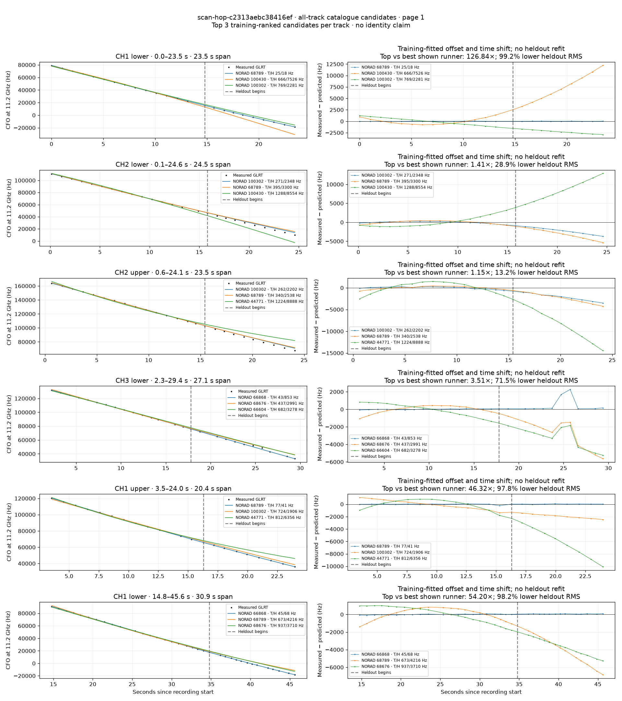
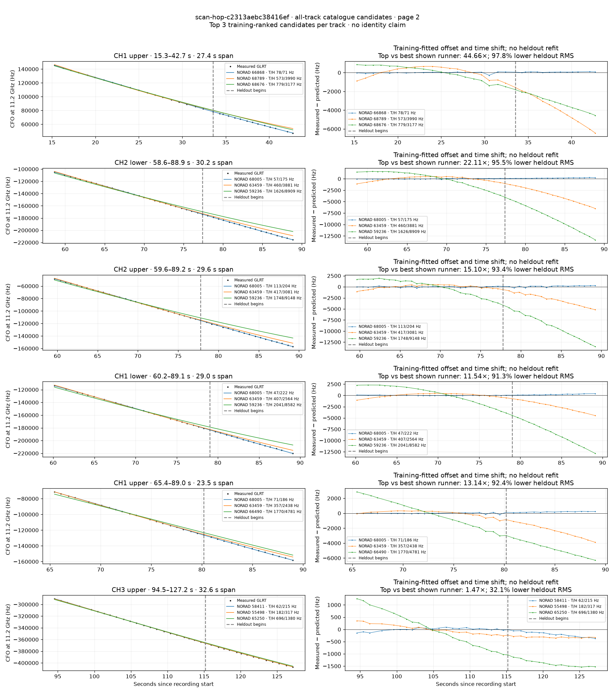
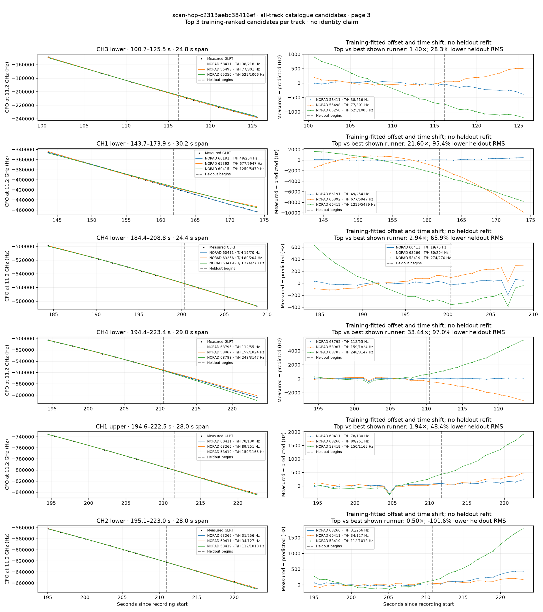
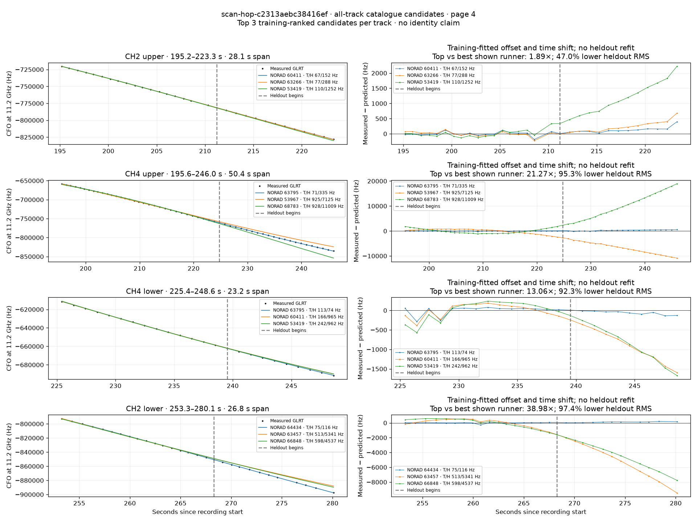

# All track overlays: scan-hop-c2313aebc38416ef

Recorded **2026-09-14T16:30:12.553220Z**, RX0, 10 MS/s. All **22 eligible tracks** are shown in chronological order.

[Recording assessment](scan-hop-c2313aebc38416ef.md) · [Candidate RMS and gains](scan-hop-c2313aebc38416ef-candidates.md)

Each row matches the requested view: measured GLRT CFO and the top three training-ranked TLE curves on the left, residuals on the right. Offset and time shift are fitted only on the first 60%; the last 40% is held out. These are candidate diagnostics, not satellite identifications.

RMS cells below are `training / heldout` in Hz. Runner-up 1 and 2 are training ranks two and three. The gain compares the top TLE with whichever of those two has lower heldout RMS.

| Track | Top TLE, train / heldout RMS | Runner-up 1, train / heldout RMS | Runner-up 2, train / heldout RMS | Top vs best shown runner, heldout |
|---|---:|---:|---:|---:|
| CH1 lower, 0.0–23.5 s | STARLINK-37413 / 68789: 25.1 / 18.0 Hz | STARLINK-38013 / 100430: 665.7 / 7526.2 Hz | STARLINK-38253 / 100302: 768.5 / 2280.6 Hz | 126.84× / 99.2% lower |
| CH2 lower, 0.1–24.6 s | STARLINK-38253 / 100302: 270.7 / 2347.6 Hz | STARLINK-37413 / 68789: 395.4 / 3300.4 Hz | STARLINK-38013 / 100430: 1287.8 / 8554.2 Hz | 1.41× / 28.9% lower |
| CH2 upper, 0.6–24.1 s | STARLINK-38253 / 100302: 262.2 / 2202.0 Hz | STARLINK-37413 / 68789: 340.5 / 2537.9 Hz | STARLINK-1067 / 44771: 1223.7 / 8888.3 Hz | 1.15× / 13.2% lower |
| CH3 lower, 2.3–29.4 s | STARLINK-36108 / 66868: 43.3 / 853.4 Hz | STARLINK-37312 / 68676: 437.0 / 2991.5 Hz | STARLINK-35977 / 66604: 682.2 / 3277.9 Hz | 3.51× / 71.5% lower |
| CH1 upper, 3.5–24.0 s | STARLINK-37413 / 68789: 76.7 / 41.2 Hz | STARLINK-38253 / 100302: 724.4 / 1906.2 Hz | STARLINK-1067 / 44771: 812.0 / 6356.2 Hz | 46.32× / 97.8% lower |
| CH1 lower, 14.8–45.6 s | STARLINK-36108 / 66868: 44.5 / 68.5 Hz | STARLINK-37413 / 68789: 673.2 / 4216.3 Hz | STARLINK-37312 / 68676: 937.4 / 3710.4 Hz | 54.20× / 98.2% lower |
| CH1 upper, 15.3–42.7 s | STARLINK-36108 / 66868: 78.0 / 71.1 Hz | STARLINK-37413 / 68789: 573.0 / 3990.5 Hz | STARLINK-37312 / 68676: 778.6 / 3177.2 Hz | 44.66× / 97.8% lower |
| CH2 lower, 58.6–88.9 s | STARLINK-36910 / 68005: 56.6 / 175.5 Hz | STARLINK-33780 / 63459: 459.9 / 3880.8 Hz | STARLINK-31444 / 59236: 1626.1 / 8909.2 Hz | 22.11× / 95.5% lower |
| CH2 upper, 59.6–89.2 s | STARLINK-36910 / 68005: 113.1 / 204.0 Hz | STARLINK-33780 / 63459: 417.1 / 3080.5 Hz | STARLINK-31444 / 59236: 1748.0 / 9147.8 Hz | 15.10× / 93.4% lower |
| CH1 lower, 60.2–89.1 s | STARLINK-36910 / 68005: 47.4 / 222.2 Hz | STARLINK-33780 / 63459: 406.7 / 2563.5 Hz | STARLINK-31444 / 59236: 2041.0 / 8582.4 Hz | 11.54× / 91.3% lower |
| CH1 upper, 65.4–89.0 s | STARLINK-36910 / 68005: 71.2 / 185.5 Hz | STARLINK-33780 / 63459: 356.5 / 2438.5 Hz | STARLINK-35693 / 66490: 1770.0 / 4781.2 Hz | 13.14× / 92.4% lower |
| CH3 upper, 94.5–127.2 s | STARLINK-30919 / 58411: 62.5 / 215.1 Hz | STARLINK-5365 / 55498: 182.1 / 316.5 Hz | STARLINK-34973 / 65250: 695.8 / 1379.8 Hz | 1.47× / 32.1% lower |
| CH3 lower, 100.7–125.5 s | STARLINK-30919 / 58411: 37.7 / 215.7 Hz | STARLINK-5365 / 55498: 77.1 / 300.9 Hz | STARLINK-34973 / 65250: 525.1 / 1006.1 Hz | 1.40× / 28.3% lower |
| CH1 lower, 143.7–173.9 s | STARLINK-35061 / 66191: 48.9 / 253.6 Hz | STARLINK-35082 / 65392: 676.9 / 5946.9 Hz | STARLINK-32265 / 60415: 1259.0 / 5478.5 Hz | 21.60× / 95.4% lower |
| CH4 lower, 184.4–208.8 s | STARLINK-32244 / 60411: 18.6 / 69.5 Hz | STARLINK-11659 / 63266: 79.7 / 204.2 Hz | STARLINK-4476 / 53419: 273.8 / 270.0 Hz | 2.94× / 65.9% lower |
| CH4 lower, 194.4–223.4 s | STARLINK-33867 / 63795: 112.2 / 54.6 Hz | STARLINK-4634 / 53967: 159.4 / 1824.1 Hz | STARLINK-37364 / 68783: 247.5 / 3146.8 Hz | 33.44× / 97.0% lower |
| CH1 upper, 194.6–222.5 s | STARLINK-32244 / 60411: 77.7 / 129.6 Hz | STARLINK-11659 / 63266: 89.1 / 251.0 Hz | STARLINK-4476 / 53419: 150.3 / 1164.9 Hz | 1.94× / 48.4% lower |
| CH2 lower, 195.1–223.0 s | STARLINK-11659 / 63266: 31.3 / 255.7 Hz | STARLINK-32244 / 60411: 34.2 / 126.8 Hz | STARLINK-4476 / 53419: 111.9 / 1017.7 Hz | 0.50× / -101.6% lower |
| CH2 upper, 195.2–223.3 s | STARLINK-32244 / 60411: 66.7 / 152.4 Hz | STARLINK-11659 / 63266: 77.2 / 287.6 Hz | STARLINK-4476 / 53419: 109.7 / 1252.0 Hz | 1.89× / 47.0% lower |
| CH4 upper, 195.6–246.0 s | STARLINK-33867 / 63795: 70.9 / 335.0 Hz | STARLINK-4634 / 53967: 924.7 / 7124.8 Hz | STARLINK-37364 / 68783: 927.6 / 11009.0 Hz | 21.27× / 95.3% lower |
| CH4 lower, 225.4–248.6 s | STARLINK-33867 / 63795: 113.1 / 73.7 Hz | STARLINK-32244 / 60411: 165.6 / 965.1 Hz | STARLINK-4476 / 53419: 242.1 / 962.1 Hz | 13.06× / 92.3% lower |
| CH2 lower, 253.3–280.1 s | STARLINK-34472 / 64434: 74.9 / 116.4 Hz | STARLINK-33795 / 63457: 513.3 / 5340.9 Hz | STARLINK-36091 / 66848: 598.3 / 4537.0 Hz | 38.98× / 97.4% lower |

## Page 1

## Page 2

## Page 3

## Page 4

