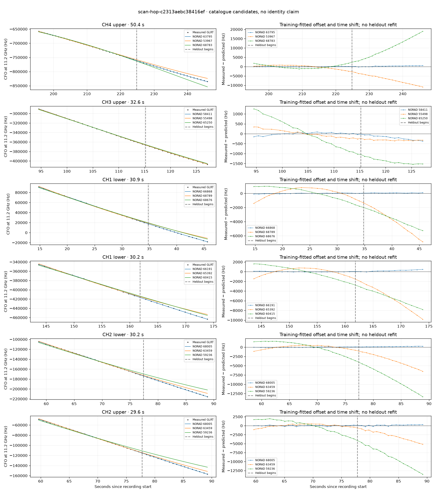

# scan-hop-c2313aebc38416ef

Recorded **2026-09-14T16:30:12.553220Z**, RX0, 10 MS/s.

**Candidates pass descriptive checks; no identification.** Candidates: 66868 (3 tracklets), 68005 (3 tracklets), 63795 (3 tracklets).

**Stricter audit of one shortlisted track: ABSTAIN; leading NORAD 63795.** radio-polynomial-null-not-worse-on-heldout. [Full audit](deep-checks/scan-hop-c2313aebc38416ef.json.gz).

Counts are correlated lane tracklets, not independent detections or satellite counts. A recording can contain multiple transmitters; these are not one-label-per-file assignments.

Solid curves include a per-track constant carrier offset fitted on the first 60% of observations. The final 40% is held out. A close curve is not identity evidence by itself.

Catalogue: `sha256:f623da8623d574a387a40f84f1b4e813d76f1f993d2759f7aa9a8c002a1c272e`. Orbital-only exclusions: STARLINK-34343 DEB (NORAD 69730; SGP4 [6]), STARLINK-37793 (NORAD 100286; SGP4 [6]).

| Lane | Recording seconds | Top 3 training NORADs | Train / heldout RMS (Hz) | Leader heldout rank | Assessment |
|---|---:|---|---:|---:|---|
| CH2 lower | 0.1–24.6 | 100302, 68789, 100430 | 270.7 / 2347.6 | 1 | time-shift boundary; radio drift fits as well or better |
| CH2 upper | 0.6–24.1 | 100302, 68789, 44771 | 262.2 / 2202.0 | 1 | time-shift boundary; radio drift fits as well or better |
| CH3 lower | 2.3–29.4 | 66868, 68676, 66604 | 43.3 / 853.4 | 1 | Passes descriptive checks; candidate only |
| CH1 lower | 14.8–45.6 | 66868, 68789, 68676 | 44.5 / 68.5 | 1 | Passes descriptive checks; candidate only |
| CH1 upper | 15.3–42.7 | 66868, 68789, 68676 | 78.0 / 71.1 | 1 | Passes descriptive checks; candidate only |
| CH2 lower | 58.6–88.9 | 68005, 63459, 59236 | 56.6 / 175.5 | 1 | Passes descriptive checks; candidate only |
| CH2 upper | 59.6–89.2 | 68005, 63459, 59236 | 113.1 / 204.0 | 1 | Passes descriptive checks; candidate only |
| CH1 lower | 60.2–89.1 | 68005, 63459, 59236 | 47.4 / 222.2 | 1 | radio drift fits as well or better |
| CH1 upper | 65.4–89.0 | 68005, 63459, 66490 | 71.2 / 185.5 | 1 | Passes descriptive checks; candidate only |
| CH3 upper | 94.5–127.2 | 58411, 55498, 65250 | 62.5 / 215.1 | 1 | 500s control fits as well or better |
| CH3 lower | 100.7–125.5 | 58411, 55498, 65250 | 37.7 / 215.7 | 1 | -500s control fits as well or better; 500s control fits as well or better |
| CH1 lower | 143.7–173.9 | 66191, 65392, 60415 | 48.9 / 253.6 | 1 | -500s control fits as well or better |
| CH4 lower | 194.4–223.4 | 63795, 53967, 68783 | 112.2 / 54.6 | 1 | Passes descriptive checks; candidate only |
| CH1 upper | 194.6–222.5 | 60411, 63266, 53419 | 77.7 / 129.6 | 1 | Passes descriptive checks; candidate only |
| CH2 lower | 195.1–223.0 | 63266, 60411, 53419 | 31.3 / 255.7 | 2 | leader changes on heldout; time-shift boundary |
| CH2 upper | 195.2–223.3 | 60411, 63266, 53419 | 66.7 / 152.4 | 1 | Passes descriptive checks; candidate only |
| CH4 upper | 195.6–246.0 | 63795, 53967, 68783 | 70.9 / 335.0 | 1 | Passes descriptive checks; candidate only |
| CH4 lower | 225.4–248.6 | 63795, 60411, 53419 | 113.1 / 73.7 | 1 | Passes descriptive checks; candidate only |
| CH2 lower | 253.3–280.1 | 64434, 63457, 66848 | 74.9 / 116.4 | 1 | Passes descriptive checks; candidate only |
| CH1 lower | 0.0–23.5 | 68789, 100430, 100302 | 25.1 / 18.0 | 1 | Passes descriptive checks; candidate only |
| CH4 lower | 184.4–208.8 | 60411, 63266, 53419 | 18.6 / 69.5 | 1 | Passes descriptive checks; candidate only |
| CH1 upper | 3.5–24.0 | 68789, 100302, 44771 | 76.7 / 41.2 | 1 | Passes descriptive checks; candidate only |

[Full candidate, control and measured-CFO evidence](scan-hop-c2313aebc38416ef.json.gz).
