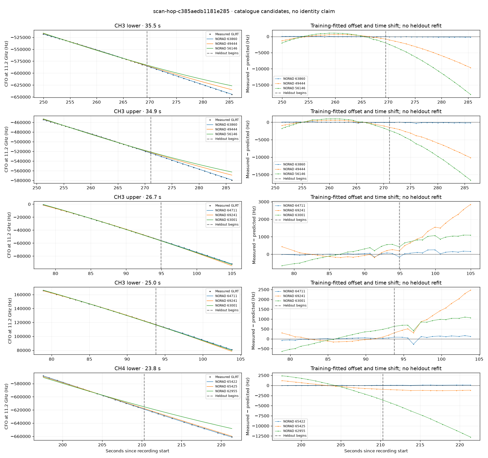

# scan-hop-c385aedb1181e285

Recorded **2026-09-14T22:50:12.764263Z**, RX0, 10 MS/s.

**Candidates pass descriptive checks; no identification.** Candidates: 64711 (2 tracklets), 63860 (2 tracklets), 65422 (1 tracklets).

Counts are correlated lane tracklets, not independent detections or satellite counts. A recording can contain multiple transmitters; these are not one-label-per-file assignments.

Solid curves include a per-track constant carrier offset fitted on the first 60% of observations. The final 40% is held out. A close curve is not identity evidence by itself.

Catalogue: `sha256:d0d899a2d1da7811b03849396c03507e74e2de38d046edc9e068d12f2700ab20`. Orbital-only exclusions: STARLINK-34343 DEB (NORAD 69730; SGP4 [6]), STARLINK-37793 (NORAD 100286; SGP4 [1]).

| Lane | Recording seconds | Top 3 training NORADs | Train / heldout RMS (Hz) | Leader heldout rank | Assessment |
|---|---:|---|---:|---:|---|
| CH3 upper | 78.3–105.0 | 64711, 69241, 63001 | 49.5 / 148.0 | 1 | Passes descriptive checks; candidate only |
| CH3 lower | 78.9–103.9 | 64711, 69241, 63001 | 40.8 / 132.8 | 1 | Passes descriptive checks; candidate only |
| CH4 lower | 197.5–221.4 | 65422, 65425, 62955 | 17.5 / 75.5 | 1 | Passes descriptive checks; candidate only |
| CH3 lower | 249.9–285.5 | 63860, 49444, 56146 | 64.4 / 128.9 | 1 | Passes descriptive checks; candidate only |
| CH3 upper | 251.2–286.1 | 63860, 49444, 56146 | 85.2 / 147.7 | 1 | Passes descriptive checks; candidate only |

[Full candidate, control and measured-CFO evidence](scan-hop-c385aedb1181e285.json.gz).
