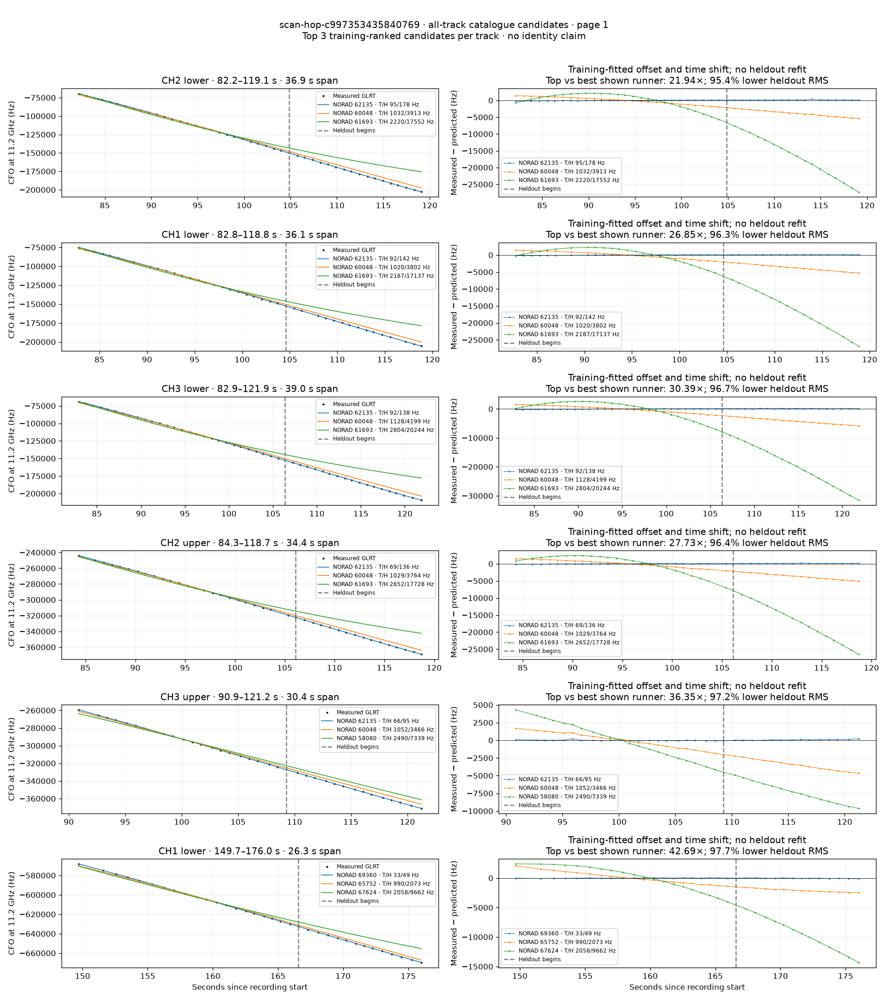
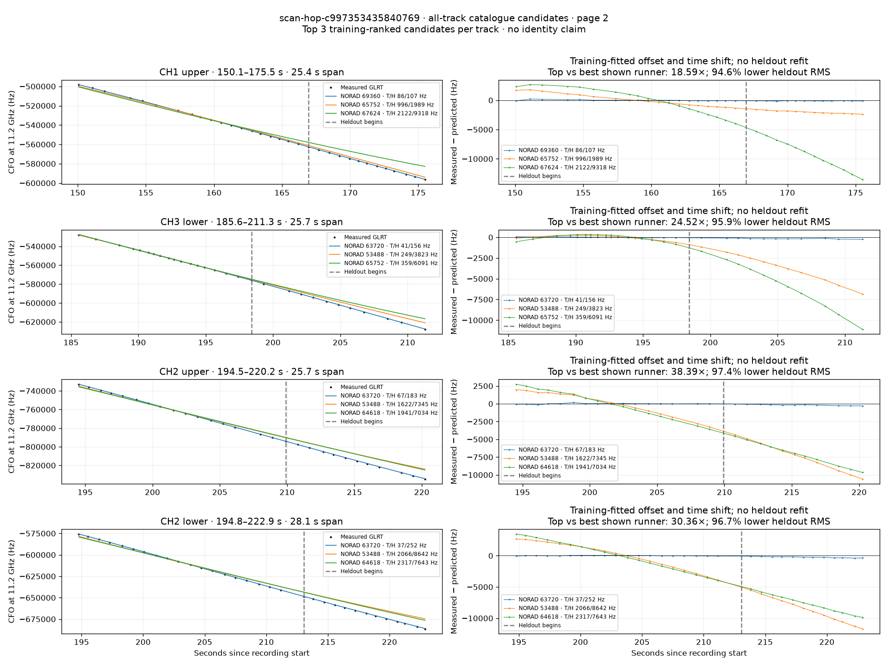

# All track overlays: scan-hop-c997353435840769

Recorded **2026-09-14T22:10:12.595034Z**, RX0, 10 MS/s. All **10 eligible tracks** are shown in chronological order.

[Recording assessment](scan-hop-c997353435840769.md) · [Candidate RMS and gains](scan-hop-c997353435840769-candidates.md)

Each row matches the requested view: measured GLRT CFO and the top three training-ranked TLE curves on the left, residuals on the right. Offset and time shift are fitted only on the first 60%; the last 40% is held out. These are candidate diagnostics, not satellite identifications.

RMS cells below are `training / heldout` in Hz. Runner-up 1 and 2 are training ranks two and three. The gain compares the top TLE with whichever of those two has lower heldout RMS.

| Track | Top TLE, train / heldout RMS | Runner-up 1, train / heldout RMS | Runner-up 2, train / heldout RMS | Top vs best shown runner, heldout |
|---|---:|---:|---:|---:|
| CH2 lower, 82.2–119.1 s | STARLINK-32545 / 62135: 94.8 / 178.3 Hz | STARLINK-11135 / 60048: 1031.5 / 3913.0 Hz | STARLINK-11366 / 61693: 2219.5 / 17552.1 Hz | 21.94× / 95.4% lower |
| CH1 lower, 82.8–118.8 s | STARLINK-32545 / 62135: 91.7 / 141.6 Hz | STARLINK-11135 / 60048: 1019.7 / 3802.1 Hz | STARLINK-11366 / 61693: 2186.8 / 17137.2 Hz | 26.85× / 96.3% lower |
| CH3 lower, 82.9–121.9 s | STARLINK-32545 / 62135: 92.4 / 138.2 Hz | STARLINK-11135 / 60048: 1127.7 / 4198.9 Hz | STARLINK-11366 / 61693: 2804.3 / 20244.5 Hz | 30.39× / 96.7% lower |
| CH2 upper, 84.3–118.7 s | STARLINK-32545 / 62135: 68.7 / 135.7 Hz | STARLINK-11135 / 60048: 1028.8 / 3763.6 Hz | STARLINK-11366 / 61693: 2652.2 / 17727.6 Hz | 27.73× / 96.4% lower |
| CH3 upper, 90.9–121.2 s | STARLINK-32545 / 62135: 65.8 / 95.3 Hz | STARLINK-11135 / 60048: 1051.9 / 3465.6 Hz | STARLINK-30603 / 58080: 2490.3 / 7339.1 Hz | 36.35× / 97.2% lower |
| CH1 lower, 149.7–176.0 s | STARLINK-37599 / 69360: 33.4 / 48.6 Hz | STARLINK-34893 / 65752: 989.6 / 2073.4 Hz | STARLINK-36439 / 67624: 2058.0 / 9661.9 Hz | 42.69× / 97.7% lower |
| CH1 upper, 150.1–175.5 s | STARLINK-37599 / 69360: 85.8 / 107.0 Hz | STARLINK-34893 / 65752: 996.4 / 1988.9 Hz | STARLINK-36439 / 67624: 2121.9 / 9318.3 Hz | 18.59× / 94.6% lower |
| CH3 lower, 185.6–211.3 s | STARLINK-33757 / 63720: 41.4 / 155.9 Hz | STARLINK-4421 / 53488: 249.1 / 3823.0 Hz | STARLINK-34893 / 65752: 358.9 / 6090.6 Hz | 24.52× / 95.9% lower |
| CH2 upper, 194.5–220.2 s | STARLINK-33757 / 63720: 67.2 / 183.2 Hz | STARLINK-4421 / 53488: 1622.3 / 7344.8 Hz | STARLINK-34415 / 64618: 1941.2 / 7034.3 Hz | 38.39× / 97.4% lower |
| CH2 lower, 194.8–222.9 s | STARLINK-33757 / 63720: 37.3 / 251.7 Hz | STARLINK-4421 / 53488: 2066.5 / 8641.7 Hz | STARLINK-34415 / 64618: 2317.1 / 7642.6 Hz | 30.36× / 96.7% lower |

## Page 1

## Page 2

