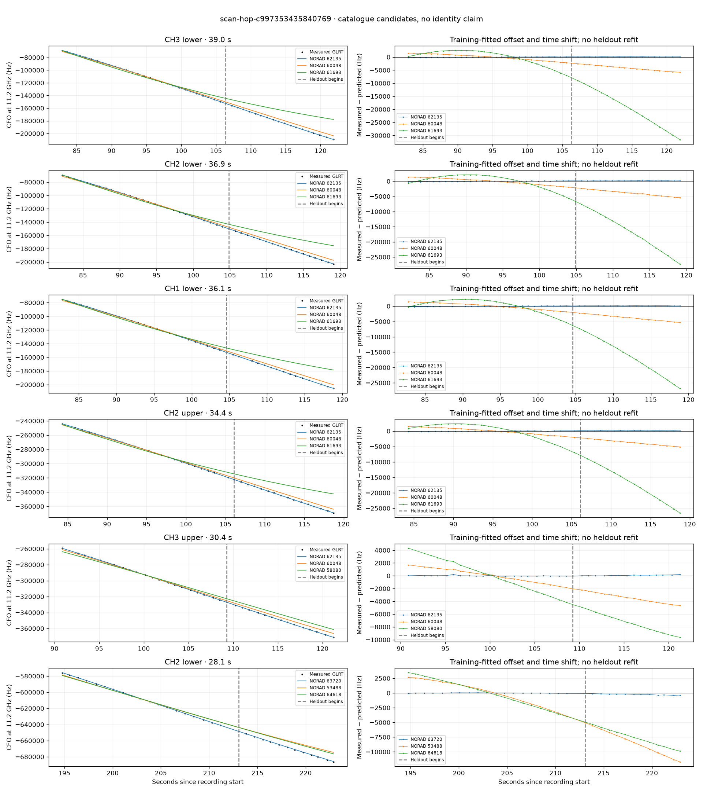

# scan-hop-c997353435840769

Recorded **2026-09-14T22:10:12.595034Z**, RX0, 10 MS/s.

**Candidates pass descriptive checks; no identification.** Candidates: 62135 (4 tracklets), 63720 (3 tracklets), 69360 (2 tracklets).

[Satellite RMS comparisons and top-1 gains](scan-hop-c997353435840769-candidates.md).

[Measured CFO/TLE overlays for every track](scan-hop-c997353435840769-all-tracks.md).

Counts are correlated lane tracklets, not independent detections or satellite counts. A recording can contain multiple transmitters; these are not one-label-per-file assignments.

Solid curves include a per-track constant carrier offset fitted on the first 60% of observations. The final 40% is held out. A close curve is not identity evidence by itself.

Catalogue: `sha256:5e48341ac859002618ed02192863efc22858a3e23cfba4b9b18348f0378e9657`. Orbital-only exclusions: STARLINK-34343 DEB (NORAD 69730; SGP4 [6]), STARLINK-37793 (NORAD 100286; SGP4 [1]).

| Lane | Recording seconds | Top 3 training NORADs | Train / heldout RMS (Hz) | Leader heldout rank | Assessment |
|---|---:|---|---:|---:|---|
| CH2 lower | 82.2–119.1 | 62135, 60048, 61693 | 94.8 / 178.3 | 1 | Passes descriptive checks; candidate only |
| CH1 lower | 82.8–118.8 | 62135, 60048, 61693 | 91.7 / 141.6 | 1 | Passes descriptive checks; candidate only |
| CH3 lower | 82.9–121.9 | 62135, 60048, 61693 | 92.4 / 138.2 | 1 | Passes descriptive checks; candidate only |
| CH2 upper | 84.3–118.7 | 62135, 60048, 61693 | 68.7 / 135.7 | 1 | Passes descriptive checks; candidate only |
| CH3 upper | 90.9–121.2 | 62135, 60048, 58080 | 65.8 / 95.3 | 1 | time-shift boundary; 500s control fits as well or better |
| CH1 lower | 149.7–176.0 | 69360, 65752, 67624 | 33.4 / 48.6 | 1 | Passes descriptive checks; candidate only |
| CH1 upper | 150.1–175.5 | 69360, 65752, 67624 | 85.8 / 107.0 | 1 | Passes descriptive checks; candidate only |
| CH3 lower | 185.6–211.3 | 63720, 53488, 65752 | 41.4 / 155.9 | 1 | Passes descriptive checks; candidate only |
| CH2 upper | 194.5–220.2 | 63720, 53488, 64618 | 67.2 / 183.2 | 1 | Passes descriptive checks; candidate only |
| CH2 lower | 194.8–222.9 | 63720, 53488, 64618 | 37.3 / 251.7 | 1 | Passes descriptive checks; candidate only |

[Full candidate, control and measured-CFO evidence](scan-hop-c997353435840769.json.gz).
