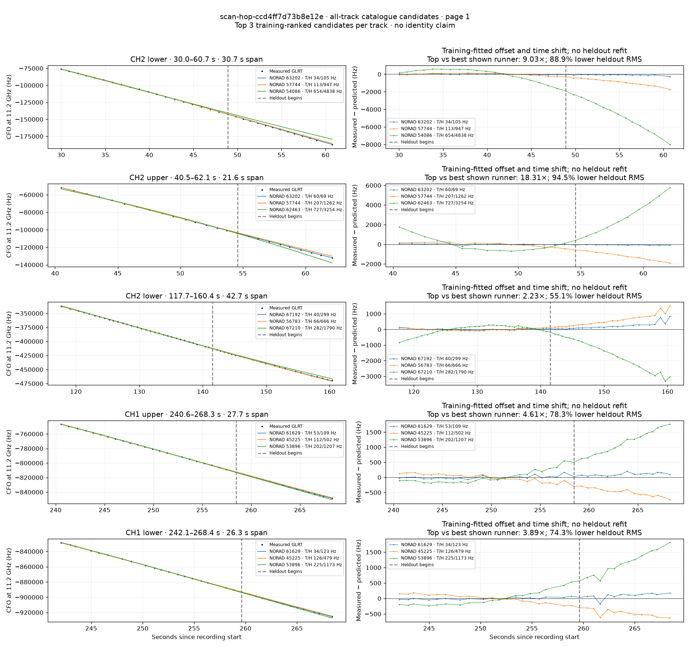

# All track overlays: scan-hop-ccd4ff7d73b8e12e

Recorded **2026-09-14T23:20:12.558941Z**, RX0, 10 MS/s. All **5 eligible tracks** are shown in chronological order.

[Recording assessment](scan-hop-ccd4ff7d73b8e12e.md) · [Candidate RMS and gains](scan-hop-ccd4ff7d73b8e12e-candidates.md)

Each row matches the requested view: measured GLRT CFO and the top three training-ranked TLE curves on the left, residuals on the right. Offset and time shift are fitted only on the first 60%; the last 40% is held out. These are candidate diagnostics, not satellite identifications.

RMS cells below are `training / heldout` in Hz. Runner-up 1 and 2 are training ranks two and three. The gain compares the top TLE with whichever of those two has lower heldout RMS.

| Track | Top TLE, train / heldout RMS | Runner-up 1, train / heldout RMS | Runner-up 2, train / heldout RMS | Top vs best shown runner, heldout |
|---|---:|---:|---:|---:|
| CH2 lower, 30.0–60.7 s | STARLINK-32935 / 63202: 34.3 / 104.9 Hz | STARLINK-30363 / 57744: 112.5 / 947.4 Hz | STARLINK-5211 / 54086: 654.4 / 4837.6 Hz | 9.03× / 88.9% lower |
| CH2 upper, 40.5–62.1 s | STARLINK-32935 / 63202: 60.2 / 68.9 Hz | STARLINK-30363 / 57744: 207.1 / 1261.5 Hz | STARLINK-11455 / 62463: 727.1 / 3253.7 Hz | 18.31× / 94.5% lower |
| CH2 lower, 117.7–160.4 s | STARLINK-36182 / 67192: 40.0 / 299.4 Hz | STARLINK-6357 / 56783: 66.5 / 666.3 Hz | STARLINK-36173 / 67210: 281.6 / 1789.9 Hz | 2.23× / 55.1% lower |
| CH1 upper, 240.6–268.3 s | STARLINK-32403 / 61629: 53.5 / 108.8 Hz | STARLINK-1215 / 45225: 112.5 / 501.7 Hz | STARLINK-5037 / 53896: 202.3 / 1207.5 Hz | 4.61× / 78.3% lower |
| CH1 lower, 242.1–268.4 s | STARLINK-32403 / 61629: 33.5 / 122.9 Hz | STARLINK-1215 / 45225: 126.0 / 478.8 Hz | STARLINK-5037 / 53896: 225.3 / 1172.9 Hz | 3.89× / 74.3% lower |

## Page 1

