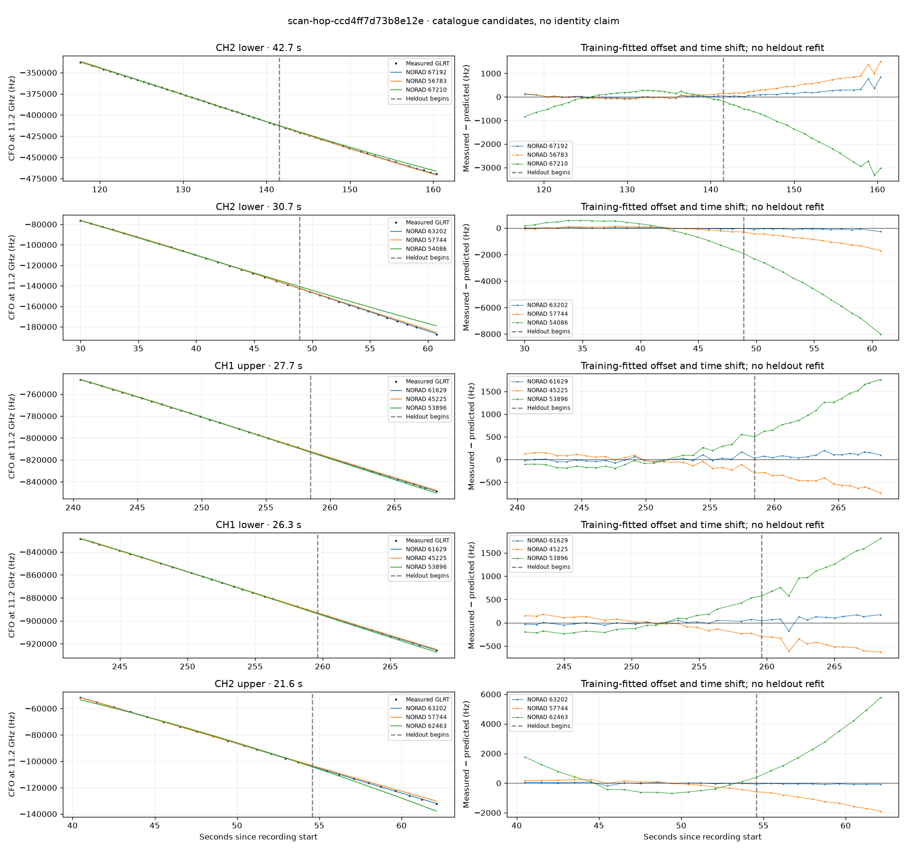

# scan-hop-ccd4ff7d73b8e12e

Recorded **2026-09-14T23:20:12.558941Z**, RX0, 10 MS/s.

**Candidates pass descriptive checks; no identification.** Candidates: 63202 (2 tracklets), 61629 (2 tracklets), 67192 (1 tracklets).

[Satellite RMS comparisons and top-1 gains](scan-hop-ccd4ff7d73b8e12e-candidates.md).

Counts are correlated lane tracklets, not independent detections or satellite counts. A recording can contain multiple transmitters; these are not one-label-per-file assignments.

Solid curves include a per-track constant carrier offset fitted on the first 60% of observations. The final 40% is held out. A close curve is not identity evidence by itself.

Catalogue: `sha256:d0d899a2d1da7811b03849396c03507e74e2de38d046edc9e068d12f2700ab20`. Orbital-only exclusions: STARLINK-34343 DEB (NORAD 69730; SGP4 [6]), STARLINK-37793 (NORAD 100286; SGP4 [1]).

| Lane | Recording seconds | Top 3 training NORADs | Train / heldout RMS (Hz) | Leader heldout rank | Assessment |
|---|---:|---|---:|---:|---|
| CH2 lower | 30.0–60.7 | 63202, 57744, 54086 | 34.3 / 104.9 | 1 | Passes descriptive checks; candidate only |
| CH2 upper | 40.5–62.1 | 63202, 57744, 62463 | 60.2 / 68.9 | 1 | Passes descriptive checks; candidate only |
| CH2 lower | 117.7–160.4 | 67192, 56783, 67210 | 40.0 / 299.4 | 1 | Passes descriptive checks; candidate only |
| CH1 upper | 240.6–268.3 | 61629, 45225, 53896 | 53.5 / 108.8 | 1 | Passes descriptive checks; candidate only |
| CH1 lower | 242.1–268.4 | 61629, 45225, 53896 | 33.5 / 122.9 | 1 | Passes descriptive checks; candidate only |

[Full candidate, control and measured-CFO evidence](scan-hop-ccd4ff7d73b8e12e.json.gz).
