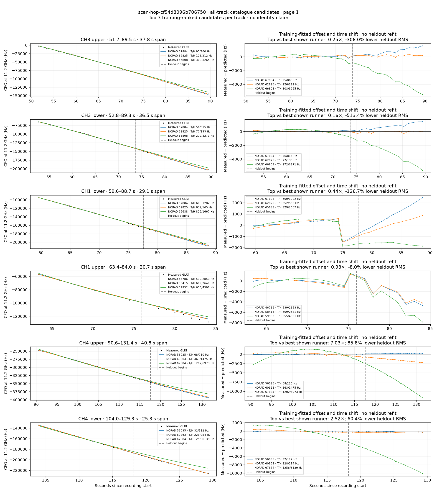
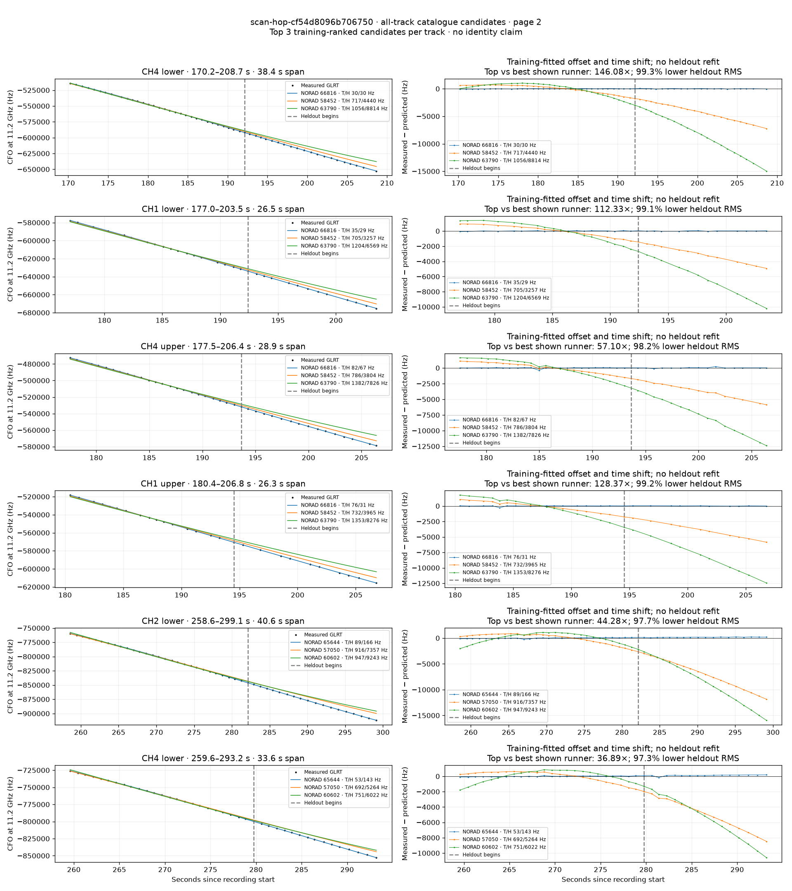
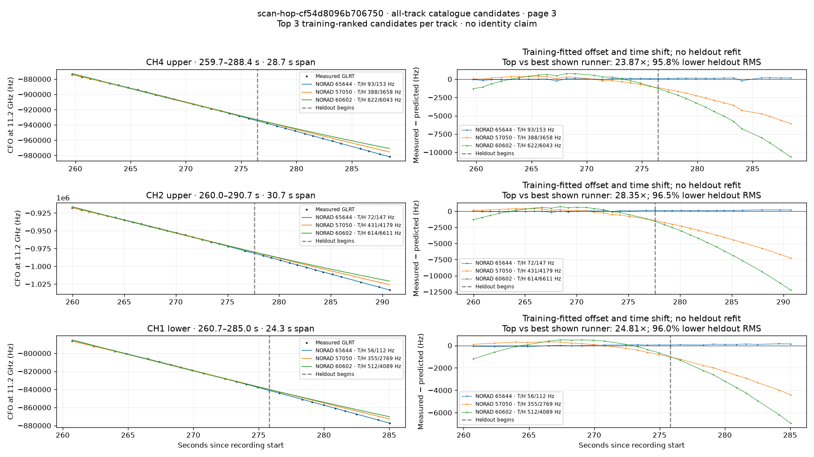

# All track overlays: scan-hop-cf54d8096b706750

Recorded **2026-09-14T20:40:12.394928Z**, RX0, 10 MS/s. All **15 eligible tracks** are shown in chronological order.

[Recording assessment](scan-hop-cf54d8096b706750.md) · [Candidate RMS and gains](scan-hop-cf54d8096b706750-candidates.md)

Each row matches the requested view: measured GLRT CFO and the top three training-ranked TLE curves on the left, residuals on the right. Offset and time shift are fitted only on the first 60%; the last 40% is held out. These are candidate diagnostics, not satellite identifications.

RMS cells below are `training / heldout` in Hz. Runner-up 1 and 2 are training ranks two and three. The gain compares the top TLE with whichever of those two has lower heldout RMS.

| Track | Top TLE, train / heldout RMS | Runner-up 1, train / heldout RMS | Runner-up 2, train / heldout RMS | Top vs best shown runner, heldout |
|---|---:|---:|---:|---:|
| CH3 upper, 51.7–89.5 s | STARLINK-36842 / 67884: 94.9 / 860.2 Hz | STARLINK-32825 / 62825: 125.8 / 211.8 Hz | STARLINK-36071 / 66808: 303.1 / 3264.8 Hz | 0.25× / -306.0% lower |
| CH3 lower, 52.8–89.3 s | STARLINK-36842 / 67884: 56.2 / 814.9 Hz | STARLINK-32825 / 62825: 76.9 / 132.9 Hz | STARLINK-36071 / 66808: 272.0 / 3271.5 Hz | 0.16× / -513.4% lower |
| CH1 lower, 59.6–88.7 s | STARLINK-36842 / 67884: 599.8 / 1282.2 Hz | STARLINK-32825 / 62825: 652.4 / 565.5 Hz | STARLINK-35213 / 65638: 828.8 / 1666.8 Hz | 0.44× / -126.7% lower |
| CH1 upper, 63.4–84.0 s | STARLINK-1893 / 46786: 538.8 / 2853.1 Hz | STARLINK-30949 / 58415: 608.6 / 2640.6 Hz | STARLINK-11124 / 59952: 655.5 / 4590.9 Hz | 0.93× / -8.0% lower |
| CH4 upper, 90.6–131.4 s | STARLINK-5792 / 56035: 68.4 / 209.7 Hz | STARLINK-32267 / 60363: 363.1 / 1475.2 Hz | STARLINK-36842 / 67884: 1201.8 / 6972.8 Hz | 7.03× / 85.8% lower |
| CH4 lower, 104.0–129.3 s | STARLINK-5792 / 56035: 32.4 / 112.5 Hz | STARLINK-32267 / 60363: 227.9 / 283.8 Hz | STARLINK-36842 / 67884: 1256.4 / 6139.2 Hz | 2.52× / 60.4% lower |
| CH4 lower, 170.2–208.7 s | STARLINK-36098 / 66816: 30.3 / 30.4 Hz | STARLINK-30928 / 58452: 716.6 / 4440.4 Hz | STARLINK-33869 / 63790: 1056.0 / 8813.9 Hz | 146.08× / 99.3% lower |
| CH1 lower, 177.0–203.5 s | STARLINK-36098 / 66816: 34.7 / 29.0 Hz | STARLINK-30928 / 58452: 704.7 / 3256.6 Hz | STARLINK-33869 / 63790: 1203.9 / 6568.8 Hz | 112.33× / 99.1% lower |
| CH4 upper, 177.5–206.4 s | STARLINK-36098 / 66816: 81.5 / 66.6 Hz | STARLINK-30928 / 58452: 785.9 / 3804.4 Hz | STARLINK-33869 / 63790: 1381.7 / 7826.0 Hz | 57.10× / 98.2% lower |
| CH1 upper, 180.4–206.8 s | STARLINK-36098 / 66816: 76.4 / 30.9 Hz | STARLINK-30928 / 58452: 731.5 / 3964.9 Hz | STARLINK-33869 / 63790: 1353.5 / 8275.7 Hz | 128.37× / 99.2% lower |
| CH2 lower, 258.6–299.1 s | STARLINK-35141 / 65644: 89.0 / 166.1 Hz | STARLINK-5845 / 57050: 915.5 / 7356.5 Hz | STARLINK-31983 / 60602: 946.6 / 9243.5 Hz | 44.28× / 97.7% lower |
| CH4 lower, 259.6–293.2 s | STARLINK-35141 / 65644: 53.0 / 142.7 Hz | STARLINK-5845 / 57050: 691.6 / 5263.6 Hz | STARLINK-31983 / 60602: 750.7 / 6022.1 Hz | 36.89× / 97.3% lower |
| CH4 upper, 259.7–288.4 s | STARLINK-35141 / 65644: 93.1 / 153.2 Hz | STARLINK-5845 / 57050: 387.7 / 3657.6 Hz | STARLINK-31983 / 60602: 622.4 / 6042.6 Hz | 23.87× / 95.8% lower |
| CH2 upper, 260.0–290.7 s | STARLINK-35141 / 65644: 71.8 / 147.4 Hz | STARLINK-5845 / 57050: 431.0 / 4178.6 Hz | STARLINK-31983 / 60602: 614.4 / 6611.1 Hz | 28.35× / 96.5% lower |
| CH1 lower, 260.7–285.0 s | STARLINK-35141 / 65644: 55.9 / 111.6 Hz | STARLINK-5845 / 57050: 354.6 / 2769.2 Hz | STARLINK-31983 / 60602: 511.6 / 4088.7 Hz | 24.81× / 96.0% lower |

## Page 1

## Page 2

## Page 3

