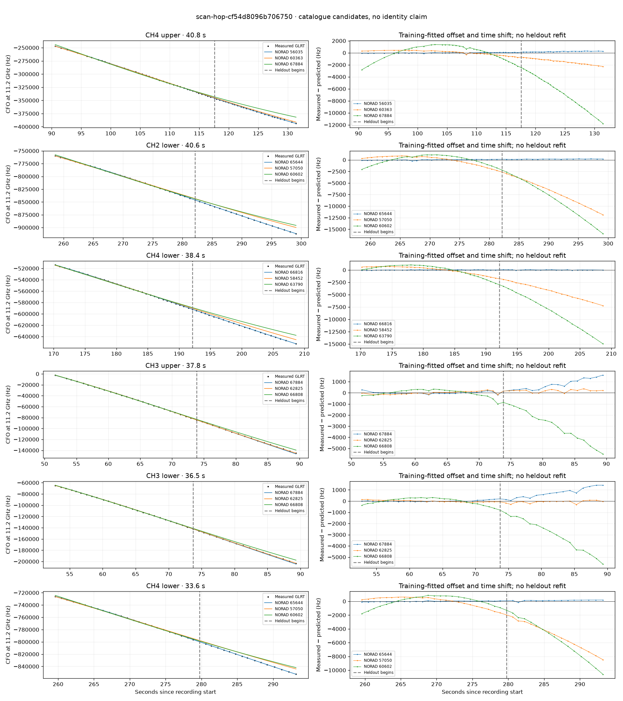

# scan-hop-cf54d8096b706750

Recorded **2026-09-14T20:40:12.394928Z**, RX0, 10 MS/s.

**Candidates pass descriptive checks; no identification.** Candidates: 65644 (5 tracklets), 66816 (3 tracklets), 56035 (2 tracklets).

[Satellite RMS comparisons and top-1 gains](scan-hop-cf54d8096b706750-candidates.md).

Counts are correlated lane tracklets, not independent detections or satellite counts. A recording can contain multiple transmitters; these are not one-label-per-file assignments.

Solid curves include a per-track constant carrier offset fitted on the first 60% of observations. The final 40% is held out. A close curve is not identity evidence by itself.

Catalogue: `sha256:889e7736a313d5543eb60d5bad6841ef1ba92f93f691d8af8bb2a30aafee825e`. Orbital-only exclusions: STARLINK-34343 DEB (NORAD 69730; SGP4 [6]), STARLINK-37793 (NORAD 100286; SGP4 [1]).

| Lane | Recording seconds | Top 3 training NORADs | Train / heldout RMS (Hz) | Leader heldout rank | Assessment |
|---|---:|---|---:|---:|---|
| CH3 upper | 51.7–89.5 | 67884, 62825, 66808 | 94.9 / 860.2 | 2 | leader changes on heldout |
| CH3 lower | 52.8–89.3 | 67884, 62825, 66808 | 56.2 / 814.9 | 2 | leader changes on heldout |
| CH1 lower | 59.6–88.7 | 67884, 62825, 65638 | 599.8 / 1282.2 | 2 | leader changes on heldout; time-shift boundary; radio drift fits as well or better |
| CH1 upper | 63.4–84.0 | 46786, 58415, 59952 | 538.8 / 2853.1 | 4 | leader changes on heldout; radio drift fits as well or better; -500s control fits as well or better; 500s control fits as well or better |
| CH4 upper | 90.6–131.4 | 56035, 60363, 67884 | 68.4 / 209.7 | 1 | Passes descriptive checks; candidate only |
| CH4 lower | 104.0–129.3 | 56035, 60363, 67884 | 32.4 / 112.5 | 1 | Passes descriptive checks; candidate only |
| CH4 lower | 170.2–208.7 | 66816, 58452, 63790 | 30.3 / 30.4 | 1 | Passes descriptive checks; candidate only |
| CH1 lower | 177.0–203.5 | 66816, 58452, 63790 | 34.7 / 29.0 | 1 | Passes descriptive checks; candidate only |
| CH4 upper | 177.5–206.4 | 66816, 58452, 63790 | 81.5 / 66.6 | 1 | Passes descriptive checks; candidate only |
| CH1 upper | 180.4–206.8 | 66816, 58452, 63790 | 76.4 / 30.9 | 1 | -500s control fits as well or better |
| CH2 lower | 258.6–299.1 | 65644, 57050, 60602 | 89.0 / 166.1 | 1 | Passes descriptive checks; candidate only |
| CH4 lower | 259.6–293.2 | 65644, 57050, 60602 | 53.0 / 142.7 | 1 | Passes descriptive checks; candidate only |
| CH4 upper | 259.7–288.4 | 65644, 57050, 60602 | 93.1 / 153.2 | 1 | Passes descriptive checks; candidate only |
| CH2 upper | 260.0–290.7 | 65644, 57050, 60602 | 71.8 / 147.4 | 1 | Passes descriptive checks; candidate only |
| CH1 lower | 260.7–285.0 | 65644, 57050, 60602 | 55.9 / 111.6 | 1 | Passes descriptive checks; candidate only |

[Full candidate, control and measured-CFO evidence](scan-hop-cf54d8096b706750.json.gz).
