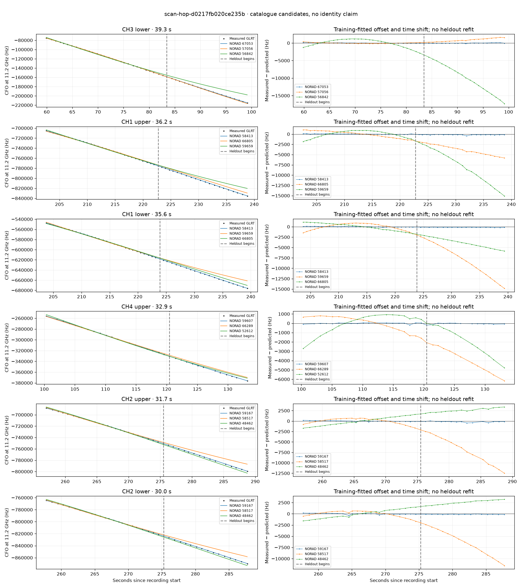

# scan-hop-d0217fb020ce235b

Recorded **2026-09-14T20:20:12.508356Z**, RX0, 10 MS/s.

**Candidates pass descriptive checks; no identification.** Candidates: 58413 (4 tracklets), 67053 (2 tracklets), 63426 (2 tracklets).

Counts are correlated lane tracklets, not independent detections or satellite counts. A recording can contain multiple transmitters; these are not one-label-per-file assignments.

Solid curves include a per-track constant carrier offset fitted on the first 60% of observations. The final 40% is held out. A close curve is not identity evidence by itself.

Catalogue: `sha256:889e7736a313d5543eb60d5bad6841ef1ba92f93f691d8af8bb2a30aafee825e`. Orbital-only exclusions: STARLINK-34343 DEB (NORAD 69730; SGP4 [6]), STARLINK-37793 (NORAD 100286; SGP4 [1, 6]).

| Lane | Recording seconds | Top 3 training NORADs | Train / heldout RMS (Hz) | Leader heldout rank | Assessment |
|---|---:|---|---:|---:|---|
| CH3 upper | 58.7–88.3 | 67053, 57056, 59322 | 96.8 / 77.4 | 1 | Passes descriptive checks; candidate only |
| CH3 lower | 59.9–99.2 | 67053, 57056, 56842 | 69.6 / 67.8 | 1 | Passes descriptive checks; candidate only |
| CH4 upper | 100.3–133.2 | 59607, 66289, 52612 | 58.8 / 84.0 | 1 | Passes descriptive checks; candidate only |
| CH2 upper | 119.1–143.8 | 59607, 52612, 66274 | 69.5 / 271.6 | 1 | -500s control fits as well or better; 500s control fits as well or better |
| CH2 lower | 120.3–145.3 | 59607, 52612, 52600 | 80.7 / 163.5 | 1 | -500s control fits as well or better; 500s control fits as well or better |
| CH4 lower | 127.5–149.0 | 63426, 57227, 62306 | 27.8 / 15.5 | 1 | Passes descriptive checks; candidate only |
| CH2 lower | 151.3–178.8 | 62306, 63426, 50841 | 36.7 / 110.5 | 1 | Passes descriptive checks; candidate only |
| CH4 lower | 200.7–224.3 | 58413, 66805, 59659 | 49.6 / 150.8 | 1 | Passes descriptive checks; candidate only |
| CH4 upper | 200.8–224.4 | 58413, 66805, 59659 | 78.4 / 127.4 | 1 | Passes descriptive checks; candidate only |
| CH1 upper | 202.6–238.8 | 58413, 66805, 59659 | 64.5 / 175.7 | 1 | Passes descriptive checks; candidate only |
| CH1 lower | 203.7–239.4 | 58413, 59659, 66805 | 66.4 / 135.3 | 1 | Passes descriptive checks; candidate only |
| CH2 upper | 257.0–288.7 | 59167, 58517, 48462 | 96.2 / 217.6 | 1 | Passes descriptive checks; candidate only |
| CH2 lower | 257.8–287.7 | 59167, 58517, 48462 | 128.1 / 114.3 | 1 | Passes descriptive checks; candidate only |
| CH4 upper | 127.0–148.6 | 63426, 57227, 62306 | 64.0 / 19.9 | 1 | Passes descriptive checks; candidate only |

[Full candidate, control and measured-CFO evidence](scan-hop-d0217fb020ce235b.json.gz).
