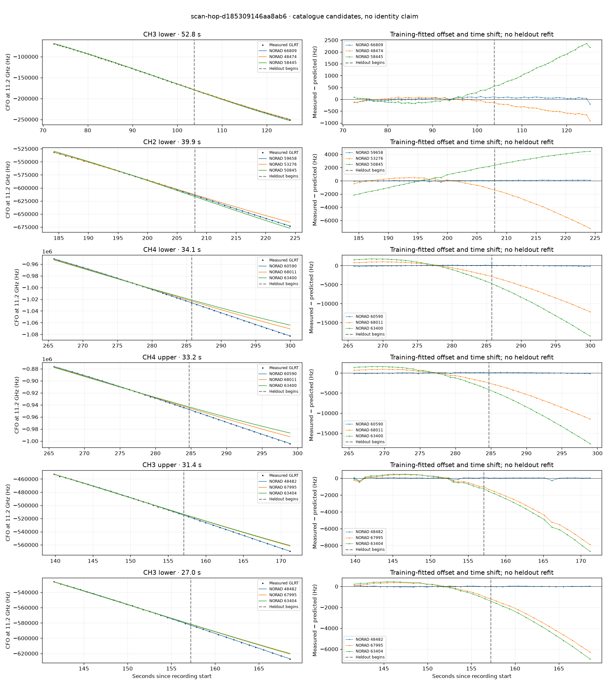

# scan-hop-d185309146aa8ab6

Recorded **2026-09-14T20:30:12.780413Z**, RX0, 10 MS/s.

**Candidates pass descriptive checks; no identification.** Candidates: 48482 (2 tracklets), 59658 (2 tracklets), 60590 (2 tracklets).

Counts are correlated lane tracklets, not independent detections or satellite counts. A recording can contain multiple transmitters; these are not one-label-per-file assignments.

Solid curves include a per-track constant carrier offset fitted on the first 60% of observations. The final 40% is held out. A close curve is not identity evidence by itself.

Catalogue: `sha256:889e7736a313d5543eb60d5bad6841ef1ba92f93f691d8af8bb2a30aafee825e`. Orbital-only exclusions: STARLINK-34343 DEB (NORAD 69730; SGP4 [6]), STARLINK-37793 (NORAD 100286; SGP4 [1, 6]).

| Lane | Recording seconds | Top 3 training NORADs | Train / heldout RMS (Hz) | Leader heldout rank | Assessment |
|---|---:|---|---:|---:|---|
| CH3 lower | 72.4–125.2 | 66809, 48474, 58445 | 63.1 / 76.6 | 1 | Passes descriptive checks; candidate only |
| CH3 upper | 75.1–97.6 | 66809, 48474, 58445 | 52.9 / 104.0 | 2 | leader changes on heldout |
| CH3 upper | 139.8–171.2 | 48482, 67995, 63404 | 96.4 / 82.1 | 1 | Passes descriptive checks; candidate only |
| CH3 lower | 141.6–168.6 | 48482, 67995, 63404 | 32.9 / 20.0 | 1 | Passes descriptive checks; candidate only |
| CH2 upper | 181.0–205.9 | 59658, 53276, 62418 | 24.2 / 70.0 | 1 | Passes descriptive checks; candidate only |
| CH2 lower | 184.2–224.1 | 59658, 53276, 50845 | 56.8 / 77.7 | 1 | Passes descriptive checks; candidate only |
| CH4 lower | 185.8–211.5 | 64793, 67037, 53274 | 45.0 / 34.8 | 1 | Passes descriptive checks; candidate only |
| CH1 lower | 229.5–253.6 | 63764, 69182, 63276 | 87.8 / 73.6 | 1 | Passes descriptive checks; candidate only |
| CH4 upper | 265.7–298.9 | 60590, 68011, 63400 | 89.1 / 79.9 | 1 | Passes descriptive checks; candidate only |
| CH4 lower | 265.8–300.0 | 60590, 68011, 63400 | 89.7 / 82.1 | 1 | Passes descriptive checks; candidate only |

[Full candidate, control and measured-CFO evidence](scan-hop-d185309146aa8ab6.json.gz).
