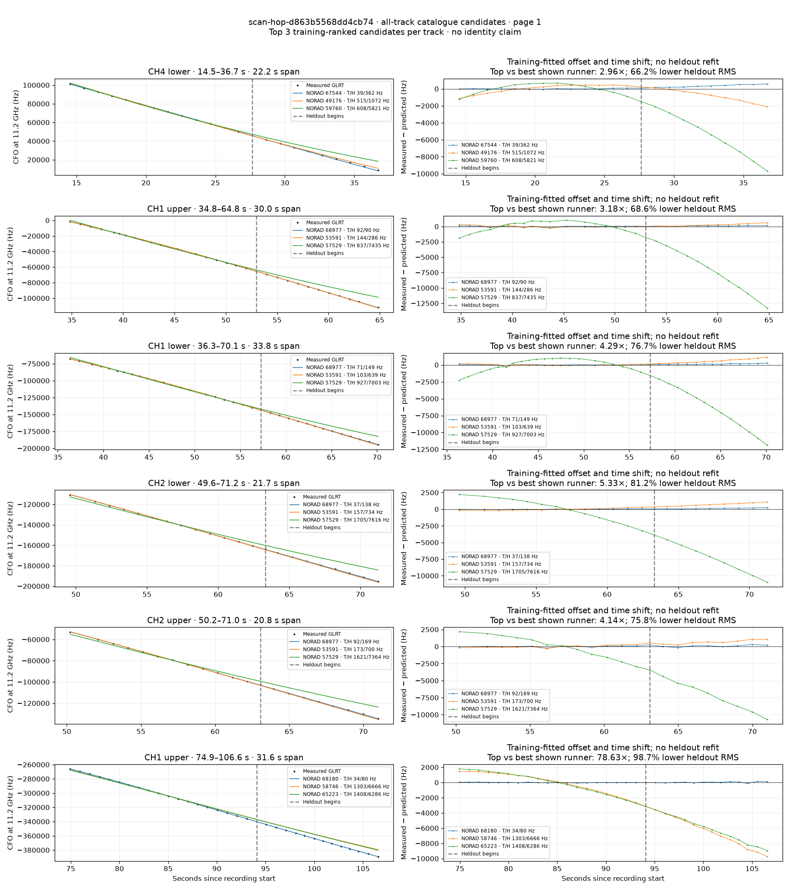
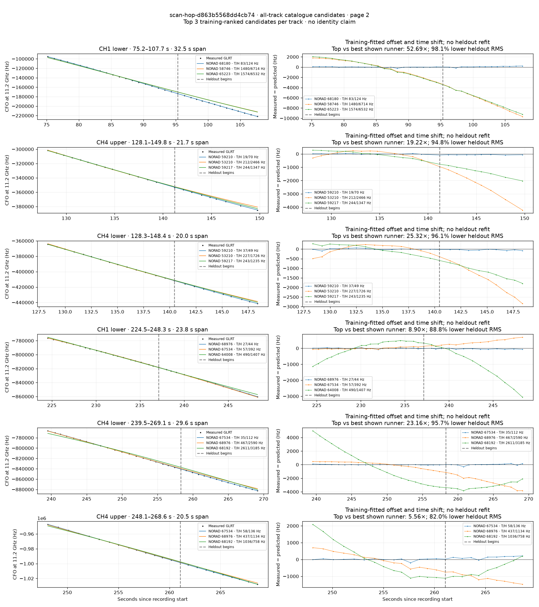
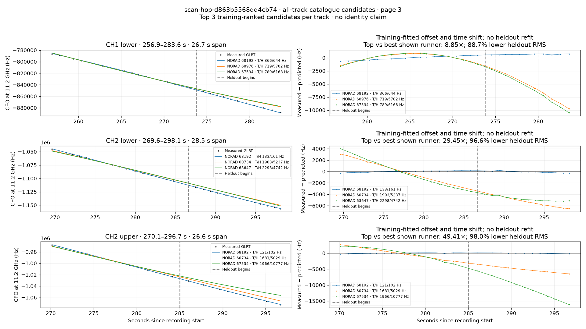

# All track overlays: scan-hop-d863b5568dd4cb74

Recorded **2026-09-14T17:50:12.620976Z**, RX0, 10 MS/s. All **15 eligible tracks** are shown in chronological order.

[Recording assessment](scan-hop-d863b5568dd4cb74.md) · [Candidate RMS and gains](scan-hop-d863b5568dd4cb74-candidates.md)

Each row matches the requested view: measured GLRT CFO and the top three training-ranked TLE curves on the left, residuals on the right. Offset and time shift are fitted only on the first 60%; the last 40% is held out. These are candidate diagnostics, not satellite identifications.

RMS cells below are `training / heldout` in Hz. Runner-up 1 and 2 are training ranks two and three. The gain compares the top TLE with whichever of those two has lower heldout RMS.

| Track | Top TLE, train / heldout RMS | Runner-up 1, train / heldout RMS | Runner-up 2, train / heldout RMS | Top vs best shown runner, heldout |
|---|---:|---:|---:|---:|
| CH4 lower, 14.5–36.7 s | STARLINK-36565 / 67544: 38.8 / 362.3 Hz | STARLINK-3069 / 49176: 515.0 / 1072.2 Hz | STARLINK-11098 / 59760: 608.5 / 5820.6 Hz | 2.96× / 66.2% lower |
| CH1 upper, 34.8–64.8 s | STARLINK-37371 / 68977: 91.6 / 89.9 Hz | STARLINK-4674 / 53591: 143.5 / 286.2 Hz | STARLINK-30266 / 57529: 837.0 / 7434.6 Hz | 3.18× / 68.6% lower |
| CH1 lower, 36.3–70.1 s | STARLINK-37371 / 68977: 70.8 / 148.9 Hz | STARLINK-4674 / 53591: 102.7 / 638.5 Hz | STARLINK-30266 / 57529: 927.1 / 7002.7 Hz | 4.29× / 76.7% lower |
| CH2 lower, 49.6–71.2 s | STARLINK-37371 / 68977: 36.7 / 137.6 Hz | STARLINK-4674 / 53591: 156.9 / 733.8 Hz | STARLINK-30266 / 57529: 1704.7 / 7616.4 Hz | 5.33× / 81.2% lower |
| CH2 upper, 50.2–71.0 s | STARLINK-37371 / 68977: 92.3 / 169.1 Hz | STARLINK-4674 / 53591: 173.1 / 699.8 Hz | STARLINK-30266 / 57529: 1621.0 / 7363.7 Hz | 4.14× / 75.8% lower |
| CH1 upper, 74.9–106.6 s | STARLINK-37035 / 68180: 33.5 / 80.0 Hz | STARLINK-31181 / 58746: 1302.7 / 6665.8 Hz | STARLINK-34996 / 65223: 1408.2 / 6286.5 Hz | 78.63× / 98.7% lower |
| CH1 lower, 75.2–107.7 s | STARLINK-37035 / 68180: 82.6 / 124.0 Hz | STARLINK-31181 / 58746: 1480.0 / 6714.5 Hz | STARLINK-34996 / 65223: 1574.3 / 6532.4 Hz | 52.69× / 98.1% lower |
| CH4 upper, 128.1–149.8 s | STARLINK-31520 / 59210: 19.1 / 70.1 Hz | STARLINK-4427 / 53210: 212.1 / 2466.4 Hz | STARLINK-31499 / 59217: 243.7 / 1346.7 Hz | 19.22× / 94.8% lower |
| CH4 lower, 128.3–148.4 s | STARLINK-31520 / 59210: 37.4 / 48.8 Hz | STARLINK-4427 / 53210: 227.3 / 1725.6 Hz | STARLINK-31499 / 59217: 242.8 / 1235.1 Hz | 25.32× / 96.1% lower |
| CH1 lower, 224.5–248.3 s | STARLINK-36735 / 68976: 26.9 / 44.0 Hz | STARLINK-36576 / 67534: 56.9 / 392.1 Hz | STARLINK-34163 / 64008: 490.0 / 1406.8 Hz | 8.90× / 88.8% lower |
| CH4 lower, 239.5–269.1 s | STARLINK-36576 / 67534: 34.6 / 111.8 Hz | STARLINK-36735 / 68976: 467.5 / 2589.7 Hz | STARLINK-37098 / 68192: 2611.2 / 3184.9 Hz | 23.16× / 95.7% lower |
| CH4 upper, 248.1–268.6 s | STARLINK-36576 / 67534: 58.1 / 136.4 Hz | STARLINK-36735 / 68976: 436.8 / 1134.0 Hz | STARLINK-37098 / 68192: 1036.1 / 758.2 Hz | 5.56× / 82.0% lower |
| CH1 lower, 256.9–283.6 s | STARLINK-37098 / 68192: 366.2 / 644.4 Hz | STARLINK-36735 / 68976: 719.1 / 5701.7 Hz | STARLINK-36576 / 67534: 788.6 / 6168.0 Hz | 8.85× / 88.7% lower |
| CH2 lower, 269.6–298.1 s | STARLINK-37098 / 68192: 132.7 / 161.0 Hz | STARLINK-32179 / 60734: 1902.6 / 5237.3 Hz | STARLINK-33729 / 63647: 2298.2 / 4742.1 Hz | 29.45× / 96.6% lower |
| CH2 upper, 270.1–296.7 s | STARLINK-37098 / 68192: 120.6 / 101.8 Hz | STARLINK-32179 / 60734: 1680.6 / 5028.7 Hz | STARLINK-36576 / 67534: 1966.4 / 10777.2 Hz | 49.41× / 98.0% lower |

## Page 1

## Page 2

## Page 3

