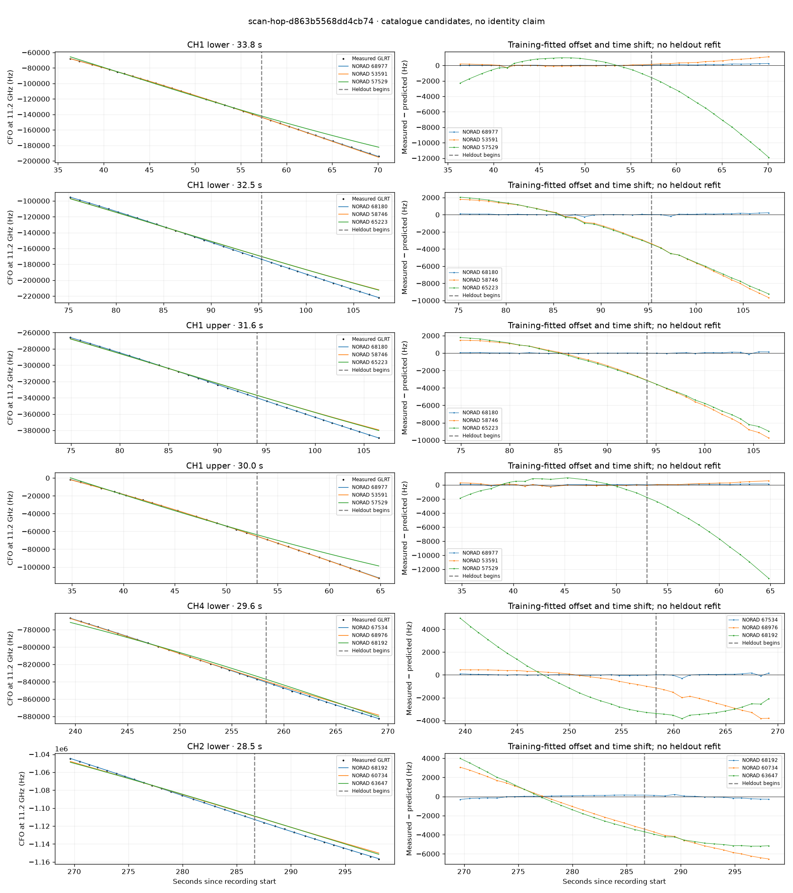

# scan-hop-d863b5568dd4cb74

Recorded **2026-09-14T17:50:12.620976Z**, RX0, 10 MS/s.

**Candidates pass descriptive checks; no identification.** Candidates: 68977 (4 tracklets), 68180 (2 tracklets), 59210 (2 tracklets).

[Satellite RMS comparisons and top-1 gains](scan-hop-d863b5568dd4cb74-candidates.md).

Counts are correlated lane tracklets, not independent detections or satellite counts. A recording can contain multiple transmitters; these are not one-label-per-file assignments.

Solid curves include a per-track constant carrier offset fitted on the first 60% of observations. The final 40% is held out. A close curve is not identity evidence by itself.

Catalogue: `sha256:f027c02cbe99846bc1b1e0b5a10d35c7fe22c60b64c3ddd0a6bf0efe667659cd`. Orbital-only exclusions: STARLINK-34343 DEB (NORAD 69730; SGP4 [6]), STARLINK-37793 (NORAD 100286; SGP4 [1, 6]).

| Lane | Recording seconds | Top 3 training NORADs | Train / heldout RMS (Hz) | Leader heldout rank | Assessment |
|---|---:|---|---:|---:|---|
| CH4 lower | 14.5–36.7 | 67544, 49176, 59760 | 38.8 / 362.3 | 1 | Passes descriptive checks; candidate only |
| CH1 upper | 34.8–64.8 | 68977, 53591, 57529 | 91.6 / 89.9 | 1 | Passes descriptive checks; candidate only |
| CH1 lower | 36.3–70.1 | 68977, 53591, 57529 | 70.8 / 148.9 | 1 | Passes descriptive checks; candidate only |
| CH2 lower | 49.6–71.2 | 68977, 53591, 57529 | 36.7 / 137.6 | 1 | Passes descriptive checks; candidate only |
| CH2 upper | 50.2–71.0 | 68977, 53591, 57529 | 92.3 / 169.1 | 1 | Passes descriptive checks; candidate only |
| CH1 upper | 74.9–106.6 | 68180, 58746, 65223 | 33.5 / 80.0 | 1 | Passes descriptive checks; candidate only |
| CH1 lower | 75.2–107.7 | 68180, 58746, 65223 | 82.6 / 124.0 | 1 | Passes descriptive checks; candidate only |
| CH4 upper | 128.1–149.8 | 59210, 53210, 59217 | 19.1 / 70.1 | 1 | Passes descriptive checks; candidate only |
| CH4 lower | 128.3–148.4 | 59210, 53210, 59217 | 37.4 / 48.8 | 1 | Passes descriptive checks; candidate only |
| CH1 lower | 224.5–248.3 | 68976, 67534, 64008 | 26.9 / 44.0 | 1 | Passes descriptive checks; candidate only |
| CH4 lower | 239.5–269.1 | 67534, 68976, 68192 | 34.6 / 111.8 | 1 | Passes descriptive checks; candidate only |
| CH4 upper | 248.1–268.6 | 67534, 68976, 68192 | 58.1 / 136.4 | 1 | Passes descriptive checks; candidate only |
| CH1 lower | 256.9–283.6 | 68192, 68976, 67534 | 366.2 / 644.4 | 1 | time-shift boundary |
| CH2 lower | 269.6–298.1 | 68192, 60734, 63647 | 132.7 / 161.0 | 1 | time-shift boundary |
| CH2 upper | 270.1–296.7 | 68192, 60734, 67534 | 120.6 / 101.8 | 1 | time-shift boundary |

[Full candidate, control and measured-CFO evidence](scan-hop-d863b5568dd4cb74.json.gz).
