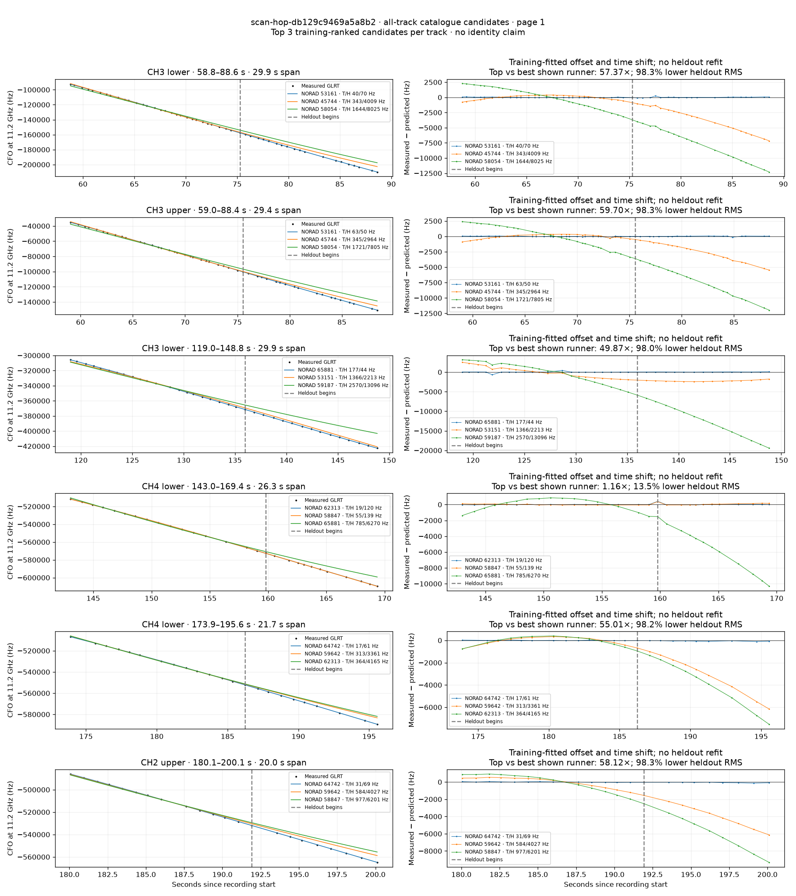
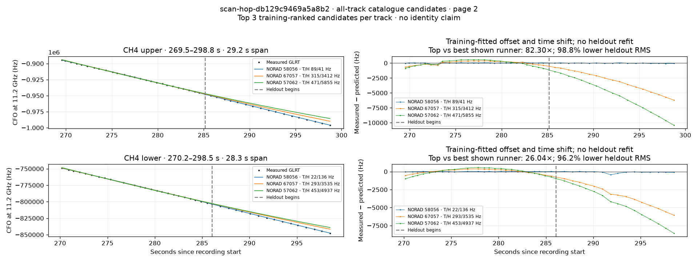

# All track overlays: scan-hop-db129c9469a5a8b2

Recorded **2026-09-14T19:40:12.731860Z**, RX0, 10 MS/s. All **8 eligible tracks** are shown in chronological order.

[Recording assessment](scan-hop-db129c9469a5a8b2.md) · [Candidate RMS and gains](scan-hop-db129c9469a5a8b2-candidates.md)

Each row matches the requested view: measured GLRT CFO and the top three training-ranked TLE curves on the left, residuals on the right. Offset and time shift are fitted only on the first 60%; the last 40% is held out. These are candidate diagnostics, not satellite identifications.

RMS cells below are `training / heldout` in Hz. Runner-up 1 and 2 are training ranks two and three. The gain compares the top TLE with whichever of those two has lower heldout RMS.

| Track | Top TLE, train / heldout RMS | Runner-up 1, train / heldout RMS | Runner-up 2, train / heldout RMS | Top vs best shown runner, heldout |
|---|---:|---:|---:|---:|
| CH3 lower, 58.8–88.6 s | STARLINK-4055 / 53161: 40.0 / 69.9 Hz | STARLINK-1500 / 45744: 343.3 / 4009.0 Hz | STARLINK-30566 / 58054: 1644.1 / 8024.8 Hz | 57.37× / 98.3% lower |
| CH3 upper, 59.0–88.4 s | STARLINK-4055 / 53161: 62.6 / 49.6 Hz | STARLINK-1500 / 45744: 344.6 / 2963.7 Hz | STARLINK-30566 / 58054: 1721.0 / 7805.3 Hz | 59.70× / 98.3% lower |
| CH3 lower, 119.0–148.8 s | STARLINK-35464 / 65881: 176.9 / 44.4 Hz | STARLINK-4040 / 53151: 1366.4 / 2212.7 Hz | STARLINK-31514 / 59187: 2569.7 / 13095.5 Hz | 49.87× / 98.0% lower |
| CH4 lower, 143.0–169.4 s | STARLINK-32634 / 62313: 19.2 / 120.1 Hz | STARLINK-31262 / 58847: 54.7 / 138.9 Hz | STARLINK-35464 / 65881: 784.7 / 6269.8 Hz | 1.16× / 13.5% lower |
| CH4 lower, 173.9–195.6 s | STARLINK-34607 / 64742: 16.9 / 61.1 Hz | STARLINK-31660 / 59642: 313.0 / 3361.4 Hz | STARLINK-32634 / 62313: 363.5 / 4165.5 Hz | 55.01× / 98.2% lower |
| CH2 upper, 180.1–200.1 s | STARLINK-34607 / 64742: 31.3 / 69.3 Hz | STARLINK-31660 / 59642: 584.3 / 4027.3 Hz | STARLINK-31262 / 58847: 977.4 / 6201.0 Hz | 58.12× / 98.3% lower |
| CH4 upper, 269.5–298.8 s | STARLINK-30553 / 58056: 89.3 / 41.5 Hz | STARLINK-36141 / 67057: 315.0 / 3412.0 Hz | STARLINK-5536 / 57062: 470.9 / 5855.4 Hz | 82.30× / 98.8% lower |
| CH4 lower, 270.2–298.5 s | STARLINK-30553 / 58056: 21.7 / 135.8 Hz | STARLINK-36141 / 67057: 292.8 / 3534.7 Hz | STARLINK-5536 / 57062: 452.6 / 4936.9 Hz | 26.04× / 96.2% lower |

## Page 1

## Page 2

